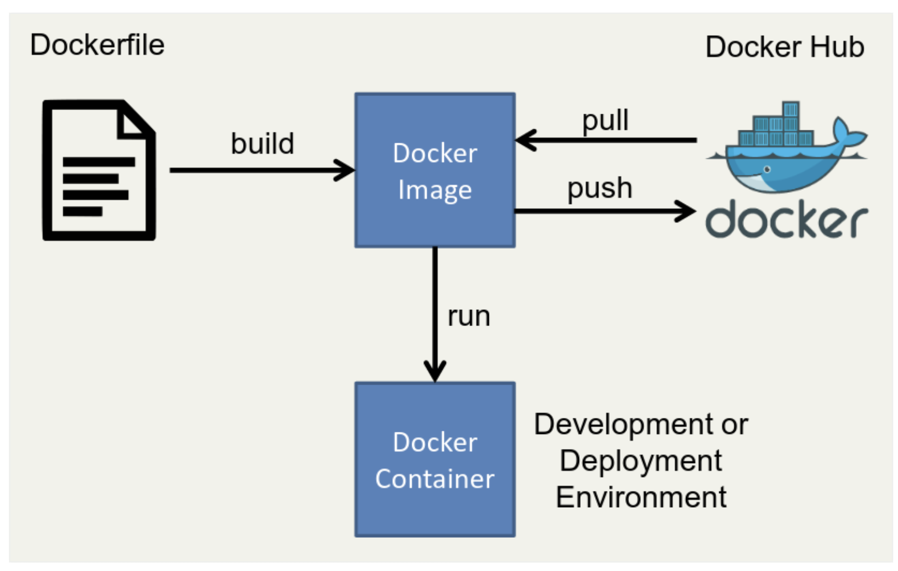

## Docker

```
ㅁ Author: suktae.choi
ㅁ References:
- https://docs.docker.com/reference/
- https://www.pyrasis.com/archive.html
- https://www.44bits.io/ko/post/almost-perfect-development-environment-with-docker-and-docker-compose
```

**`Dockerfile` (or docker-compose.yml) 에 기술한 내용으로 `image` 를 만들고,** 
**해당 이미지로 `container` 실행합니다.**



생성한 (push) or 가져온 (pull) 이미지는 `docker server` 에 저장되고, 그렇게 관리하는 이미지를 선택해서 `docker run` 수행시 container 가 생성되어 instance 가 동작하는 원리 입니다.

## Terms

### Dockerfile

이미지를 생성할 명세를 정의합니다.

```dockerfile
# Dockerfile
# pull base image
FROM registry.docker.com/nginx/base-nginx:1.12.2

# export env
ENV NGINX_HOME /usr/local/etc/nginx
ENV CONF_HOME $NGINX_HOME/conf

# copy
WORKDIR $CONF_HOME
ADD /docker/nginx/conf .

# run
EXPOSE 80 443
CMD ["nginx", "-g", "daemon off;"]
```

기술한 Dockerfile 을 아래 명령어로 image 로 만들 수 있습니다.

```bash
$ docker build --tag nginx:20200320_145400 .
```

### Image

docker server 에서 관리하는 이미지를 확인 할 수 있습니다.

```bash
suktae@localHost /usr/local/etc/nginx $ docker images
REPOSITORY                          TAG           IMAGE ID      CREATED        SIZE
base-nginx											   1.12.2       a8c3d87a58e7   2 days ago      831MB
nginx											    20200320_145400   65d59f58cbsb   2 days ago      833MB
```

### Container

생성한 (or 가져온) 이미지를 run 을 통해 container 로 띄웁니다.

```bash
$ docker run -it --rm -d -p 80:80 -p 443:443 nginx:20200320_145400
```

- -it: input & tty
  - 입출력을 CLI 와 연결한다는 의미
- --rm
  - 미사용시 생성된 container 삭제
- -d
  - daemon mode 로 실행. [옵션이 필요한 이유](https://roseline124.github.io/kuberdocker/2019/07/24/docker-study05.html)
- -p {external}:{internal}
  - 포트포워딩. 기본적으로 container 는 외부와 통신이 불가능하고, 노출할 외부/내부 포트 지정필요

### CLI

더 자세한 CLI 명령어 및 Dockerfile 작성 가이드는 아래 링크 참조

- https://docs.docker.com/engine/reference/commandline/cli/
- https://docs.docker.com/engine/reference/builder/

## Advanced

레퍼런스에 있는 Best Practices 중에서 도움될만한 내용을 정리합니다.

- https://docs.docker.com/develop/develop-images/dockerfile_best-practices/

### Dockerfile vs docker-compose.yml

- Dockerfile
  - 1개의 이미지 생성 정의
- docker-compose.yml
  - N개의 이미지 생성 정의
  - 컨테이너 간 실행순서나 의존성 관리가능

동일한 context 에서 여러개의 이미지를 만들때 docker-compose.yml 이 유용합니다. 

뒤에 설명할 pipeline 에서도 하나의 build-pipeline (동일한 context 가 유지되는) 에서 compose 의 형태로 container 를 생성합니다.

```yaml
# docker-compose.yml
version: "3"
services:
  spring-app: # container name
    build:  # if images not exists
      context: .
      dockerfile: ./docker/Dockerfile
  nginx:
    image: nginx:20200320_145400  # if images exists
    ports:
      - "80:80"
      - "443:443"
    volumes:	# 필요시 fuse 가능
      - /docker/nginx/conf:/usr/local/etc/nginx/conf
```

아래 명령어로 실행 합니다.

```bash
$ docker-compose up
```

> 더 자세한 사용법은 https://docs.docker.com/compose/compose-file/ 참조

### BuildContext

Dockerfile 빌드가 수행될때, build context 의 범위를 알고 있어야합니다.

```bash
/home/usr1/workspace $ ls -l
total 8
-rw-r--r--  1 suktae  staff  1729 Mar 18 16:15 Dockerfile
drwxr-xr-x  5 suktae  staff   160 Mar 17 13:22 scripts
```

파일시스템 구조가 위의 모습으로 잡혀있으면, image 생성시 접근가능한 경로는 `Dockerfile 이 존재하는 하위 뿐` 입니다.

> Dockerfile 내부에서의 / 는 파일시스템의 /home/usr1/workspace

만약 접근불가능한 path 의 파일을 참조하고 싶으면 아래의 방법이 있습니다.

- argument 로 직접 전달

```bash
$ docker build --tag nginx:20200320 --build-arg ssl_perm=/{PATH}/ssl.pub

# Dockerfile
ARG ssl_perm	# define argument to use
ADD $ssl_perm . 
```

- volume mount

```bash
$ docker run --volume /{PATH}/ssl.pub:/container/some/where .

# Dockerfile
ADD /docker/nginx/conf .
```


