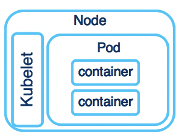
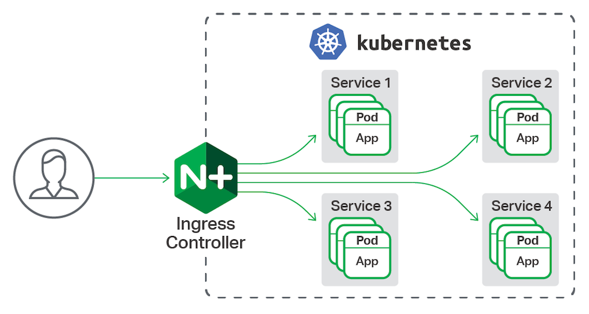

## Kubernetes

```
ㅁ Author: suktae.choi
ㅁ References:
- https://kubernetes.io/ko/docs/concepts/
- https://github.com/grepsean/k8skr-study-architecture
```

#### Index

- [Networking](networking)
- [Namespace](namespace)
- [Policies](policies)

#### Blog

- [Pod Lifecycle](https://kubernetes.io/ko/docs/concepts/workloads/pods/pod-lifecycle/)

***

**Kubernetes 는 `최대한 바라는 상태` (== spec) 로 컨테이너화된 `앱` (== object) 의 `실제 상태` (== status) 를 조율하는 플랫폼이다.**


### Master

클러스터를 `최대한 바라는 상태를 유지`하는 책임을 담당한다. 

kubectl (CLI), HTTP 등의 인터페이스를 통한 상호작용은 master 와 통신을 하는 것이다.

> `마스터`는 클러스터 상태를 관리하는 프로세스의 묶음. 주로 단일노드로 구동된다.

- kube-apiserver
  - kube api interface 를 제공 (ex. CLI 와의 통신담당)
- kube-controller-manager
  - kube-apiserver 를 통해 클러스터 상태를 감시하고, `최대한 바라는 상태` 로 만드는 event-loop
- kube-scheduler
  - 노드에 pod 을 배치하는 역할 (ex. 신규생성 or 재생성된 Pod 등)
- etcd
  - key-value storage

### Node

컨테이너화된 어플리케이션을 실행하는 단위 (VM and/or PM).

> 어플리케이션의 구성요소인 Pod 을 호스팅한다.

- kubelet
  - master 와 통신을 담당
- kube-proxy
  - kube service 의 구현체 이다. (a.k.a. network-proxy)
  - iptables, port-forwarding 등


## Terms

### Objects

영속성을 가지는 객체 (== Persistent Entity). 클러스터의 상태를 표현한다.

즉 하나의 의미가 있는 단위이고 (== 의도), 클러스터는 오브젝트의 `현재 상태`를 체크하여 `최대한 의도한 상태`로 조율한다.

- spec: 의도한 상태
- status: 현재 상태



**Container**

docker image 로 동작하는 실행단위

**Pod**

kube 애플리케이션의 기본 실행 단위. `일반적 시스템에서 1대의 서버단위`로 보면된다.

동일한 pod 내의 container 는 network/disk 을 공유한다.

> Node 는 물리적인 구분이고, 논리적인 구분단위는 Pod 이다.

```java
public class Pod {
  @OneToMany
  private Collection<Container> containers;	
}
```

**Service**

Pod 의 endpoint 를 제공합니다.

> Pod 은 자동종료/재시작 될수있어, IP 가 동적으로 변경됨

그래서 Pod 의 외부노출이 필요할때, Service 를 통해 고정된 VIP 를 제공합니다.

```java
public class Service {
  @Getter
  private Collection<Pod> pods;

  private static class Pod {
    @OneToMany
    private Collection<Container> containers;	
  }
}
```

**ConfigMap**

다른 오브젝트에서 사용할 config (== properties) 를 관리.

```bash
$ cat << EOF > boot-configmap.conf
project=boot-deployment
cluster=cluster-name
namespace=alpha
EOF

$ kubectl create configmap boot-configmap --from-file=./boot-configmap.conf
```

코드로 표현하면 이런 느낌이겠지?

```java
public interface ConfigMap {
  String project = "boot-deployment";
  String cluster = "cluster-name";
  String namespace = "alpha";
}
```

**Secret**

ConfigMap 으로 관리하기 어려운 credentials 을 관리하는 별도의 오브젝트.

***

오브젝트는 아래와 같은 yaml 를 통해 생성한다.

```yaml
apiVersion: apps/v1
kind: Deployment
metadata:
  name: 'boot-deployment'
  # object labels
  labels:
    name: api-server
    phase: alpha
spec:
  replicas: 3
  selector:
    matchLabels:
      name: api-server
  template:
    # resource labels
    metadata:
      labels:
        name: api-server
        phase: alpha
    spec:
      # pods 은 N 개의 containers 를 가질 수 있다.
      containers:
        # springboot as container
        - name: 'boot-app'
          image: 'public.registry.com/boot-app'
          imagePullPolicy: Always
          ports:
            - protocol: TCP
              containerPort: 8080
              name: http
        # nginx as container
        - name: 'boot-nginx'
          image: 'public.registry.com/boot-nginx'
          command: ["nginx", "-c", "nginx.conf", "-g", "daemon off;"]
          ports:
            - protocol: TCP
              containerPort: 80
              name: http
            - protocol: TCP
              containerPort: 443
              name: https
```

- apiVersion: kube API version (현재는 v1.x 이므로, v1)
- kind: 오브젝트의 종류
- metadata: 오브젝트의 identifier
- spec: 의도한 상태

### Controllers

Controller 는 N 개의 Pod 을 생성/운영하는 단위이다. Pod 이나 Node 장애시 failover 처리등을 스케쥴링 한다.

**ReplicaSet**

replicas 로 명시된 Pod 개수를 유지하는 역할을 담당한다.

> A group of pods

하지만 더 상위개념인 **Deployment 의 사용이 권장**된다.

**Deployement**

ReplicaSet 을 포함하는 개념으로, Replication & Pod 업데이트 & 스케일링 & Canary 배포  등을 지원하는 그룹이다.

> A group of pods with functionalities


**StatefulSet**

Deployment 와 같지만, pod 의 배포/삭제 순서 보장이 필요 할 경우 사용한다.

- 배포(생성): 0 -> 1 -> 2
- 삭제: 2 -> 1 -> 0

**DaemonSet**

Node 단위에서 (전체 or 일부) `동일한 1개의 Pod 을 운영`하는 개념.

- filebeat exporter
- prometheus node-exporter
- systemd

Pod 에서 직접 daemon process 를 실행해도 되지만, 하나의 관심사만 수행하는 Pod 의 개념과는 맞지않다.

하지만 그만큼 시스템 복잡도가 증가하니 판단이 필요하다.0

**CronJob**

`cron`과 유사하게 지정된 시간/일자에 실행되는 Job 을 생성한다.

> 시간은 master:kube-controller-manager 의 시간대를 사용한다.

Job 은 하나 이상의 Pod 을 생성하고, 명령을 수행한 후 종료된다. 배치작업이나 간단한 lambda 작업을 수행하는데 적합하다.

**[Ingress](https://kubernetes.io/ko/docs/concepts/services-networking/ingress/)**

Cluster 외부에서 내부의 서비스로 트래픽 라우팅을 담당합니다.



> 서비스는 Deployment 단위의 라우팅, Ingress 는 Cluster 단위를 라우팅을 의미한다.

클러스터 단위의 전체 라우팅을 담당하므로, 앞단에서의 로드밸런싱/circuit-breaker 등의 기능을 수행한다.

```java
@Component
public class Ingress {
  private Collection<Deployment> deployments;

  /**
   * entry point
   */
  @HystrixCommand(fallbackMethod = "routeFallback")
  public RouteResult process(Metric metric) {
    return getDeployment(metric)
      .route();
  }

  private Deployment getDeployment(Metric metric) {
    // metrics & circuit 상태를 보고, routing 할 deployment 선택 
    return deployments.get(0);
  }

  private RouteResult routeFallback() {
    // logging, alarm 등 적절한 처리
    throw new NoProperDeploymentException();
  }
}
```

기본적으로 Ingress 구현체인 Ingress Controller 는 자동 설치되지 않고, 직접 구현체를 선택해야하고, 가장 활성화된 구현체는:

- GCE (Google Compute Engine): k8s 공식지원
  - 유료
- Nginx ingress controller: k8s 공식지원
  - service-discovery 는 DNS 기반으로만 동작
  - 아직 개발중
- **Instance** (자체구현): ncc 지원
- Traefik
- **Istio** (Envoy 프록시 사용): ncc 지원예정
  - external 뿐만 아니라, internal 까지 전체지원
  - 모든 서비스에 sidecar 방식으로 envoy 가 설치되어, cluster 내부에서의 밸런싱도 가능

