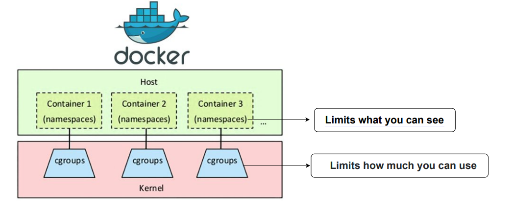
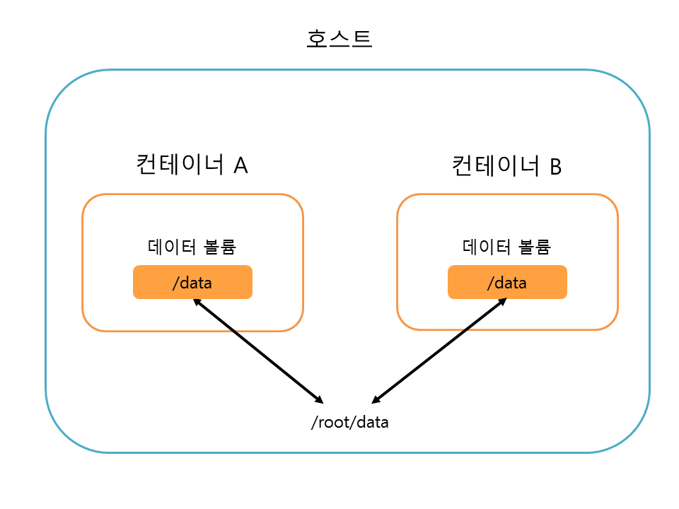
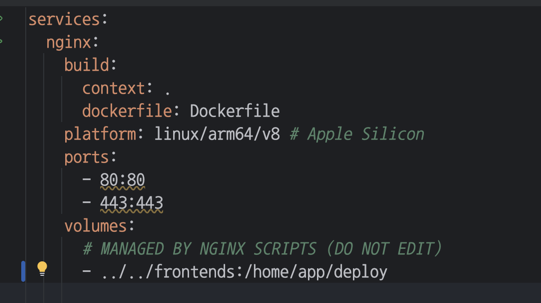
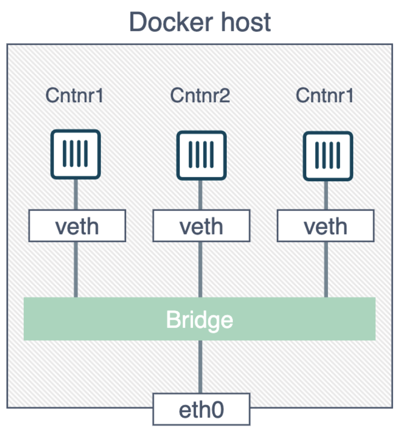
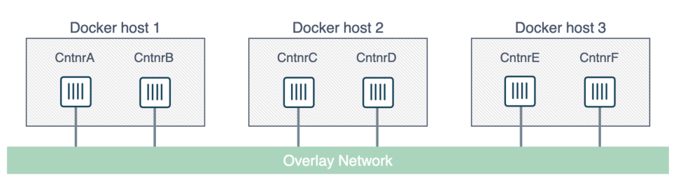
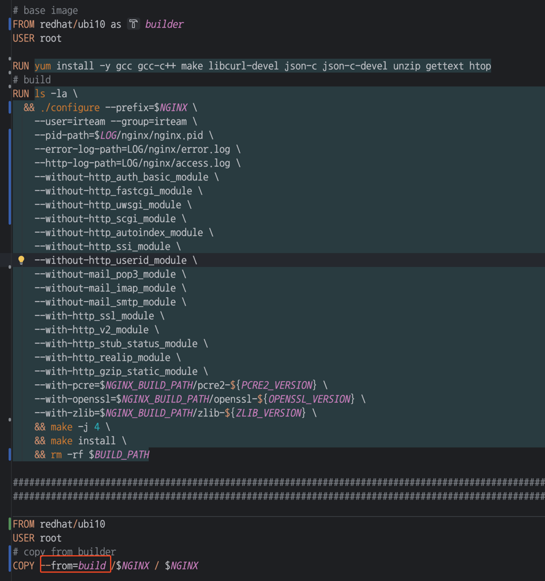

# Docker
```
https://docs.docker.com/reference/
https://pyrasis.com/jHLsAlwaysUpToDateDocker
https://velog.io/@choidongkuen/%EC%84%9C%EB%B2%84-Docker-Network-%EC%97%90-%EB%8C%80%ED%95%B4
```

## 개념
Docker 는 Host 와 동일한 커널영역을 사용하지만 
- 격리: `cgroup, namespace` 등을 활용해 컨테이너 격리 (내부적으로 system_call 호출)
- 공유: `Network, Storage` 등을 같이 같이 사용

격리된 환경 에서 호스트 자원을 공유하며 애플리케이션을 실행하는 경량 가상화 기술입니다.



## 구성요소
Docker 는 크게 3가지로 구성되어 있습니다.
- **Server (== Engine)**
  - Docker Daemon 이라고도 불리며, Host OS 의 커널을 공유하여 컨테이너를 실행합니다
- **Client (== CLI)**
  - Docker Daemon 과 API 통신하는 CLI
- **Docker Compose**
  - N개의 Dockerfile 을 동시에 실행해주는 도구 입니다

## Dockerfile
이미지를 생성할 명세를 정의합니다.

```dockerfile
# Dockerfile
# pull base image
FROM registry.docker.com/nginx/base-nginx:1.12.2

# export env
ENV NGINX_HOME /usr/local/etc/nginx
ENV CONF_HOME $NGINX_HOME/conf

# copy
WORKDIR $CONF_HOME
ADD /docker/nginx/conf .

# run
EXPOSE 80 443
CMD ["nginx", "-g", "daemon off;"]
```

기술한 Dockerfile 을 아래 명령어로 image 로 만들 수 있습니다.
```bash
$ docker build --tag nginx:20200320_145400 .
```

빌드후 registry 에 push 한 이미지를 pull 하면 현재 engine 에 저장된 이미지 목록을 확인 할 수 있습니다:
```bash
suktae@localHost /usr/local/etc/nginx $ docker images
REPOSITORY                          TAG           IMAGE ID      CREATED        SIZE
base-nginx  					   1.12.2       a8c3d87a58e7   2 days ago      831MB
nginx				              20200320_145400   65d59f58cbsb   2 days ago      833MB
```

Registry 로 부터 pull 한 이미지를 run 커맨드로 컨테이너를 실행 합니다

```bash
$ docker run -it --rm -d -p 80:80 -p 443:443 nginx:20200320_145400
```

- -it: input & tty
  - 입출력을 CLI 와 연결한다는 의미
- --rm
  - 미사용시 생성된 container 삭제
- -d
  - daemon mode 로 실행. [옵션이 필요한 이유](https://roseline124.github.io/kuberdocker/2019/07/24/docker-study05.html)
- -p {external}:{internal}
  - 포트포워딩. 기본적으로 container 는 외부와 통신이 불가능하고, 노출할 외부/내부 포트 지정필요

## Volume
Docker volume 은 `호스트 OS의 특정 경로에 저장`되고, 컨테이너는 이를 `마운트`해서 사용합니다.

> /var/lib/docker/volumes/xxx



cgroup 으로 사이즈를 제한할 수 있고, 호스트에 저장되므로 `컨테이너끼리 공유` 할 수 있습니다. 
- --volumn {HOST_경로}:{컨테이너_경로}



## Network
Docker Network 는 `컨테이너 간 통신`과 `외부 네트워크 (Host 를 통해) 연결`을 제공합니다

- Docker containers 는 아무런 설정을 하지 않으면 외부에서 접근할 수 없으며 호스트만 접근 가능합니다
- 외부 통신을 위해서 (컨테이너)의 eth0 IP:PORT 를 (호스트)의 IP:PORT 에 바인딩 해야 합니다
  - `호스트에 veth*` 이름의 가상 인터페이스 <--> `컨테이너의 eth0` 인터페이스
- veth 와 eth0 는 `Docker network` 를 통해 연결 됩니다:
  - `(기본값) bridge`
    - Host#{PORT} 와 Container#{PORT} 바인딩
    - 동일 호스트 내의 컨테이너끼리 통신 가능



```yaml
    ports:
      - 80:80 # host#port : container#port
      - 443:443
```

  - host
    - Host 의 Network 를 그대로 사용
  - overlay
    - 멀티 호스트간 통신



  - none
    - 외부 네트워크와 연결하지 않음

## [Advanced](https://docs.docker.com/develop/develop-images/dockerfile_best-practices/)
### [Multi-stage builds](https://docs.docker.com/build/building/multi-stage/)
Multi-stage builds let you reduce the size of your final image, by creating a cleaner separation between the building of your image and the final output



### Pin base image versions
FROM 구문에서 이미지 버전을 지정해서 항상 동일한 버전을 가져 올 수 있도록 합니다.

```dockerfile
FROM alpine:3.21

## cache 가 있다면 동일한/다른 이미지가 사용 될 수 있음
# FROM alpine:latest
```

만약 latest 를 사용한다면 digest 를 명시해서 같은 이미지를 지정 할 수 있습니다:
```dockerfile
FROM alpine:latest@sha256:a8560b36e8b8210634f77d9f7f9efd7ffa463e380b75e2e74aff4511df3ef88c
```

### RUN
> Here documents

&& 을 이용해서 체이닝 하는 부분을 here documents 로 작성할 수 있습니다.
```dockerfile
RUN apt-get update && apt-get install -y --no-install-recommends \
    package-bar \
    package-baz \
    package-foo
```

```dockerfile
RUN << EOF
apt-get update
apt-get install -y --no-install-recommends
    package-bar
    package-baz
    package-foo
EOF
```

> yum update -y && yum install ....

패키지 업데이트 구문과 설치 구문은 동일 라인에서 작성해야 합니다

- 기존
```dockerfile
FROM rhel:8.10
RUN yum update -y
RUN yum install -y curl
```

- 추가
```dockerfile
FROM rhel:8.10
RUN yum update -y
RUN yum install -y curl htop # htop 추가
```

각각의 RUN 구문은 새로운 layer 를 생성/캐싱 하므로 htop 은 outdated 로 설치 될 수 있습니다.

아래와 같이 하나의 RUN 구문으로 작성하면 변경 감지되어 캐싱값이 아니라 실제 실행된 결과를 사용합니다: 
```dockerfile
FROM rhel:8.10
RUN yum update -y && yum install -y curl htop
```

### Build Context
```bash
/home/usr1/workspace $ ls -l
total 8
-rw-r--r--  1 suktae  staff  1729 Mar 18 16:15 Dockerfile
drwxr-xr-x  5 suktae  staff   160 Mar 17 13:22 scripts
```

Dockerfile 이 `/home/usr1/workspace` 경로에 위치하면, 빌드시점에 /home/usr1/workspace 가 build context 가 됩니다. (상위 경로 접근 불가능)

만약 상위 Path 의 파일을 참조하고 싶으면 아래의 방법이 있습니다.

- argument 로 직접 전달
```bash
$ docker build --tag nginx:20200320 --build-arg ssl_perm=/{PATH}/ssl.pub

# Dockerfile
ARG ssl_perm	# define argument to use
ADD $ssl_perm . 
```

- volume mount
```bash
$ docker run --volume /{PATH}/ssl.pub:/container/some/where .

# Dockerfile
ADD /docker/nginx/conf .
```


