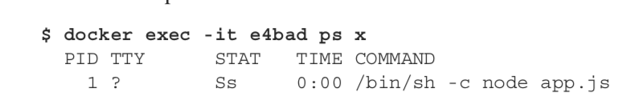
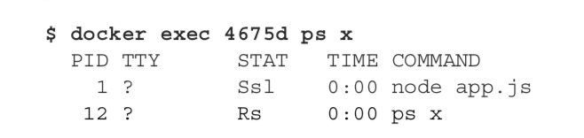

# ENTRYPOINT vs CMD
```
https://stackoverflow.com/questions/40902445/using-variable-interpolation-in-string-in-docker
```

## ENTRYPOINT 
기본적으로 실행할 명령을 정의 합니다:
```bash
$ docker run --entrypoint="echo hello" app
```
```yaml
apiVersion: v1
kind: Pod
metadata:
  name: sample
spec:
  containers:
    - image: image
      command: ["/bin/command"] # ENTRYPOINT 와 동일기능
      args: ["arg1", "arg2", "arg3"]
```

## CMD
ENTRYPOINT에 전달할 인자를 정의, CMD 자체에 실행할 명령을 정의할 수도 있습니다:
```bash
# 각각 $1, $2 로 바인딩
$ docker run app foo bar
```
```yaml
apiVersion: v1
kind: Pod
metadata:
  name: sample
spec:
  containers:
    - image: image
      command: ["/bin/command"]
      args: ["arg1", "arg2", "arg3"] # CMD 와 동일기능
```

## EXEC VS SH
### SH
```dockerfile
# using shell
ENTRYPOINT node app.js
```

내부적으로 `/bin/sh -c 'node app.js'` 으로 실행됩니다:



### EXEC
```dockerfile
# without shell
ENTRYPOINT ["node", "app.js"]
```

내부적으로 `exec('node', 'app.js')` 으로 실행됩니다:



### 실제 사용
EXEC 방식이 PID 1 로 실행되기 때문에 더 안전하다고 하지만 실제 서비스에서는 아래와 같이 사용했습니다:

```dockerfile
ENTRYPOINT /${SCRIPT}/entrypoint.sh
```

> Dockerfile 은 내부에서 관리하는 형상이므로 안전성에 대해선 걱정하지 않았고, SHELL 의 유연함을 좀 더 활용
