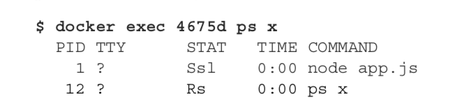

## ENTRYPOINT vs CMD

```
ㅁ Author: suktae.choi
ㅁ References:
- https://stackoverflow.com/questions/40902445/using-variable-interpolation-in-string-in-docker
```

- ENTRYPOINT 
  - 컨테이너가 시작될때 호출될 명령어 정의

```bash
$ docker run --entrypoint="echo hello" app
```

- CMD
  - ENTRYPOINT에 전달되는 인자를 정의

```bash
# 각각 $1, $2 로 바인딩
$ docker run app foo bar
```

### EXEC VS SH
SH 을 통한 실행

```dockerfile
# via shell
ENTRYPOINT echo hello
```


EXEC 을 통한 실행

```dockerfile
# without shell
ENTRYPOINT ["echo", "hello"]
```



### 사용
```dockerfile
# Dockerfile
FROM ubuntu:latest

RUN apt-get update ; apt-get -y install xxx;
ADD entrypoint.sh /bin/entrypoint.sh

ENTRYPOINT ["/bin/entrypoint.sh"] # exec 형태의 ENTRYPOINT 명령
CMD ["10"] # 실행할때 사용할 args
```

