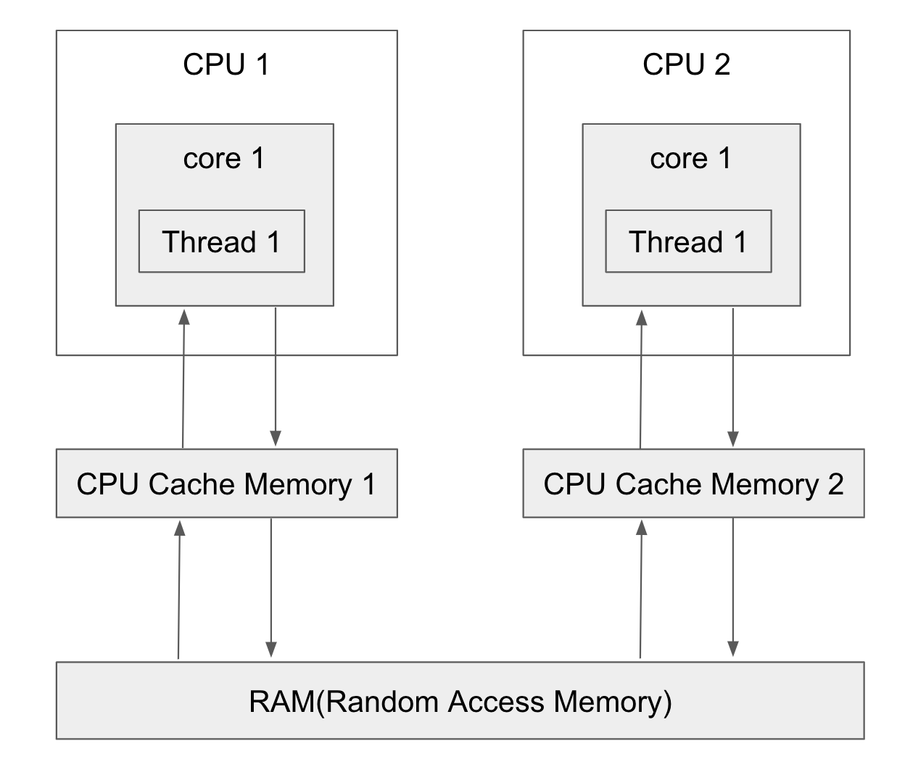

## Java Concurrency

```
ㅁ Author: suktae.choi
- http://javarevisited.blogspot.com
- http://tutorials.jenkov.com/java-concurrency/index.html
- http://www.javaworld.com/article/2078809/java-concurrency/java-concurrency-java-101-the-next-generation-java-concurrency-without-the-pain-part-1.html
- https://www.mkyong.com/spring/spring-and-java-thread-example/
- http://redutan.github.io/posts/
- http://aroundck.tistory.com/search/%EB%B3%91%EB%A0%AC
- http://tutorials.jenkov.com/java-concurrency/index.html
```

#### Index
- [Volatile](volatile)
- [Executors](executors)
- [Synchronized](synchronized)
- [Lock](lock)
- [CountDownLatch](countdown-latch)
- [CyclicBarrier](cyclic-barrier)
- [ABA Concurrency](aba-concurrency)

#### Blog
- [쓰레드풀 과 ForkJoinPool](http://hamait.tistory.com/612)
- [Difference between CompletableFuture, Future and RxJava's Observable](https://stackoverflow.com/questions/35329845/difference-between-completablefuture-future-and-rxjavas-observable)
- [CountDownLatch vs CyclicBarrier](https://docs.oracle.com/javase/8/docs/api/java/util/concurrent/CountDownLatch.html)

***

### Cores

#### Intrinsic

고유락 (a.k.a monitor) 라고 부른다. 

> 모든 Object 는 고유락을 소유함

#### Reentrancy

Thread 단위로 한번 획득한 고유락은 재진입이 가능해야한다.

```java
private static class Counter {
  private static int count = 0;

  // 묵시적 고유락 (this) 사용
  public synchronized void increment() {
    System.out.println(++count);

    decrement();
  }

  // 묵시적 획득한 고유락 (this) 사용한 재진입
  public synchronized void decrement() {
    System.out.println(++count);
  }
}
```

#### Structured

락의 획득/해제는 구조적으로 발생한다. block 단위로 진입/해지는 lock 의 획득/해제를 의미한다.

```
// 위의 예제를 보면
A 획득 - B 획득 - B 해제 - A 해제
```

이 구조를 따르지않고 programmatic 제어가 필요하면, 명시적으로 lock 을 사용해야한다.

#### [JMM (Java Memory Model)](https://www.cs.umd.edu/~pugh/java/memoryModel/jsr133.pdf) 이해

강한 메모리 모델

ㄴ 전체코어는 항상 같은 값을 바라본다

약한 메모리 모델

ㄴ 다를수 있고, 코어마다 캐시사용

JVM 은 약한 메모리 모델을 선택했다.



> 강한모델은 H/W 레벨에서 미지원시 sw 로 각 예외처리를 필요함
>
> JVM 은 multi-run 을 지향하므로 모든 예외 케이스를 감당할수 없음

자바의 동기화는 `약한 메모리 모델` 이므로 야기되는 아래 케이스를 해결하는데 초점을 둔다:

- Read: 메인메모리에서 가져오지 않고, core-cache 를 재사용하는 케이스
- Write: 메인메모리에 즉시 반영 하지않고, 일시적으로 캐시버퍼에만 쓰는 케이스

이런 맥락에서 Synchronized 의 정확한 의미는 `현재 Thread local 이 Memory 와 동기화` 하는것을 의미한다.

- Write: code block 을 벗어난 후 즉시 메인메모리에 반영하며
- Read: thread local 을 보지않고, 메인메모리를 직접 바라보게 (== volatile)

> 이런 이유로 [read 시에도](https://d2.naver.com/helloworld/1326256) 다른 Thread 가 업데이트 한 내용을 바라보게 synchronized 를 사용해야함

