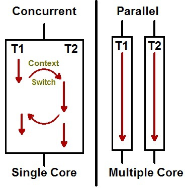

## Java Concurrency

```
ㅁ Author: suktae.choi
ㅁ References:
- http://javarevisited.blogspot.com
- http://tutorials.jenkov.com/java-concurrency/index.html
- http://www.javaworld.com/article/2078809/java-concurrency/java-concurrency-java-101-the-next-generation-java-concurrency-without-the-pain-part-1.html
- https://www.mkyong.com/spring/spring-and-java-thread-example/
- http://redutan.github.io/posts/
- http://aroundck.tistory.com/search/%EB%B3%91%EB%A0%AC
- http://tutorials.jenkov.com/java-concurrency/index.html
```

#### Index
- [Volatile](volatile)
- [Executors](executors)
- [Synchronized](synchronized)
- [Lock](lock)
- [CountDownLatch](countdown-latch)
- [CyclicBarrier](cyclic-barrier)

#### Blog
- [쓰레드풀 과 ForkJoinPool](http://hamait.tistory.com/612)
- [Difference between CompletableFuture, Future and RxJava's Observable](https://stackoverflow.com/questions/35329845/difference-between-completablefuture-future-and-rxjavas-observable)
- [CountDownLatch vs CyclicBarrier](https://docs.oracle.com/javase/8/docs/api/java/util/concurrent/CountDownLatch.html)

### Cores

#### Concurrency vs Parallel

