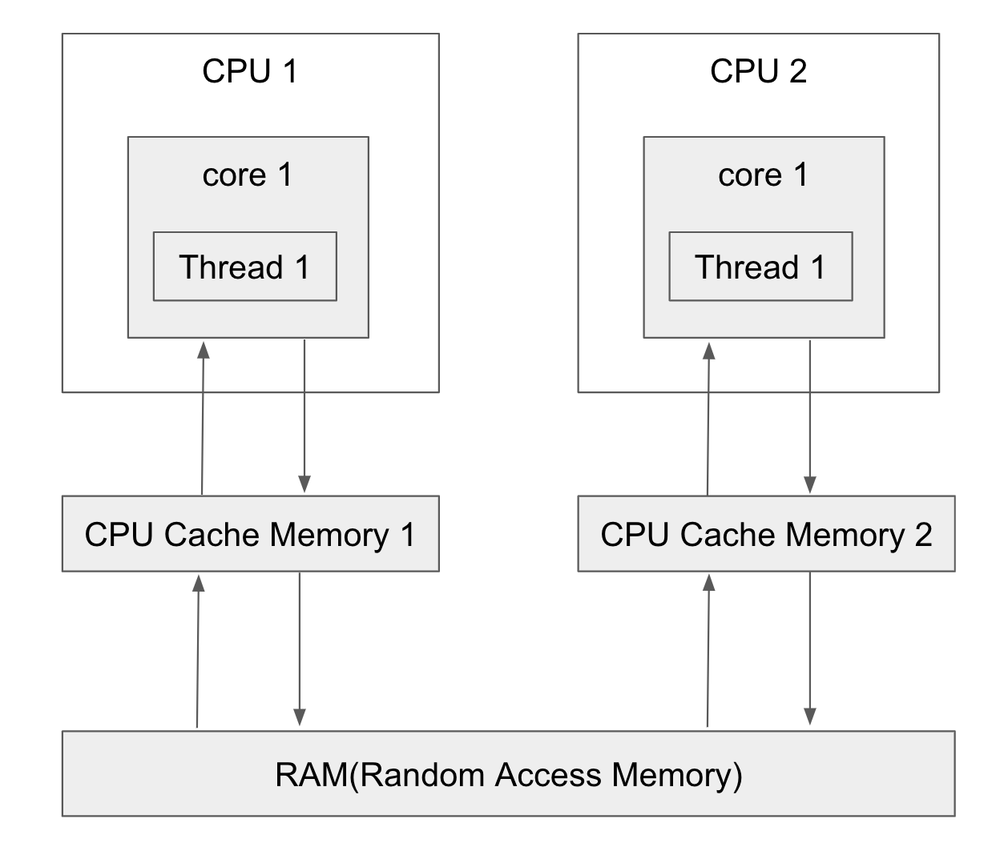

## Lock
```
ㅁ Author: suktae.choi
ㅁ References:
- http://happinessoncode.com/2017/10/04/java-intrinsic-lock/
```

### 병렬성 (Parallelism)

고전적인 예제지만, 아래 샘플을 다시한번 봐보자.

```java
private static class Counter {
  // shared
  private static int count = 0;

  public void increment() {
    System.out.println(++count);
  }
}

@Test
public void test() {
  Counter counter = new Counter();
  Runnable r1 = () -> counter.increment();
  Runnable r2 = () -> counter.increment();

  for (int i = 0; i < 50; i++) {
    r1.run();
    r2.run();
  }
}
```

> 수행할때마다 다른 결과가 나올수 있음

JVM 에서 지원하는 여러가지 방법으로 해결할수 있는 방법들은 아래와 같다:

### 동시성 라이브러리

#### Mutex

1 개의 Thread 만 read/write 접근가능

- Synchronized

특정 코드수행부분에 lock 을 건다:

```java
private static class Counter {
  private static int count = 0;
  private ReentrantLock lock = new ReentrantLock();

  public void increment() {
    // lock object
    synchronized (lock) {
      System.out.println(++count);
    }
  }
}
```

```java
private static class Counter {
  private static int count = 0;

  public void increment() {
    // lock itself
    synchronized (this) {
      System.out.println(++count);
    }
  }
}
```

> this 가 동작하는 이유 -> 모든 자바 객체는 고유락 (Intrinsic lock) 을 가지고있다 == 모니터 (Monitor) 라고도 부름

아니면 method-level 에서의 전체 lock:

```java
private static class Counter {
  private static int count = 0;

  // method lock
  public synchronized void increment() {
    System.out.println(++count);
  }
}
```

> 묵시적으로 Intrinsic lock 을 사용한다.

- Reentrancy

Thread 단위로, 한번 획득한 IntrinsicLock 이 있다면, 같은 락에 대해선 재진입 가능하다:

```java
private static class Counter {
  private static int count = 0;

  // 묵시적 고유락 (this) 사용
  public synchronized void increment() {
    System.out.println(++count);

    decrement();
  }

  // 묵시적 획득한 고유락 (this) 사용한 재진입
  public synchronized void decrement() {
    System.out.println(++count);
  }
}
```

- Structured

락의 획득/해제는 구조적으로 발생한다. block 단위로 진입/해지 시 lock 이 획득/해제 됨을 의미한다

```java
// 위의 예제를 보면
A 획득 - B 획득 - B 해제 - A 해제
```

이 구조를 따르지않고 programmatic 제어가 필요하면, 명시적으로 lock 을 사용해야한다

- ReentrantLock

명시적으로 lock 획득/해제 를 제어할 수 있다:

```java
private static class Counter {
  private static int count = 0;
  private ReentrantLock lock = new ReentrantLock();

  public void increment() {
    lock.lock();	// block until condition holds
    try {
      // ... method body
    } finally {
      lock.unlock();
    }
  }
}
```

Read/Write 의 lock 을 구분해서 관리 할 수도 있다:

```java
private static class Counter {
  private int count = 0;
  private ReentrantReadWriteLock lock = new ReentrantReadWriteLock();

  // write lock
  public void write() {
    lock.writeLock().lock();
    try {
			count++;
    } finally {
    lock.writeLock().unlock();
    }
  }
  
  // read lock
  public int read() {
    lock.readLock().lock();
    try {
      return count;
    } finally {
      lock.readLock().unlock();
    }
  }
}
```

- (재미로) 다시보는 double-check locking

```java
/**
 * 싱글톤
 **/
public Object getInstance() {
  if (INSTANCE == null) {
    // block 은 1개의 Thread 만 수행하지만, 해당 lock 을 대기하는 N 개의 쓰레드 존재가능
    synchronized (this) {
      // double-check
      if (INSTANCE == null) {
        INSTANCE = new User();
      }
    }
  }

  return INSTANCE;
}
```

#### Semaphore

N 개의 Thread 가 read/write 접근가능

```java
Semaphore semaphore = new Semaphore(/*permitted threads concurrently*/ 3);
```

### [JMM (Java Memory Model)](https://www.cs.umd.edu/~pugh/java/memoryModel/jsr133.pdf) 이해

강한 메모리 모델

ㄴ 전체코어는 항상 같은 값을 바라본다

약한 메모리 모델

ㄴ 다를수 있고, 코어마다 캐시사용

JVM 은 약한 메모리 모델을 선택했다.



> 강한모델은 H/W 레벨에서 미지원시 sw 로 각 예외처리를 다 해줘야 하는데, JVM 은 multi-run 을 지향.\
>
> 모든 케이스를 감당할수 없음

자바의 동기화는 `약한 메모리 모델` 이므로 야기되는 아래 케이스를 해결하는데 초점을 둔다:

- Read: 메인메모리에서 가져오지 않고, core-cache 를 재사용하는 케이스
- Write: 메인메모리에 즉시 반영 하지않고, 일시적으로 캐시버퍼에만 쓰는 케이스

이런 맥락에서 Synchronized 의 정확한 의미는 `현재 Thread local 이 Memory 와 동기화` 하는것을 의미한다.

- Write: code block 을 벗어난 후 즉시 메인메모리에 반영하며
- Read: thread local 을 보지않고, 메인메모리를 직접 바라보게 (== volatile)

> 이런 이유로 read 시에도 다른 Thread 가 업데이트 한 내용을 바라보게 synchronized 를 사용해야함