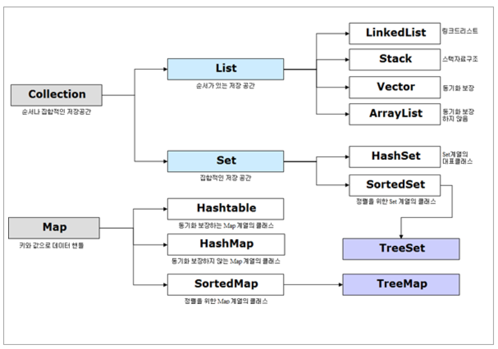

# Collection
```
https://en.wikipedia.org/wiki/Java_collections_framework
http://tutorials.jenkov.com/java-collections/index.html
```



## 읽기 전용
### java.util.Collections
- List<E> list = Collections.unmodifiableList(new ArrayList());
- Set<E> set = Collections.unmodifiableSet(new HashSet());
- Map<K, V> map = Collections.unmodifiableMap(new HashMap());

### com.google.common.collect
- ImmutableList#of
- ImmutableSet#of
- ImmutableMap#of

### java.util
- List.of
- Set.of
- Map.of

### 동시성 제어
- List<E> list = Collections.synchronizedList(new ArrayList());
- Set<E> set = Collections.synchronizedSet(new HashSet());
  - Set<E> set = new ConcurrentHashMap<>().keySet();
- Map<K,V> map = Collections.synchronizedMap(new HashMap());
  - SortedMap<K, V> m = Collections.synchronizedSortedMap(new TreeMap());

## [List](list)
중복 허용 리스트

- ArrayList
- LinkedList
- CopyOnWriteArrayList

## [Set](set)
중복 미허용 리스트

- HashSet
- LinkedHashSet
- TreeSet
  - SortedSet
  - NavigableSet
- EnumSet
- CopyOnWriteArraySet
- ConcurrentSkipListSet
  - SortedSet
  - NavigableSet

## [Map](map)
키-밸류

- HashMap
- LinkedHashMap
- TreeMap
  - SortedMap
  - NavigableMap
- EnumMap
- IdentityHashMap
- WeakHashMap
- ConcurrentHashMap
- ConcurrentSkipListMap
  - SortedMap
  - NavigableMap
  - ConcurrentNavigableMap

> Do not use Vector or HashTable those are introduced in early JDK and internally synchronized instead of concurrent package

## Stack
LIFO

- Stack

## [Queue](queue)
FIFO

- ArrayBlockingQueue
- LinkedBlockingQueue
  - LinkedBlockingDeque
- ConcurrentLinkedQueue
- DelayQueue
- LinkedTransferQueue
- SynchronousQueue
- PriorityQueue
  - PriorityBlockingQueue

## [Deque](deque)
Queue 의 양방향 enqueue/dequeue

- ArrayDeque
- ConcurrentLinkedDeque
- LinkedBlockingDeque

## [Heap](heap)
최대/최소값을 구하기 위한 우선순위큐

- PriorityQueue

