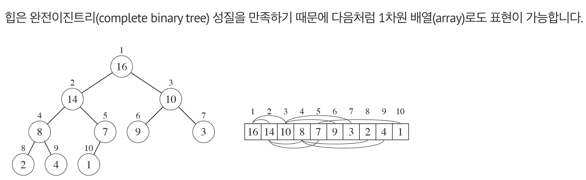
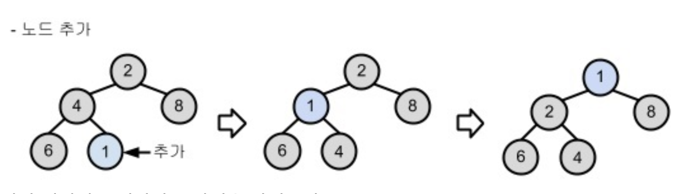
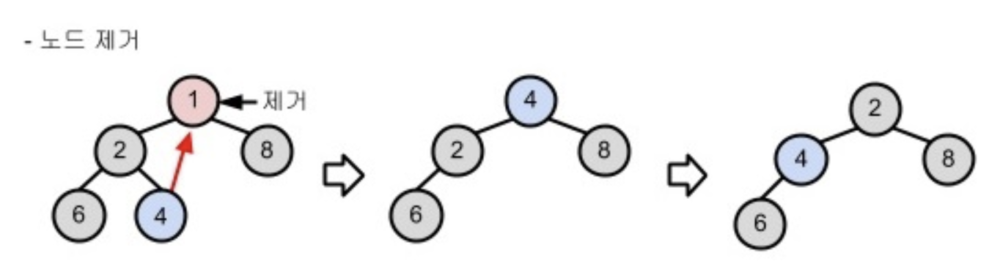
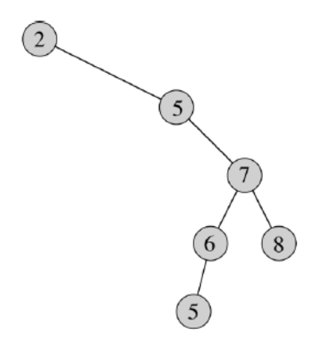
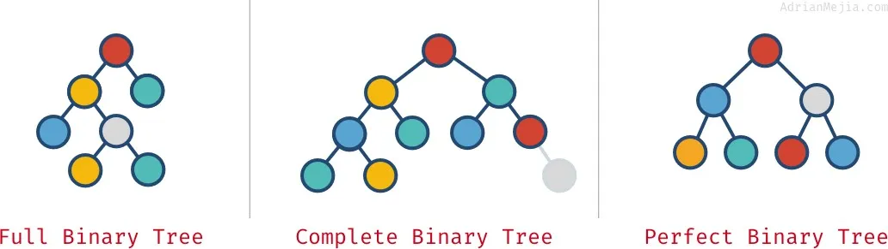
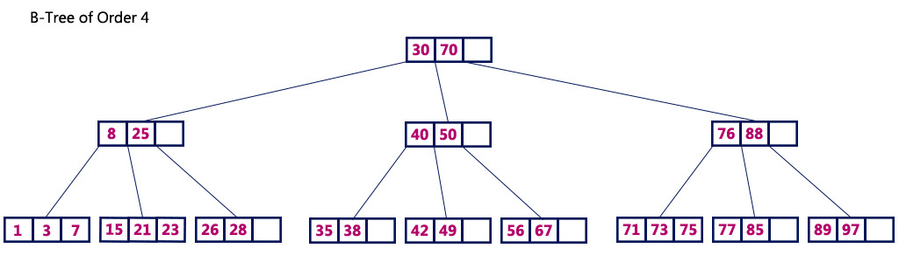
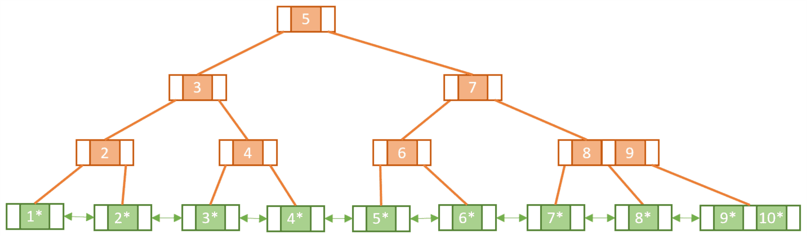

# Heap
```
https://ratsgo.github.io/data%20structure&algorithm/2017/09/27/heapsort
https://www.baeldung.com/cs/b-trees-vs-btrees
```

힙은 최대/최소값을 찾기 위해 만든 완전이진트리 입니다.

- 완전이진트리
- 부모는 자식보다 크거나, 작아야 한다 (insert/delete 시 sort 발생)
  - 부모자식의 정렬만 존재하고, 형제는 정렬되지 않음
  - Max Heap/Min Heap



## 우선순위 큐 (Priority Queue)
`부모/자식간 greater or less` 관계가 성립되므로, 힙으로 우선순위 큐를 구현 할 수 있다.

- enqueue



- dequeue



우선순위 큐는 FIFO 가 아닌, 우선순위에 따라 dequeue 됩니다.

***
## 이진트리
각 노드가 최대 두 개의 자식 노드를 가질 수 있는 트리

균형을 잡지 않으면 아래와 같이 불균형이 발생할 수 있습니다:



## 완전이진트리
이진트리 + 불균형 없이 모든 노드가 왼쪽부터 빠짐없이 채워짐 (맨 마지막 리프 제외)

힙은 완전이진트리를 이용해서 부모-자식간에 정렬을 구현한 개념



## 이진탐색트리
- 이진트리
- 전위/중위/후위 탐색

[in-order (중위순회)](https://ratsgo.github.io/data%20structure&algorithm/2017/10/22/bst) 방식으로 탐색하는데, 그때의 효율성은 아래와 같다:
- search-key K 입력됨
- 루트노드와 K 비교
  - K 가 더 크다면 left-subtree 는 don't care (데이터의 절반을 보지 않아도 됨)
- right-node 와 K 비교
  - ... 해당 과정 반복하며 효율적으로 탐색

insert/delete 가 자주 발생시 트리의 balance 가 무너질수 있고, 그때는 효율적이지 않게됩니다.

## 균형이진트리
이진트리의 불균형을 개선하기 위해 삽입/삭제시 Balancing 해서 Depth 차이가 1이상으로 발생하지 않는 트리

## 균형이진탐색트리
### [AVL 트리](https://ratsgo.github.io/data%20structure&algorithm/2017/10/27/avltree/)
AVL 트리란 서브트리의 높이를 적절하게 제어해 전체 트리가 어느 한쪽으로 늘어지지 않도록 한 이진탐색트리(Binary Search Tree)의 일종입니다.

### [Red-Black 트리](https://ratsgo.github.io/data%20structure&algorithm/2017/10/28/rbtree/)
Red-Black 트리는 다음 다섯 가지 속성을 만족하는 이진탐색트리(Binary Search Tree)의 일종입니다.

- 모든 노드는 빨간색, 검은색 둘 중 하나다.
- 루트노드는 검은색이다.
- 모든 잎새노드(NIL)는 검은색이다.
- 어떤 노드가 빨간색이라면 두 개 자식노드는 모두 검은색이다. (따라서 빨간색 노드가 같은 경로상에 연이어 등장하지 않는다)
- `각 노드~자손 잎새노드 사이의 모든 경로`에 대해 검은색 노드의 수가 같다.

## B-Tree/B+Tree
균형탐색트리 (2개 이상의 노드를 가질수 있으므로 이진이 아님)

- B-Tree
  - leaf node 가 연결되지 않음



- B+Tree
  - B-Tree 에서 leaf node 가 연결된 트리

