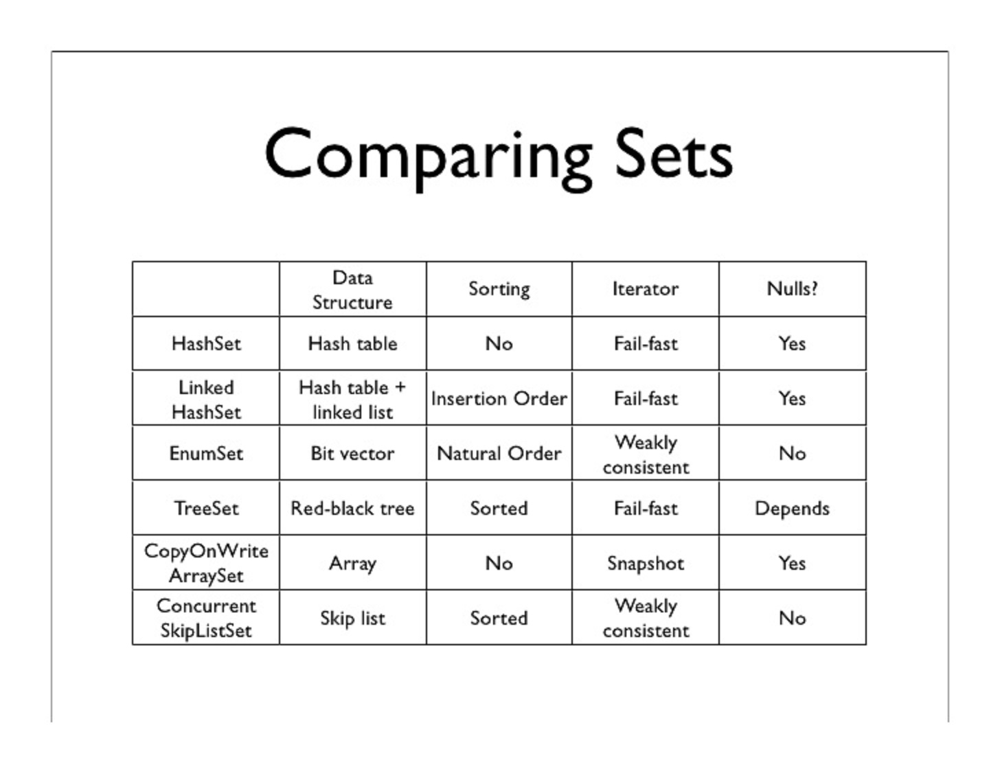

# Set
```
https://docs.oracle.com/javase/tutorial/collections/implementations/set.html
http://tutorials.jenkov.com/java-collections/set.html
http://javarevisited.blogspot.kr/2012/11/difference-between-treeset-hashset-vs-linkedhashset-java.html
http://javarevisited.blogspot.kr/2014/03/how-to-use-enumset-in-java-with-example.html
https://stackoverflow.com/questions/6720396/different-types-of-thread-safe-sets-in-java
http://minborgsjavapot.blogspot.kr/2014/12/java-8-implementing-concurrenthashset.html
```



## HashSet
정렬되지 않음

```java
Set set = new HashSet();

set.add("name");
set.remove("name");
```

## LinkedHashSet
삽입순서 정렬

```java
Set set = new LinkedHashSet();

set.add("name");
set.remove("name");
```

## TreeSet
최대/최소 정렬

```java
SortedSet set = new TreeSet();

set.first();
set.last();

set.tailSet("from");  // from ........
set.headSet("to");    // .......... to
```
```java
// NavigableSet extends SortedSet interface providing more methods
NavigableSet<Integer> set = new TreeSet();
set.add(1);
set.add(2);
set.add(3);

set.ceiling(2); // greater or equals: 2
set.floor(2);   // less or equals: 2

set.higher(2);  // greater: 3
set.lower(2);   // less: 1
```
> Comparable is required to sort or specify Comparator

> General performance for insert/delete is slower than HashSet

## EnumSet
Special purposed set to contain enums
- Natural-order

```java
EnumSet<Size> largeSize = EnumSet.of(Size.XXXL, Size.XXL, Size.XL, Size.L);
for(Size size: largeSize) {
    log.debug("size: {}", size);
}
```

## Concurrent packages
Keys in map never be duplicated, Set which being derived from keySet() can be Set

### CopyOnWriteArraySet
- Copy entire Set on write
  - Iteration can keep origin snapshot while other thread changes the value of it
- Suitable as read-only collection whose size is small enough to copy rarely if change happens

### ConcurrentSkipListSet
Natural-order
- read no-lock / write lock

### Collections.synchronizedSet(Set)
- Simple wrap of origin set with wrap synchronized-block in all methods
- read lock / write lock (entire table-lock, not row-lock)

### new ConcurrentHashMap<>().keySet()
- Set can be derived from Map
  - It could be ConcurrentHashSet

> Prior to Java 8, Collections.newSetFromMap(new ConcurrentHashMap<>()); is used
