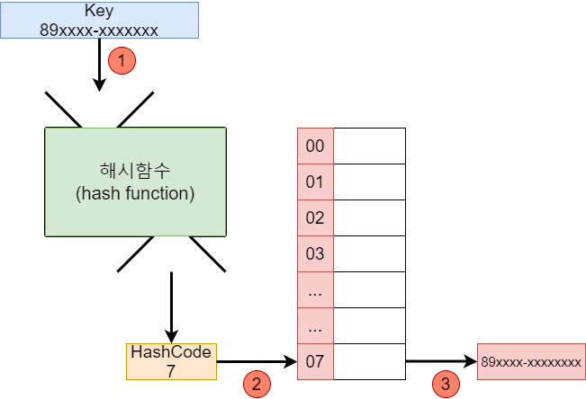

# equals() and/or hashcode()
```
https://stackoverflow.com/questions/17027777/relationship-between-hashcode-and-equals-method-in-java
https://vprog1215.tistory.com/204
```

## 특징
- 두 객체의 hashCode() 결과가 동일해도, equals() 결과는 다를수 있다
- 두 객체의 equals() 결과가 동일하면, hashCode() 값도 동일해야 한다

## 필요한 경우
HashMap (or HashSet) 은 `Object#hashcode / {bucket size}` 를 이용해서 Bucket 을 선택합니다.
- hashCode(): int 이므로 결과가 빠름

그후 동일 Bucket 에 저장된 (== Hash Collision) element 들은 `Object#equals` 의 결과를 이용해서 동등성 확인을 합니다
- equals(): boolean 이므로 모든 필드에 대한 비교가 들어가서 느림


