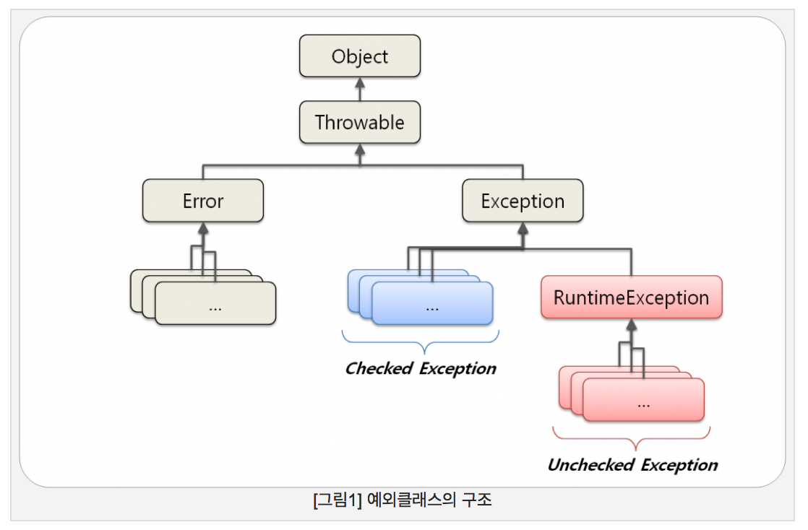

# Exception
```
https://thswave.github.io/java/exception/2015/06/28/exceptions-are-bad.html
https://dzone.com/articles/java-top-5-exception-handling
https://stackoverflow.com/questions/143622/exception-thrown-inside-catch-block-will-it-be-caught-again
```

## What is Exception
Exception is an useful way to signal that a routine could not execute normally.
 - input argument is invalid
 - a resource it relies on is unavailable
 - a condition it executed in unstable

One mechanism to transfer control, or raise an exception, is known as a `throw`. The exception is said to be thrown. Execution is transferred to a `catch`. **The exception could be caught only in `try` scope**.

```java
public static void main(String[] args) {
  try {
    // ... normal routine
  } catch(Exception ex) {
    // ... exception routine when Exception occurred
    ex.printStackTrace();
  }
}
```

## CheckedException vs UncheckedException
- CheckedException
 - `compile-time` exception
 - a subclass of `Exception`
 - a SDK that throws exception, then consumer class needs to `try ~ catch` that exception explicitly

- UncheckedException
 - `run-time` exception a subclass of `RuntimeException`
 - a runtime exception couldn't be caught in normal flow of program



## Throw inside of catch
```java
public class Catch {
    public static void main(String[] args) {
        try {
            throw new java.io.IOException();
        } catch (java.io.IOException ex) {
            System.err.println("In catch IOException: " + ex.getClass());
            // catch 에서 rethrow 하는 exception 은 상위에서 잡을수 있음 (flat-level 에서는 처리 불가)
            throw new RuntimeException();
        } catch (Exception ex) {
            System.err.println("In catch Exception: " + ex.getClass());
        } finally {
            System.err.println("In finally");
        }
    }
}
```
```
In catch IOException: class java.io.IOException
In finally
Exception in thread "main" java.lang.RuntimeException
        at Catch.main(Catch.java:8)
```
Exception thrown only inside the try block would be caught in catch block. But when you handle something inside of catch block and other exception thrown then those are not caught in flat-catch level.