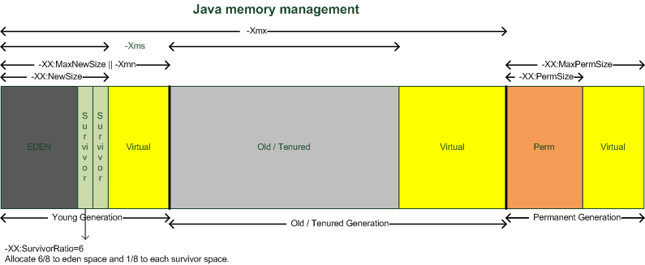

## Garbage Collection - Concept

```
ㅁ Author: suktae.choi
ㅁ Date: 2016.02.13
ㅁ References:
 - http://www.oracle.com/technetwork/tutorials/tutorials-1876574.html
 - http://javarevisited.blogspot.sg/2011/04/garbage-collection-in-java.html
 - http://javarevisited.blogspot.kr/2011/05/java-heap-space-memory-size-jvm.html

 - http://d2.naver.com/helloworld/1329
 - http://d2.naver.com/helloworld/329631
 - http://d2.naver.com/helloworld/1134732
 - http://d2.naver.com/helloworld/6043
 - http://d2.naver.com/helloworld/37111
 - http://d2.naver.com/helloworld/4717
 - http://d2.naver.com/helloworld/184615

 - https://prezi.com/bwba2m2xhive/java-garbage-collection
 - https://yckwon2nd.blogspot.kr/2014/04/garbage-collection.html
 - http://imp51.tistory.com/entry/G1-GC-Garbage-First-Garbage-Collector-Tuning
 - http://initproc.tistory.com/entry/G1-Garbage-Collection
```



### CMS (Serial, Parallel) Garbage Collection


- Young
  - Eden, From (S0), To (S1) 영역으로 구성
  - 새로 생성한 객체는 Eden 영역에 할당
- Old
  - Young 영역에서 살아남은 객체가 존재
- Permanent
  - It is not considered as a part of the Java Heap space.
  - `Class definitions` are stored here, as are `static instances`, `string pool` and `meta-data`
  - Rarely `Full GC` also comes over here to clean up this area.

#### Minor GC
- Eden 영역이 가득 차면 `Minor GC` 발생
  - Minor GC 가 발생하면 New 영역 전체에 Mark-Sweep 이 이뤄진다
  - Reference 가 있는 객체는 현재 사용되는 Survivor 영역으로 이동한다
- 다시 Minor GC 가 발생하면
- 살아남은 객체는 다른 Survivor 영역으로 이동한다 - `Aging`
  - Eden 에서 Survivor 로 이동할 객체도, 이동할 Survivor 로 할당된다
- 이 과정을 반복
- Threshold 이상의 Age 객체는 Old 영역으로 이동하게 된다 - `Promotion`

> Survivor 영역 중 하나는 반드시 비어 있는 상태로 남아 있어야 한다

> 객체의 크기가 Eden 보다 크면 바로 Old 영역으로 할당된다

#### Full GC
- Old 영역이 가득 차면 `Full GC` 발생
  - `STW(stop-the-world)` 발생 구간이다

> GC 튜닝이란 stop-the-world 시간을 줄이는 것이다

### G1 Garbage Collection


- 모든 영역이 정해져 있지 않고, Region 이라는 작은 단위로 동적할당된다
  - Young (Eden, S0, S1), Old, Humongous, Unused 로 구성
  - Region의 목표 수치는 2048으로 분활된다. 즉, 8G의 Heap이라면 하나의 Region의 크기는 4MB
    - 8192MB/2048 = 4MB

> 객체 크기가 Region의 1/2보다 큰 경우, humongous 영역으로 관리

#### Young GC (== Evacuation)
Young GC 는 Heap 이 일정 용량 이상으로 점유시 Parallel 하게 수행된다.

- Reference 가 있는 객체는 (Live object) 다음 Phase 로 이동한다
  - Eden > Survivor
  - Survivor from <> to  - `Aging`
  - Survivor > Old - `Promotion`
- Young GC (STW) 동안 Old GC 의 STW 이 발생하는 Phase 들을 조금씩 같이 수행한다

#### Old GC
`-XX:InitiatingHeapOccupancyPercent` (IHOP) 에서 정한 수치가 넘어가면 동작한다. 모든 phase 가 병렬로 처리된다

- Initial mark `(STW)`
  - `Young GC` 때 같이 수행
  - Initial marking of live object along with Young GC
- Concurrent marking
  - 별도의 Thread 로 수행 (Young GC 와 같이 수행되지 않음)
  - Mark empty region
    - 이 때부터 Young GC 와 동시 실행 가능
- Remark `(STW)`
  - `Young GC` 때 같이 수행
  - Empty regions are removed and reclaimed. Region liveness is now calculated for all regions
- Cleanup/Copying `(STW)`
  - `Young GC` 때 같이 수행
  - G1 selects the regions with the lowest "liveness", those regions which can be collected the fastest
- After Cleanup/Copying
  - Compaction

> Young GC 가 발생할때 병렬적으로 Old region 에 대해 미리 mark 해놓고, Next GC에 liveness (빨리 처리가능한) 한 region 이 같이 정리되는 구조

> 조금씩 Young GC 때 Old region 이 같이 정리되는 개념이다

#### Full GC
Old GC 를 통해 필요한 Memory 를 확보하지 못하면, Full GC 수행

- Single Thread
- STW

> 최대한 Young, Old 로 버티면서 Full GC 횟수를 줄이는 방식이지만, 한번 Full GC 가 발생하면 STW 가 길다

### Changes in JDK 8
JDK 8 에서 변경된 점
- Perm 사라짐 (MetaSpace 영역으로 바뀜 - native memory)
- PermGen 영역이 삭제되어 heap 영역에서 사용할 수 있는 메모리가 늘어났다.
- PermGen 영역을 삭제하기 위해 존재했던 여러 복잡한 코드들이 삭제
- PermGen영역을 스캔 하기 위해 소모되었던 시간이 감소되어 GC 성능이 향상 되었다.

정리하면 JDK7 까지는
- new / survive / old / perm /  native  로 구분했다면

JDK8 에서는
- new / survive / old / metaSpace 로 아키텍쳐가 변경되었고

기존의 perm에 저장되어 문제를 유발하던 static Object 는 heap으로 옮겨서 GC 대상이 되도록함
