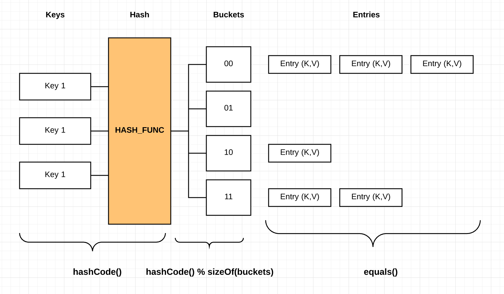
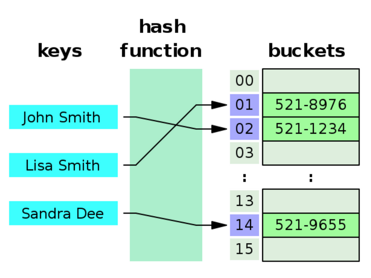
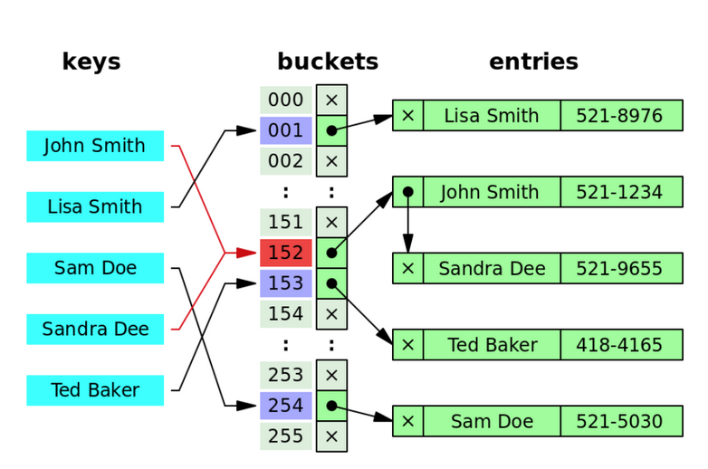

# HashMap
```
https://en.wikipedia.org/wiki/Hash_table
http://d2.naver.com/helloworld/831311
http://bcho.tistory.com/1072
http://starplatina.tistory.com/entry/%EC%9E%90%EB%B0%94-%EC%BB%AC%EB%A0%89%EC%85%98-%ED%94%84%EB%A0%88%EC%9E%84%EC%9B%8C%ED%81%AC-%EC%9D%B8%ED%84%B0%EB%B7%B0-%EC%A7%88%EB%AC%B8-40%EA%B0%9C
http://egloos.zum.com/iilii/v/4457500
```



## entrySet() vs keySet() vs values()
Most common use of iteration of Map<> is to use entrySet().

```java
@Getter
@Setter
@Builder
private static class Data {
    int a;
    int b;
    String c;
    String d;
}
// full-iteration, get Entry<Key, Value>
for (Map.Entry<String, Data> entry : map.entrySet()) {
    // ...
}

// full-iteration, get Key
for (String key : map.keySet()) {
    // ...
}

// full-iteration, get Value
for (Data value : map.values()) {
    // ...
}
```

## 해시 충돌


HashMap 의 키는 아래의 공식에 따라 버킷이 결정되고, hashing 충돌이 발생할 수 있습니다:
```
index = hashCode(KEY) % BUCKET_SIZE;
```

- hashcode == 1 % 10 => `1`
- hashcode == 11 % 10 => `1`
- hashcode == 21 % 10 => `1`
  - 모두 1번 bucket 으로 저장됨

동일 bucket 에 저장된 데이터들은 LinkedList or RedBlack-tree 에 저장되고, 순회하면서 `equals` 가 일치하는 KEY 를 검색합니다

### Equals and Hashcode
동일 Bucket 에 저장된 (== Hash Collision) element 들은 `Object#equals` 의 결과를 이용해서 동등성 확인을 합니다
- hashcode
  - KEY 의 단순 해시값을 계산하므로 빠름
- equals
  - 동일 버킷에 저장된 모든 필드를 equals 비교하고 실제 값비교이므로 느림

## 자료구조


- `TREEIFY_THRESHOLD = 8`
- 한 버킷에 8개 이상의 element 가 있으면, `LinkedList -> Red-Black Tree` 로 자료구조를 변환합니다. (탐색속도 위함)
  - 초기에는 LinkedList 를 사용

## 버킷 사이즈
전체 element 의 개수가 capacity 를 증가하면 버킷은 리사이징 됩니다:
- `DEFAULT_INITIAL_CAPACITY = 16`
- LoadFactor: 0.75
  - 16 * 0.75 == 12

버킷의 사이즈를 2배로 증가하면서 리밸런싱 합니다

> 최대한 해시충돌 확률을 줄이기 위함

### 사이즈? 자료구조
- HashMap의 전체 버킷 배열의 크기(Capacity)가 64 미만일때
- 한 버킷에 8개 이상의 요소가 있어도 바로 트리로 변환하지 않고, 먼저 HashMap의 전체 크기를 2배로 늘리는 리사이징을 시도합니다.
- `MIN_TREEIFY_CAPACITY: 64 사이즈 까지는 리사이징을 Tree 변환보다 우선으로 수행합니다`

따라서 HashMap 의 최종동작은 아래와 같습니다:
- 전체 element 가 증가하여 CAPACITY: 16 -> 32 -> 64 까지 리밸런싱
- 그후 한 버킷의 element 가 8개 이상일 경우
- 자료구조를 LinkedList -> Red-Black Tree 으로 변환
