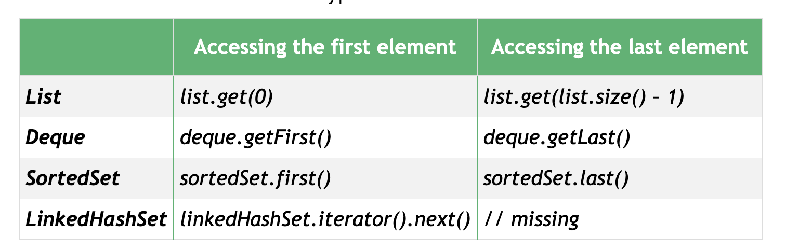
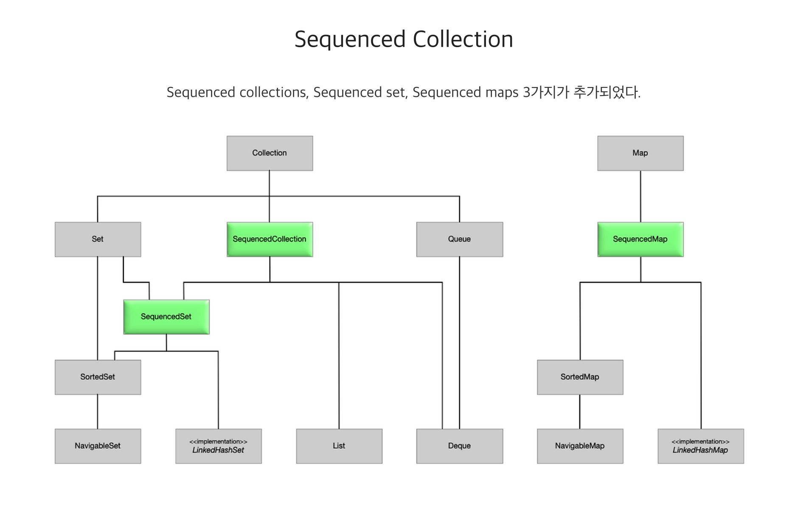
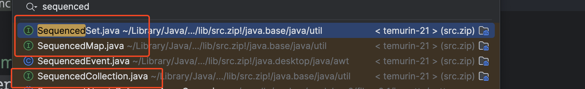
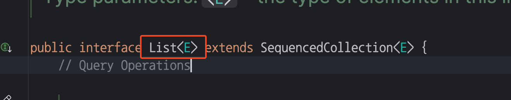
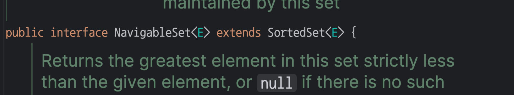
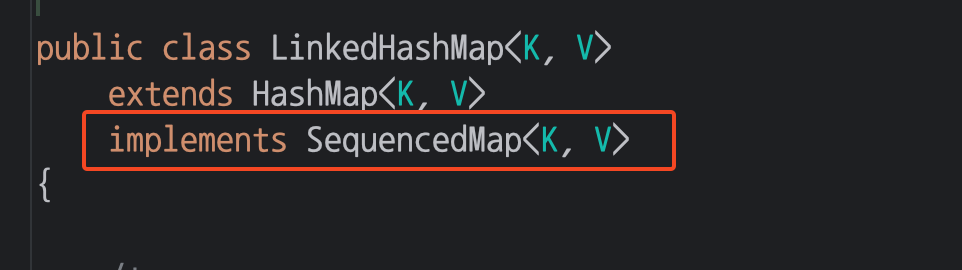

# JDK 21
```
https://www.freeblog-web.info/post/74?blogId=1
https://mangkyu.tistory.com/308
```

# JDK 18
# [Deprecate Finalization for Removal 그리고 finally](https://junhkang.com/posts/80/)
https://docs.oracle.com/javase/specs/jls/se21/html/jls-12.html#jls-12.6 의 명세를 보면
- Before the storage for an object is `reclaimed by the garbage collector`, the `Java Virtual Machine will invoke the finalizer` of that object.
  - The Java programming language `does not specify how soon a finalizer will be invoked`, except to say that it will happen before the storage for the object is reused. (호출되는 타이밍을 보장할 수 없음)
  - GC 의 발생 빈도가 증가합니다 (GC 가 실행될때 까지 리소스가 해제되지 않으므로)
  - GC 의 성능이 저하됩니다 (객체를 회수할때 finalize 를 호출하므로)
- The Java programming language imposes `no ordering on finalize method calls`. Finalizers may be called `in any order, or even concurrently`.
  - 다른 객체나 순서를 전제로 하는 코드를 작성하면 안됩니다
- If an uncaught exception is thrown `during the finalization, the exception is ignored` and finalization of that object terminates.
  - JVM GC 에 의해 호출되는 것이기 때문에, 예외가 발생해도 무시됩니다 (처리할 방법이 없음)

대안으로 `try-with-resources 및 AutoCloseable` 을 사용합니다.
- try-with-resources 구문이 종료될때 close() 메소드가 호출됩니다
  - 호출되는 타이밍을 보장할 수 있습니다
  - GC 의 발생 빈도를 줄일 수 있습니다
  - GC 의 성능이 저하되지 않습니다

# JDK 19 ~ 21
## [Pattern Matching for switch](https://medium.com/@jicholkim/pattern-matching-for-switch-0ec442268ec0)
```java
private String getAnimalSound(Animal animal) {
    // if (animal == null) throw new XYZException();
        
    return switch (animal) { // 기존 switch 는 animal null 일 때 NPE 발생
        case null -> "Animal does not exist";
        case Cat a -> a.sound(); // if (animal instanceof Cat a) { a.sound() } 처럼 타입 캐스팅 가능
        case Dog b -> b.sound();
        case Cow c -> c.sound();
        /**
         * case Chicken:
         * case Duck: {
         *    return "DDD";
         * }
         */
        case Chicken, Duck -> "DDD"; // 다수의 매칭 조건
        default -> "Unknown";
    };
}
```

## [Virtual Threads](https://d2.naver.com/helloworld/1203723)
간단한 정리 https://oss.navercorp.com/ncp/gncp-terra/issues/1165

- 생성/소멸 비용이 `마치 객체 하나 만드는 수준` 으로 매우 적음
  - 기존 스레드는 Stack 1MB 이상 할당 (`Native` 이므로 JVM 이 관리 X) & [OS 스레드와 매핑](https://openjdk.org/jeps/425#Description)되므로 생성/소멸비용이 큼
  - 가상 스레드는 Heap 으로 Stack 대체 (`Heap` 이므로 JVM 이 관리 O) & `OS 스레드와 매핑되지 않은 순수한 POJO` 이므로 생성/소멸비용 적음
  - `Context Switch 비용 감소 & 생성/소멸 비용 감소`
    - Heap 은 동일 Thread 하위 Virtual Threads 는 공유합니다 (== 스위칭 비용이 적음)
    - 스케쥴링이 OS 레벨이 아닌 JVM 에서 진행하므로 작업도중에 갑자기 OS 에서 스케쥴 전환하여 작업이 멈추는 빈도가 적어집니다 (== 스위칭의 빈도가 적음)
- 아래의 사용성은 권장되지 않습니다:
  - `JNI, synchronized 사용`
    - 상위 Platform Thread 의 lock 이 잡히므로 하위 Virtual Threads 전체가 block 됨 -> ReentrantLock 으로 전환
  - [Pooling 사용](https://openjdk.org/jeps/425#Implications-of-virtual-threads)
    - 디자인상 빠르게/많은 (수십만개) Virtual Threads 를 일회용으로 사용후 GC 로 제거되는 사용성 의도
    - Pooling 한다면 그만큼 Heap (Stack 의 저장공간이 Heap 으로 대체) 이 지속적으로 점유되므로 문제발생 가능
    - 그래서 각 요청마다 즉시 생성하는 방법으로 활용 해야 합니다 (소멸은 GC 에 위임. 일반 POJO 와 같음)
  - `ThreadLocal 사용`: `InheritedThreadLocal` 을 상위 스레드에서 사용했다면 (Platform Thread) -> 수많은 virtual threads 생성 할떄 마다 deep-copy 하므로 성능 저하
    - 하지만 ThreadLocal 의 사용성은 필요하므로 [JEP 446: Scoped Values (Preview)](https://openjdk.org/jeps/446) 제안

```java
public static void main(String[] args) {
  // 가상 스레드 생성 & 실행
  Thread.ofVirtual().start(() -> {
    System.out.println("virtual thread");
  });
  // 가상 스레드 생성
  Thread virtualThread = Thread.ofVirtual().unstarted(() -> {
    System.out.println("Deferred start");
  });
  // 가상 스레드 실행
  virtualThread.start(); // 명시적으로 시작
  // 가상 스레드 풀 생성 (Pooling 을 하는게 아니라 호출시 virtual thread 생성 - unbounded)
  try (var executor = Executors.newVirtualThreadPerTaskExecutor()) {
    for (int i = 0; i < 100; i++) {
      executor.submit(() -> {
        // do something
        return null;
      });
    }
  }

  ////////////////////////////////////////////////

  // (신규 방식) 기존 스레드 생성 & 실행
  Thread.ofPlatform().start(() -> {
    System.out.println("platform thread");
  });
  // (예전 방식) 기존 스레드 생성
  var thread = new Thread(() -> {
    System.out.println("platform thread");
  });
  // (예전 방식) 기존 스레드 실행
  thread.start();
  // 기존 스레드 풀 생성
  try (var executor = Executors.newFixedThreadPool(100)) {
    for (int i = 0; i < 100; i++) {
      executor.submit(() -> {
        // do something
        return null;
      });
    }
  }
}
```

## [Sequenced Collections](https://www.baeldung.com/java-21-sequenced-collections)
각 자료구조마다 일관성 있는 방범 (add/get/removeFirst/Last 등) 을 정의하기 위해 `정렬되거나 입력순서로 element 를 저장하는 자료구조는 Sequenced... 를 상속`하도록 개선 되었습니다:

- 문제상황


- 변경된 상속구조



- List (입력순서)


- LinkedHashSet (입력순서) & TreeSet (정렬순서)


- LinkedHashMap (맵의 KEY 가 입력순서)


# JDK 22 ~ (or JDK 21 Preview)
[Unnamed Patterns and Variables (Preview)](https://www.freeblog-web.info/post/74?blogId=1)
[Unnamed Classes and Instance Main Methods (Preview)](https://www.freeblog-web.info/post/74?blogId=1)