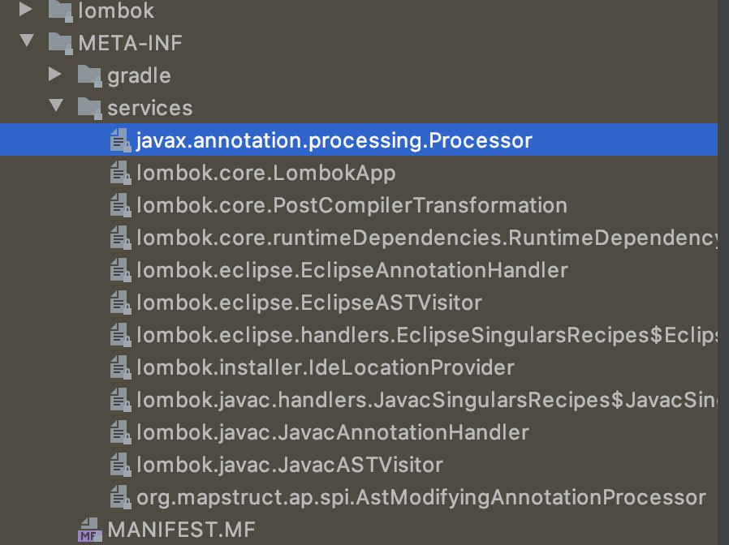

## JDK 6

```
@author: suktae.choi
- http://javarevisited.blogspot.com
- https://docs.oracle.com/javase/tutorial/index.html
```

## [Pluggable Annotation Processor](https://pluu.github.io/blog/android/2015/12/24/annotation-processing-api/)

JDK 6 에 추가된 스펙으로 compile-time 에 (모르는) annotation 이 있으면, 해당 타입을 처리할 할 Processor 를 찾아서 컴파일하는 기능이다.

JPA, Lombok 의 annotation 이 해당 프로세서를 통해서 처리된다.

### Processor

```java
public class CustomAnnotationProcessor extends AbstractProcessor {
  
  @Override
  public boolean process(Set<? extends TypeElement> annotations, RoundEnvironment env) {
    annotations.forEach(System.out::println);
    return true;
  }

  // supported annotation name
  @Override
  public Set<String> getSupportedAnnotationTypes() {
    Set<String> types = new HashSet<>();
    types.add("lombok.Getter");
    types.add("lombok.Setter");

    return supportedAnnotationTypes;
  }

  // supported java version
  @Override
  public SourceVersion getSupportedSourceVersion() {
    return SourceVersion.RELEASE_8;
  }
}
```

구조는 간단하다. `javax.annotation.processing.processor` interface 를 상속해서, 스펙에 맞춰 구현하면된다.

롬복은 #process method 에서 각 어노테이션 타입에 따라 bytecode instruction 을 통해 코드를 삽입해서 동작한다.

실행은 아래 CLI 로 확인합니다:

- -processor: annotation processor 지정

```bash
$ javac CustomAnnotationProcessor.java
$ javac -processor CustomAnnotationProcessor Application.java
```

### Jar

매번 컴파일마다 `-processor` 옵션을 주는것은 번거로우니 classpath:// 에 추가해놓고 META-INF 에 정보를 기록해서 load 도 가능합니다.

```bash
|-MANIFEST.MF
|-sample/processor/
|  `-CustomAnnotationProcessor.java`
|-META-INF/services/
   `-javax.annotation.processing.Processor`
```



의 형식으로 jar packaging 한후, `javax.annotation.processing.Processor` 파일엔 아래와 같이 기록합니다.

```bash
$ cat << EOF > META-INF/services/javax.annotation.processing.Processor
sample.processor.CustomAnnotationProcessor
EOF
```

Compiler 는 해당 jar package 를 인식할때 아래와 같이 처리합니다.

- compile 시 classpath 옵션에 있는 jar scan
- 스캔된 jar 에서 META-INF/ 하위는 JSR 269 Spec 따라,  service/javax.annotation.processing.Processor 에 지정된 클래스를 찾아서 annotation processor 로 등록
- 컴파일시 자바문법에 등록안된 annotation 이 발견되면 등록된 processor 에서 처리가능한지 확인
- Processor#getSupportedAnnotationTypes 에 지정된 타입이면 위임

만들어진 jar 를 포함해서 Application 을 빌드합니다.

```bash
$ javac -cp customProcessor.jar Application.java
```

