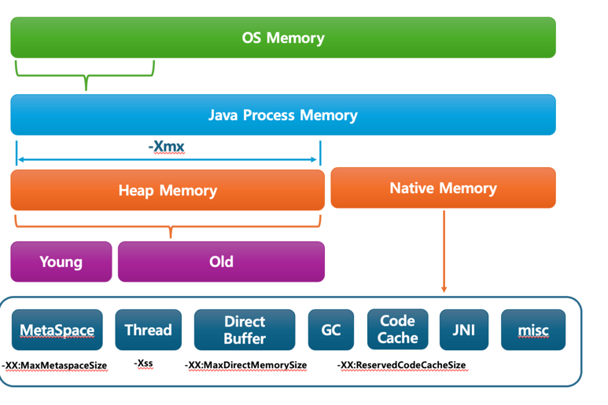
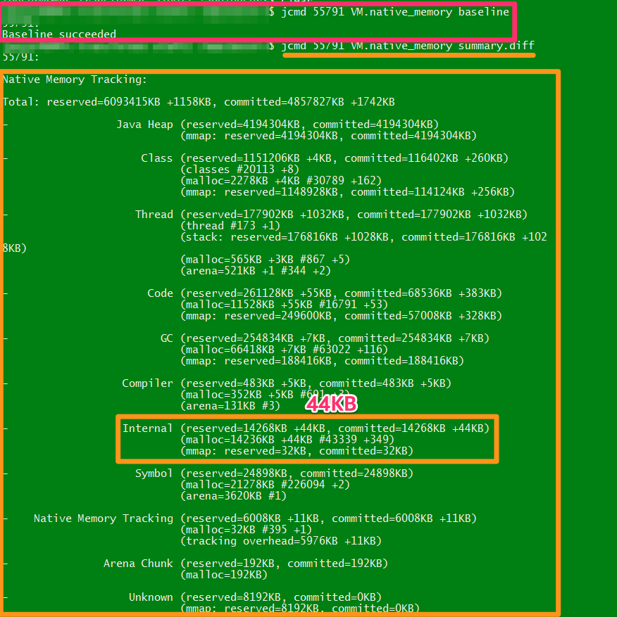

# Jemalloc

```
https://velog.io/@dbwogml15/%ED%86%A0%EC%8A%A4%E3%85%A3SLASH-22-Java-Native-Memory-Leak-%EC%9B%90%EC%9D%B8%EC%9D%84-%EC%B0%BE%EC%95%84%EC%84%9C
https://medium.com/daangn/memory-allocator-for-mongodb-1953f9cee06c
```

Logstash (JVM 기반) 의 RSS 가 지속적으로 증가하는 현상을 분석합니다

## JVM 메모리 구조
- Heap Memory
  - JVM이 GC로 관리
- Native Memory
  - OS가 직접 관리



메모리 분석시 Heap 사용량은 안정적이라서 Native Memory 의 지속적인 점유가 의심되었고, 아래의 VM Options 적용후 확인 했습니다:
```
-Xms6g
-Xmx6g
-XX:MaxMetaspaceSize=512m
-XX:MaxDirectMemorySize=2g
-XX:NativeMemoryTracking=summary
```

- -XX:MaxMetaspaceSize=512m
- -XX:MaxDirectMemorySize=2g 
- -XX:NativeMemoryTracking=summary
  - Native 영역의 메모리 트래킹 위한 설정

그후 아래의 cmd 로 트래킹 합니다:
```bash
# baseline 지정
jcmd <pid> VM.native_memory baseline

# 주기적으로 baseline 과의 diff 확인
jcmd <pid> VM.native_memory detail.diff
```



하지만 Native Memory 의 사용량 증가는 없었습니다.

> Leak 이라면 사용량 증가가 확인되야 하는데 그렇지 않음. 하지만 Grafana 를 통해 확인된 RSS (물리적인 메모리점유) 는 지속적으로 증가

Native Memory 에 JIT 영역이 있으니 [JIT Compiler 이슈](https://velog.io/@dbwogml15/%ED%86%A0%EC%8A%A4%E3%85%A3SLASH-22-Java-Native-Memory-Leak-%EC%9B%90%EC%9D%B8%EC%9D%84-%EC%B0%BE%EC%95%84%EC%84%9C) 인지 확인했습니다.

## JIT Compiler
```
nterpreter → C1(no profiling) → C1(with profiling) → C2
    0               1                    2-3            4
```
```
# C1 Compiler 사용선언 (C2 는 -XX:TieredStopAtLevel=4 사용)
-XX:TieredStopAtLevel=1
```

C2 (-server) 사용시 HotSpot VM 기반 JIT Compiler 는 많이 실행된 method 가 CodeCache 에 올라가고 (== Native Memory)
그 영역이 지속적으로 누적되면서 (free 되지 않음) RSS 점유가 가능합니다.

그래서 C1 을 사용하도록 `-XX:TieredStopAtLevel=1` 을 설정했지만 동일했습니다 

> JIT 과 반대되는 개념은 GraalVM 의 AOT (Ahead Of Time) Compiler

## 메모리 파편화
https://jobc.tistory.com/234 와 동일하게 너무 빈번한 API 호출이 지속됨으로 Native Memory Fragmentation 으로 의심했습니다.

glibc (표준 C/C++ 라이브러리) 를 사용하는 OS (RHEL, Centos 계열) 의 메모리 할당자는 (== malloc) 메모리 미회수로 인한 파편화 문제가 리포팅 되어 있습니다.
- 리포팅 https://bugs.openjdk.org/browse/JDK-8193521
- 명세 https://sourceware.org/glibc/wiki/MallocInternals#Free_Algorithm
  - malloc 은 사용완료된 메모리를 마킹하지만 즉시 회수 하지 않음 (추후 재사용을 위함 == 성능)
  - 그로인해 회수되지 않은 메모리가 누적되어 사용중 메모리 RSS (Resident Set Size)가 지속 증가

```
The free() call marks a chunk of memory as "free to be reused" by the application,
but from the operating system's point of view, the memory still "belongs" to the application.
```

Logstash 처럼 filebeat 를 통해 모든 서버의 access.log 를 수신/호출 (opensearch) 하는 인프라는 필연적으로 높은 트래픽을 처리합니다.
특히 Native Memory 를 적극적으로 사용하는 Netty 는 내부적으로 성능을 위해 ByteBuffer.allocateDirect(); 를 사용하므로 DirectBuffer 가 누적됩니다. 

> -Dio.netty.noPreferDirect=true 로도 해결되지 않음

- Non-Zero Copy
    - 성능: Heap 복사비용 발생
    - 메모리: Native 는 JNI 의 임시 영역만 잠시 사용하고 즉시 해제
- Zero Copy (== DMA)
    - 성능: Heap 복사비용 미발생
    - 메모리: JVM 의 범위를 벗어나므로 OS 에서 해제하도록 위임

OS 에서 사용하는 malloc 을 대체하는 다른 대안을 선택했습니다.

## Jemalloc
Native Memory 파편화를 해결하는 방법은 크게 2가지 입니다:
- `-XX:TrimNativeHeapInterval` 옵션을 통해 주기적으로 Native 정리
- 메모리 할당자 변경
  - `jemalloc`
    - redis, mysql 등에서 사용
    - https://publish.obsidian.md/this-is-spear/%EB%A0%88%EB%94%94%EC%8A%A4/4.+%EC%9B%90%EB%AC%B8+%EB%B6%84%EC%84%9D+-+%EB%A0%88%EB%94%94%EC%8A%A4%EC%97%90%EC%84%9C+jemalloc+%EC%82%AC%EC%9A%A9%ED%95%98%EB%8A%94+%EC%9D%B4%EC%9C%A0
  - tcmalloc
  - ptmalloc

수동 evict VM Options 을 주기보다 `회수로 마킹만 하지않고 즉시 회수하는 메모리 할당자`를 사용하는 방향을 선택했고, 그중에서 redis 및 사내 mysql 에서 선택한 jemalloc 을 적용했습니다:
```dockerfile
yum install -y jemalloc

# jemalloc 적용
ENV LD_PRELOAD=/usr/lib64/libjemalloc.so.2

# 적용 확인
$ cat /proc/{PID}/maps | grep jemalloc
```

그후 malloc 과 다르게 free 마킹된 메모리가 적극적으로 회수되어 RSS 증가 현상이 해결되었습니다