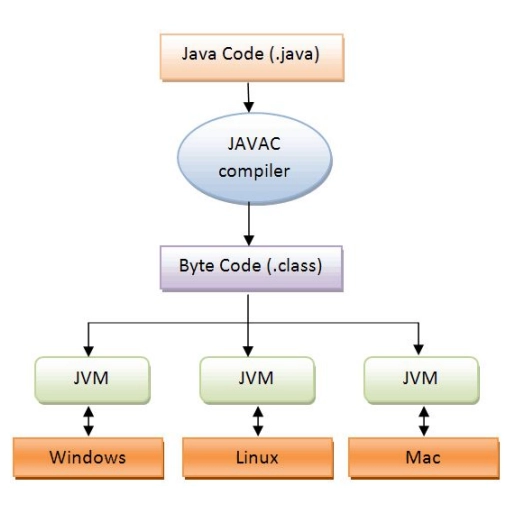
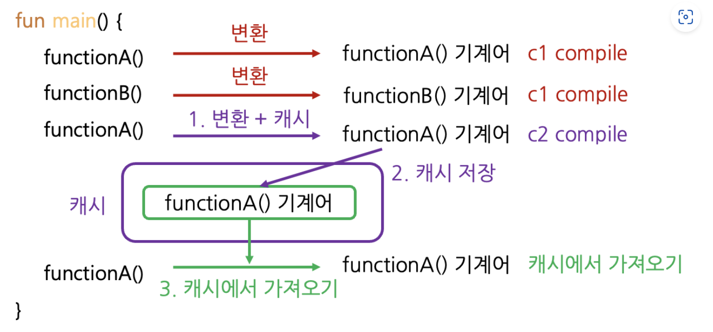

# JIT vs AOT

```
https://www.oracle.com/technical-resources/articles/java/architect-evans-pt1.html
https://docs.oracle.com/javase/8/embedded/develop-apps-platforms/codecache.htm
https://kotlinworld.com/307?category=914495
```

## JIT (Just-In-Time) Compiler
기본적으로 JVM 은 bytecode (*.class) 를 런타임에 interpret 하여 실행합니다.



하지만 interpret 를 매번하는 과정은 느리기 때문에, Hotspot VM 은 JIT (Just-In Time) 컴파일러를 사용하여 성능을 최적화 합니다.

> 기계어가 아니므로 매번 interpret 과정이 들어가서 느림

- 초기에 인터프리터를 사용해서 최적화 없이 코드를 실행
- 메서드의 호출 횟수를 추적하여 C1 and/or C2 컴파일러로 컴파일후 코드캐시에 저장
  - C1 compiler
    - `-client` 컴파일러
    - 코드 최적화는 덜하지만 즉시 시작되는 속도는 빠름
  - C2 compiler
    - `-server` 컴파일러
    - 즉시 시작되는 속도는 느리지만 최적화는 많이 되어 warm-up 후에는 빠름
- 그후 C1/C2 컴파일러로 컴파일된 코드를 사용하여 성능을 최적화



## [AOT (Ahead-Of-Time) Compiler](https://docs.spring.io/spring-boot/maven-plugin/aot.html)
JIT 컴파일러와 반대되는 개념으로 빌드 시점에 미리 컴파일하는 방식입니다.
| 항목                      | JIT (Just-In-Time) 컴파일러                            | AOT (Ahead-Of-Time) 컴파일러                            |
|---------------------------|--------------------------------------------------------|---------------------------------------------------------|
| **컴파일 시점**            | 프로그램 **실행 중(runtime)**에 컴파일됨               | 프로그램 **빌드 시(build-time)**에 미리 컴파일됨         |
| **대표 플랫폼**           | HotSpot JVM (기본 JIT), GraalVM                       | GraalVM Native Image, ART(Android), 일부 Substrate VM  |
| **초기 실행 속도**        | 느릴 수 있음 (JIT 컴파일 기다려야 함)                  | 빠름 (이미 기계어 상태)                                |
| **장기 실행 성능**        | 매우 좋음 (프로파일링 기반의 동적 최적화 가능)         | 비교적 낮음 (정적 컴파일로 제한된 최적화)              |
| **최적화 수준**           | 고급 최적화 가능 (인라인, 탈출 분석 등)               | 제한적 (런타임 정보 부족으로 보수적 최적화)             |
| **실행 파일 크기**        | 작음 (바이트코드 형태)                                | 큼 (전체 기계어 포함)                                   |
| **메모리 사용량**         | 더 높음 (JIT 캐시, 프로파일링 정보 등)                | 더 낮음 (JVM 전체 필요 없음, GC 옵션도 제한 가능)      |
| **시작 시간**             | 느림 (JIT 로딩과 초기 컴파일)                         | 매우 빠름 (이미 기계어)                                |
| **호환성**                | 높음 (표준 JVM 환경)                                 | 낮음 (네이티브 플랫폼에 종속적, reflection 제한 등)    |
| **사용 예시**             | 서버 백엔드, 웹 애플리케이션                          | CLI 앱, 서버리스 함수, 빠른 시작이 필요한 서비스         |

## GraalVM
GraalVM is a Java Development Kit (JDK) written in Java. (기존 JDK 는 C/C++ 로 작성)

> That simplifies maintenance and helps us develop and deliver new optimizations much faster
