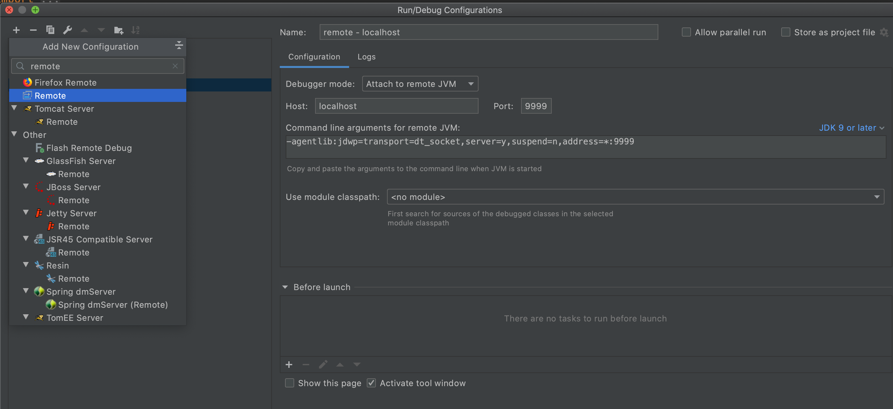

## Remote Debug

```
@author: suktae.choi
- https://www.baeldung.com/spring-debugging
```

## JAVA_OPS

JVM 옵션으로 들어갈 수 있도록, -jar 보다 앞에 들어가야한다.

> 2nd args 부터는 CLI params 으로 들어간다.

즉 아래와 같은 형식으로 실행하면 된다.

```bash
java -agentlib:jdwp=transport=dt_socket,server=y,suspend=n,address=*:9999 -jar ROOT.jar
```

- jdwp (== Java Debug Wire Protocol): JVM agent 로 내장된 jdwp 활성화
- server=y: debug connect 요청을 기다린다.
- suspend=n: bootstrap 시 debug connection 을 기다리지 않는다. (즉 실행후에 연결을 listen 하기 위함)
- address: port 지정

## IDE 설정



Run/Debug Configuration -> Remote 에서 아래와 같이 설정

- attach to remote JVM
- port: JVM 실행시 address 에 지정한 port

