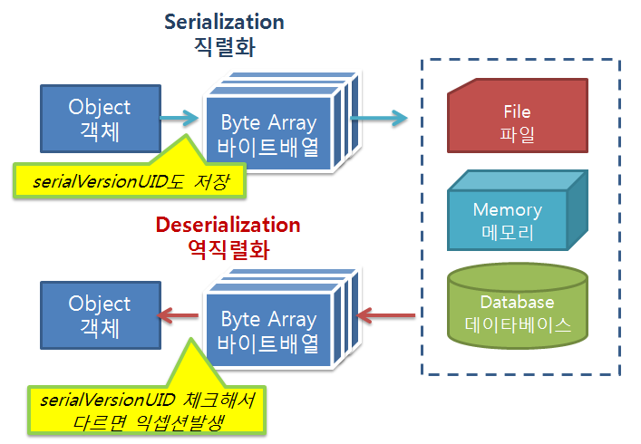

## Serializable

```
ㅁ Author: suktae.choi
- http://woowabros.github.io/experience/2017/10/17/java-serialize.html
- http://javarevisited.blogspot.kr/2011/04/top-10-java-serialization-interview.html
- http://blog.naver.com/PostView.nhn?blogId=kkson50&logNo=220564273220&categoryNo=0&parentCategoryNo=18&viewDate=&currentPage=1&postListTopCurrentPage=1&from=postView
```



### Overview

An object can be represented as a `sequence of bytes` that includes the object's data as well as `information about the object's type and the types of data stored` in the object to **transfer to other JVM or be stored as file**.

#### Serialization

Object to array of bytes.

 - required: `implements java.io.Serializable`
 - excepted `transient` or `static` fields

```java
// using pure-java
private byte[] convertToBytes(Object object) throws IOException {
  try (ByteArrayOutputStream bos = new ByteArrayOutputStream();
       ObjectOutput out = new ObjectOutputStream(bos)) {
    out.writeObject(object);
    return bos.toByteArray();
  } 
}

// using apache.commons
private byte[] convertToBytes(Object object) throws IOException {
	return SerializationUtils.serialize(object);
}
```

#### Deserialization

Array of byte[] to object.

- required: has the same `serialVersionUID`
  - If the SUID is not declared for a class, the value defaults to the hash for that class

```java
// using pure-java
private Object convertFromBytes(byte[] bytes) throws IOException, ClassNotFoundException {
  try (ByteArrayInputStream bis = new ByteArrayInputStream(bytes);
       ObjectInput in = new ObjectInputStream(bis)) {
    return in.readObject();
  } 
}

// using apache.commons
private byte[] convertToBytes(byte[] bytes) throws IOException {
	return SerializationUtils.deserialize(bytes);
}
```

#### Other serial/deserialization

- JSON
- XML
- CSV
- ...

#### When to use it

The system purely stored/transfer java serialized byte[] are:

- cache
- session
- RMI (== RPC)

### Concerns

#### Add and/or Delete fields

no problem

### Modify field (type)

will throw exception

```java
java.lang.ClassCastException: cannot assign instance of java.lang.String to field ...
```

#### Why declare serialVersionUDI explicitly

serialVersionUID is checked while deserialization in store in file system or transfer to network. JVM automatically generate UID value based on its algorithm and might be vary each JVM's version.

It causes unexpected `InvalidClassException` once It tries to read stored data after upgrading JVM version or different client with its own JVM's.

#### Size

Serialized values contains class meta (ex. size, field names), that means size of value is bigger than any other ways like JSON.

```java
@Test
public void sizeTest() {
  Member member = new Member();
  // ... configure
  
  // java serialized
  byte[] bytes1 = SerializationUtils.serialize(member);
  
  // json serialized
  String memberJson = objectMapper.writeValueAsString(member);
  byte[] bytes2 = memberJson.getBytes(StandardCharsets.UTF_8.name());
  
  assertTrue(bytes1.length >= bytes2.length)
}
```

