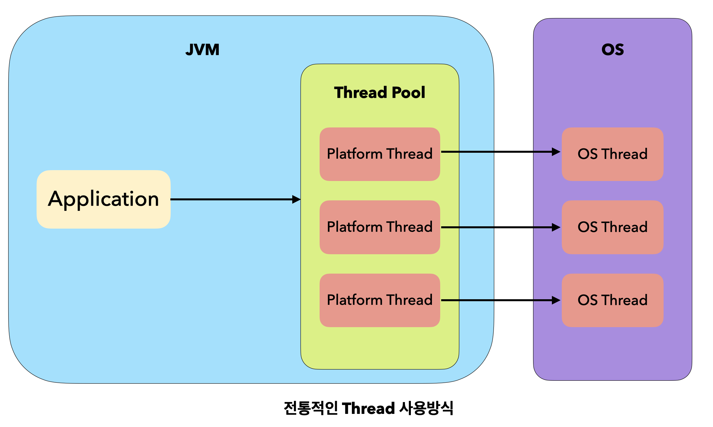

# Virtual Thread

```
@author: suktae.choi
- https://findstar.pe.kr/2023/04/17/java-virtual-threads-1/
- https://www.azul.com/blog/jdk-21-delivers-virtual-threads-other-new-features-and-long-term-support/
```

1개의 thread 는 스택 및 메타정보 할당을 위해 2MB 정도의 메모리를 사용합니다

- 2000 thread 정도일때 4G 정도 사용해서 tomcat OOM 발생하는걸 보면 대략 맞는 수치
- virtual thread 는 2K 정도 사용

thread가 blocking 연산을 할 때 CPU 할당은 그대로 유지되지 않고 다른 thread로 할당됩니다

- 효율적으로 관리되긴 하지만 context switch 에 따른 비용 발생

## OS thread

기존 thread 는 OS thread 와 1-1로 매핑됩니다. (메모리 대략 2MB 정도 사용)



virtual thread 는 OS thread 와 N-1 매핑됩니다. (메모리 대략 2K 정도 사용)


- blocking 발생시 context-switching 하지 않고 다른 virtual thread 실행
- OS thread 와 N-1 매핑이므로 적은 메모리 사용