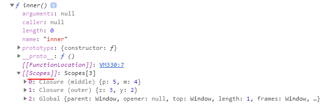

## Closure

```
ㅁ Author: suktae.choi
ㅁ References:
- https://medium.com/sjk5766/lexical-scope-closure-%EC%A0%95%EB%A6%AC-41f5d1c928e4
```

## Lexical scope

함수와 변수의 scope 를 선언시점으로 정함

## Dynamic scope

함수와 변수의 scope 를 호출시점으로 정함

> Javascript 는 lexical scope 이다.

## Closure

(lexical scope) 선언시점의 scope chain 에 접근가능한 함수

> Closure란 자신이 생성된 시점의 환경을 기억하는 함수

```javascript
var x = 1;

function outer(z) {
  var y = 2;
  
  return function middle(p) {
    var m = 4;
    
    return function inner() {
      console.log(x + y + z + m + p)
    }
  }
}

var middle = outer(3);
var inner = middle(5);

console.dir(inner);
```



각각의 outer, middle 은 호출과 동시에 종료되었는데, inner function 은 선언시점의 scope chain

- middle
- outer
- global

에 여전히 접근이 가능하다.