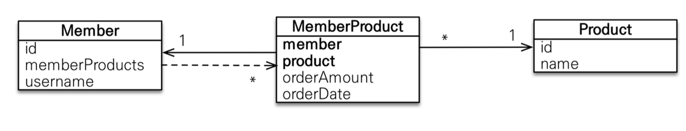
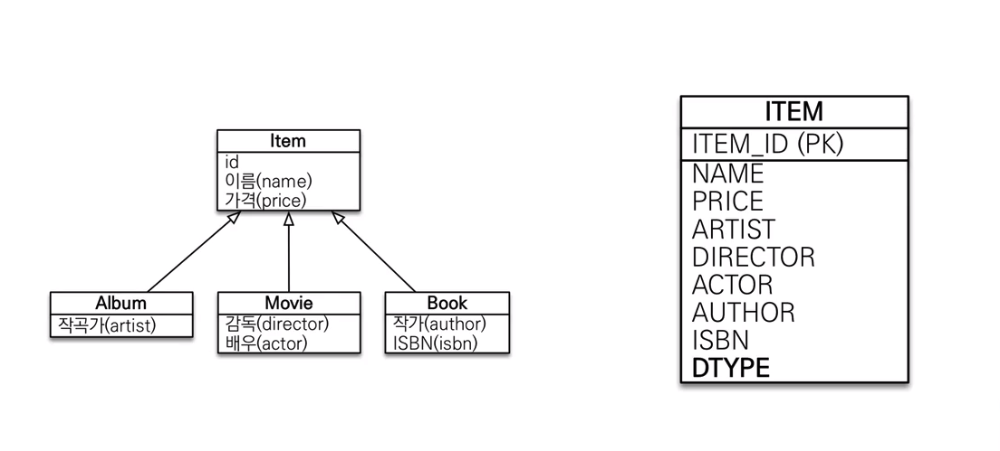
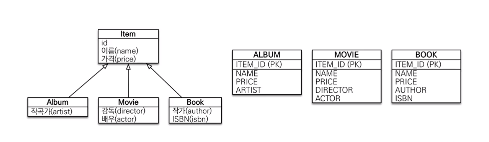
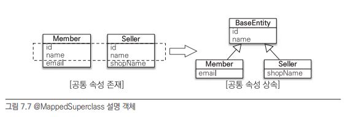
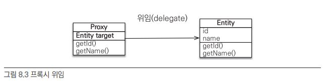
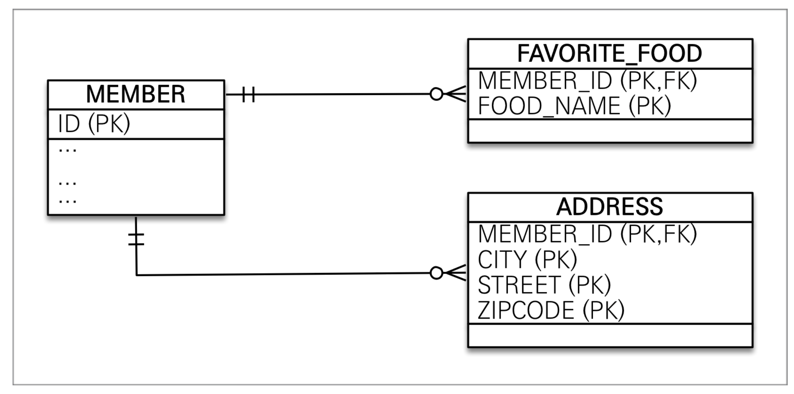

# JPA

```
@author: suktae.choi
- http://arahansa.github.io/docs_spring/jpa.html
- https://www.nowwatersblog.com/jpa/ch1
- https://en.wikibooks.org/wiki/Java_Persistence/Relationships#Common_Problems
```

### Index

- [FetchType.LAZY vs EAGER](lazy-eager)
- [EnumCodeConverter](enum-code-converter)
- [JPQL](jpql)
- [Spring Data JPA](spring-data-jpa)
- [Persistence Context](persistence-context)

### Blog

- [JPA Best Practices](https://github.com/cheese10yun/spring-jpa-best-practices)
- [JPA에서 대량의 데이터를 삭제할때 주의해야할 점](https://jojoldu.tistory.com/235)
- [JPA N+1 문제 및 해결방안](https://jojoldu.tistory.com/165)
- [순환참조를 해결하는 방법](http://binarycube.tistory.com/1)
- [JPA 프로그래밍 정리](https://github.com/cheese10yun/TIL/blob/master/Spring/jpa/jpa.md)

### Versions

- [Version history](https://en.wikipedia.org/wiki/Jakarta_Persistence)

***

## Persistence Context

entityManager 에서 관리되는 객체를 의미합니다. 영속상태는 아래의 조건을 만족하면 됩니다:

- (신규) new Object(); 를 통해 생성된 자바 객체를 \#save
- (조회) \#find 를 통해 조회한 entity

> 영속성은 tx 단위마다 생성됩니다 (정확히는 hibernate session 단위)

EntityManager 는 thread-safe 하지 않으므로, 공유하면 안되고 @PersistenceContext 를 통해 주입해야 합니다

- 일반적인 bean 으로 주입하면 안됩니다
  - thread 단위로 생성해야 하므로, singleton 이 기본인 bean 으로 사용 불가능
- @PersistenceContext 를 통해 주입받으면
  - EntityManagerFactory#createEntityManager 을 통해 생성하거나
  - 진행중인 transaction 이 있다면 -> tx 에서 사용중인 em 획득

## 기본키 매핑

- IDENTITY: auto increment 등 처럼 DB 에 위임
- SEQUENCE: 생성할 시퀀스를 지정 (generator)
- TABLE: 키 생성 전용 테이블 사용
- AUTO: dialect 에 따라 hibernate 에서 3가지 방식중 선택

## 컬럼 매핑

- @Column: 모든 컬럼에 정의 (생략시 묵시적으로 적용되지만, 명시하는게 나음)
- @Enumerated: ENUM 지정
- @Temporal: date, time, datetime 지정 (기본값은 datetime 이 모두 표현되는 timestamp)
- @Lob: clob (longtext), blob (나머지)
- @Transient: JPA 에서 관리하지 않을 field
- @Access
  - field 직접 접근 (private 이라도 접근)
  - getter/setter 통한 접근

## 연관관계 매핑

### @OneToMany/@ManyToOne

- @OneToMany(mappedBy = B)
  - 연관관계 대상
  - mappedBy 으로 연관관계 주인 필드명 지정
- @ManyToOne; @JoinColumn
  - 연관관계 주인 (F.K 을 정의한 쪽이 주인 입니다)
  - @JoinColumn 으로 F.K 지정

```java
/**
 * User Entity
 */
@OneToMany(fetch = FetchType.LAZY, mappedBy = "user")
private Set<Order> orders = new LinkedHashSet<>();

/**
 * Order Entity
 */
@ManyToOne(fetch = FetchType.LAZY)
@JoinColumn(name = "USER_ID")
private User user;
```

### @OneToOne

- 주 테이블에 F.K 정의
  - proxy 를 통한 lazy-load 가 가능합니다 (F.K is not null 이면 대상이 존재함이 보장되므로 proxy 사용가능 즉 eager 불필요)
    - proxy 가 아직 row 를 조회하진 않았지만 존재유무는 알아야 하므로 (proxy 와 null 은 다르다) 존재유무에 대한 보장이 필요
- 대상 테이블에 F.K 정의
  - eager-load 만 가능합니다

```java
/**
 * User Entity
 */
@OneToOne(mappedBy = "user")
private Order order = new LinkedHashSet<>();

/**
 * Order Entity
 */
@OneToOne(fetch = FetchType.LAZY)
@JoinColumn(name = "USER_ID")
private User user;
```

### @ManyToMany

- @JoinTable
  - 연관관계 주인이 @JoinTable 을 명시합니다 (@JoinColumn 과 동일함)
  - 연관관계 대상은 mappedBy 를 명시합니다

```java
@ManyToMany(fetch = FetchType.EAGER)
@JoinTable(name = "TABLE_NAME", joinColumns = @JoinColumn(name = "PERSON_ID"), inverseJoinColumns = @JoinColumn(name = "PRODUCT_ID"))
@Where(clause = "DEL_YN <> 1")   // 유효한 상품만 조회
@Fetch(FetchMode.SUBSELECT)
private Set<Order> orders = new LinkedHashSet<>();

@ManyToMany(mappedBy = "orders")
private Set<User> users = new LinkedHashSet<>();
```

@JoinTable 방식은 `joinColumns/inverseJoinColumns` 을 통해 2개의 컬럼만 사용가능해서 테이블 확장이 불가능합니다.

그래서 별도의 매핑테이블을 만들고 (대상1) OneToMany -- ManyToOne (매핑테이블) ManyToOne -- OneToMany (대상2) 로 연결하는게 확장성이 있습니다



## 상속관계 매핑

### @Entity 를 상속하는 방법

- InheritanceType.JOINED
  - 부모테이블이 존재하고, 자식테이블은 JOIN 으로 상속관계를 구현합니다
  - 단순조회시 JOIN 이 발생하고, INSERT 시 2번씩 쿼리가 수행됩니다


  
```java
@Entity(name = "PersonInfo")
@Table
@Inheritance(strategy = InheritanceType.SINGLE_TABLE)
@DiscriminatorFormula("case when LOCT_TP in ('A','B) then 'KR' when LOCT_TP in ('C') then 'JP' else 'US' end")
public abstract class PersonInfo {
    @Column("name")
    private String name;

    @Column("LOCT_TP")
    @DiscriminatorColumn("type")
    private LocationType locationType;
}
```

- InheritanceType.SINGLE_TABLE
  - 1개의 테이블에 부모/자식의 모든 컬럼을 표현합니다
  - 모든 자식테이블의 컬럼을 nullable 로 정의해야하고, 테이블 사이즈가 커집니다



```java
@Entity(name = "PersonInfo")
@Table(name = "PERS_INFO")
@Inheritance(strategy = InheritanceType.SINGLE_TABLE)
@DiscriminatorColumn(name = "LOCT_TP")
public abstract class PersonInfo {
    @Column("name)
    private String name;

    @Column("LOCT_TP")
    private LocationType locationType;
}

@DiscriminatorValue("KR")
public class KrPersonInfo extends PersonInfo {
    // ..
}
```

- InheritanceType.TABLE_PER_CLASS
  - 자식테이블 각각에 필요한 컬럼이 (부모에 선언한) 정의되는 형태입니다 
  - 자식테이블을 함께 조회할때 UNION 을 사용해야하므로, 일반적으로 추천하지 않습니다



```java
// ...
```

### @MappedSuperClass 를 상속하는 방법

- @MappedSuperClass
  - @AttributeOverride: 상속시 컬럼을 재정의 할때 사용
  - @AssociationOverride: 상속시 연관관계를 재정의 할때 사용



```java
@Getter
@MappedSuperclass
public abstract class BaseEntity<ID extends Serializable> {
    @Column(name = "REGR_INFO")
    @CreatedDate
    private Instant regDate;

    @Column(name = "MODR_INFO")
    @LastModifiedDate
    private Instant modDate;
    
    @Version
    @Column(name = "VER")
    private Long version;
}

@Entity
public class Person extends BaseEntity<String> {
    // ...
}
```

자식 Entity 는 @MappedSuperClass 에 정의된 모든 컬럼을 직접 소유하므로 `InheritanceType.TABLE_PER_CLASS` 와 동일한 형태로 구성됩니다.

> @Entity 는 @Entity or @MappedSuperClass 가 선언된 클래스만 상속 할 수 있습니다

## 복합키 매핑

테이블간의 결합을 막고, 부모 > 자식 > 손자로 이어지는 상속구조에서 식별관계는 P.K 가 길어지는 단점 있어서 `비식별관계`로 Entity 를 구성하는게 권장됩니다.

그리고 복합키 사용시 조회할때 복합키 생성이 필요한 단점이 있어 F.K 는 그대로 유지하고, 별도의 P.K 를 선언해서 사용하는 방식이 좀 더 낫습니다.

### 식별 vs 비식별 관계

- 식별관계
  - 부모테이블의 기본키를 자식테이블에서 기본키 + 외래키로 사용합니다
- 비식별관계
  - 부모테이블의 기본키를 자식테이블의 외래키로만 사용합니다

### @IdClass vs @EmbeddedId/@Embeddable
선언에 대한 문법적인 차이는 있지만, 복합키를 사용한다 의 관점은 동일합니다.

대신 JPQL 로 보면 아래의 차이가 있습니다:

```sql
# @IdClass
SELECT account.accountNumber FROM Account account;

# @EmbeddedId (복합키로 인해 1-depth 추가)
SELECT book.bookId.title FROM Book book;
```

### @OneToOne 식별관계
@OneToOne 관계일때 같은키로 P.K 을 선언하는 것을 의미합니다.

@MapsId 및 @JoinColumn 을 같이 선언해서 문법상 가능하지만 항상 N+1 이 발생합니다. 그래서 연관관계의 주인이 F.K 을 가지고 @JoinColumn 해서 lazy 하는 방식이 더 낫습니다

### 기타사항 // TODO - 정리필요
onetoone lazy 가 안되는 이유
- proxy 는 null 을 wrapping 할 수 없음
- 그래서 존재함이 보장되는 대상의 P.K 를 가지고 있어야함 (not null 이어야만 proxy 가능하므로)

그럼 oneToMany 는 연관관계 주인이 아니라서 joinColumn 하지 않아 동일하게 대상 존재유무를 모르는데 lazy 가능한 이유는?
- oneToMany 는 Collection 이고, collection 은 empty 표현가능
- proxy 는 empty collection 을 wrapping 하면되므로, 식별자가 없어도 무방
- onetoone 은 객체이므로, null or exist 라서 null 을 표현하지 못하는 proxy 의 한계가 있음

## 조인테이블 매핑

매핑테이블을 별도로 지정하는 방식입니다. 즉 연관관계를 맺으려면

- 테이블에 F.K 가 있다면 -> @JoinColumn
- 매핑 테이블에 F.K 가 있다면 -> @JoinTable

으로 사용하면됩니다.

```java
@ManyToOne
@JoinTable(name = "PARENT_CHILD", // 매핑할 조인 테이블 이름
  joinColumns = @JoinColumn(name = "CHILD_ID"), // 현재 엔티티를 참조하는 외래 키
  inverseJoinColumns = @JoinColumn(name = "PARENT_ID") // 반대방향 엔티티를 참조하는 외래 키
)
private Parent parent;
```

## 여러 테이블 매핑

1개의 Entity 가 여러개의 테이블을 매핑하는 것도 문법적으로 가능합니다. 가능은 하지만 테이블과 엔티티를 일대일로 정의하는게 맞습니다

```java
@Entity
@Table(name="BOARD")
@SecondaryTable(name="BOARD_DETAIL",
    pkJoinColumns = @PrimaryKeyJoinColumn(name="BOARD_DETAIL_ID"))
public class Board { ... }
```

## Proxy



LAZY 로 설정된 연관관계는 Proxy 를 만들고 실제 객체의 참조를 관리합니다. (즉 실제로 값을 사용하는 시점에 N+1 로 DB 조회)

Proxy 는 원본 엔티티를 상속받은 객체이므로 타입 체크시 주의해야 합니다.

> 아래와 같이 `HibernateProxy or PersistentCollection` 타입이고 concrete type 은 initialize 후 비교가능

```java
public final class Hibernate {
    public static void initialize(Object proxy) throws HibernateException {
        if (proxy == null) {
            return;
        }

        if (proxy instanceof HibernateProxy) {
            ((HibernateProxy)proxy).getHibernateLazyInitializer().initialize();
        } else if (proxy instanceof PersistentCollection) {
            ((PersistentCollection)proxy).forceInitialization();
        }
    }
}
```

### EAGER 

엔티티 조회시 join 으로 연관관계를 같이 가져옵니다.

이때 기본적으로 left join 이지만, not null 임을 알려준다면 inner-join 으로 쿼리가 실행됩니다:

- @JoinColumn(nullable = false)
- @ManyToOne(fetch = FetchType.EAGER, optional = false)
  - 관계의 매핑이 not null 이다. 라고 표현하므로 좀더 객체지향적인 접근 (column not null 은 DB 적인 관점)

### LAZY

엔티티 조회시 연관관계를 같이 가져오지 않고 Proxy 로 대체합니다. (그후 실제로 데이트를 사용하는 시점에 N+1 발생)

기본적으로 모든 매핑은 LAZY 로 설정하고 필요시 JPQL (querydsl or jooq) 로 FetchJoin 하는 방식이 낫습니다

### CASCADE

특정 엔티티를 영속 상태로 만들 때 연관된 엔티티도 함께 영속 상태로 만들수 있습니다.

> 영속성 전이를 사용하면 부모 엔티티를 저장할 때 자식 엔티티도 함께 저장

### Orphan Removal

부모에서 자식의 참조 제거시 자식 엔티티가 삭제되도록 설정 할 수 있습니다.

```java
@Entity
public class Parent {
    @Id @GeneratedValue
    private Long id;
    
    @OneToMany(mappedBy = "parent", orphanRemoval = true)
    private List<Child> children = new ArrayList<Child>();
    // ...

    public static void main(String[] args) {
        Parent parent = repository.findById(anyLong());
        parent.getChildren().remove(0);
    }
}

// DELETE FROM CHILD WHERE ID = ?
```

### DDD (CASCADE + Orphan Removal)

Aggregate Root 에서 연관관계를 관리할때 CASCARD, OrphanRemoval 을 모두 사용해서 관리할면 편리합니다

## 데이터 타입

### @Embedded/@Embeddable

새로운 유형의 (값) 클래스를 직접 정의해서 사용 가능합니다:

> 기존 @EmbeddedId/@Embeddable 와 동일한 사용성입니다. (대상 컬럼이 P.K 인지 단순 값인지의 차이만 존재) 

```java
@Entity
public class Member {
    @Id @GeneratedValue
    private Long id;
    private String name;
    @Embedded Address homeAddress; // 집 주소
}

@Embeddable
public class Address {
    @Column(name = "city") // 매핑할 컬럼 정의 가능
    private String city;
    private String street;
    private String zipcode;
    // ..
}
```

### @ElementCollection/@CollectionTable



값 클래스를 Collection 으로 정의 가능합니다:

```java
@Entity
public class Member {
    @Id @GeneratedValue
    private Lzong id;
    @Embedded
    private Adzdress homeAddress;

    @ElementCollection(fetch = FetchType.LAZY)
    @CollectionTable(name = "FAVORITE_FOODS", joinColumns = @JoinColumn(name = "MEMBER_ID"))
    private Set<String> favoriteFoods = new HashSet<String>();
    
    @ElementCollection(fetch = FetchType.LAZY)
    @CollectionTable(name = "ADDRESS", joinColumns = @JoinColumn(name = "MEMBER_ID"))
    private Set<Address> addressHistory = new ArrayList<Address>();
}
```
```sql
# @Embedded
INSERT INTO MEMBER (ID, CITY, STREET, ZIPCODE) VALUES (1, '통영', '몽돌해수욕장 , 660-1231);

# @ElementCollection 을 사용하는 string 타입
INSERT INTO FAVORITE FOODS (MEMBER_ID, FOOD_NAME) VALUES (1, "짬뽕");
INSERT INTO FAVORITE_FOODS (MEMBER_ID, FOOD_NAME) VALUES (1, "짜장");

# @ElementCollection 을 사용하는 @Embedded 타입
INSERT INTO ADDRESS (MEMBER_ID, CITY, STRBET, 2IPCODE) VALUES (1, '서울', '강남', '123-1231);
INSERT INTO ADDRESS (MEMBER_ID, CITY, STREET, 2IPCODE) VALUES (1,  '서울', '강북 , 1000-0001);
```

@OneToMany 과 동일하게 데이터가 추가되지만 (@CollectionTable 으로 별도 테이블 사용) 차이점은 아래와 같습니다:

- @OneToMany
  - @Entity 와의 관계
  - P.K 에 대한 제약이 없습니다
  - @Id 식별자가 있습니다 
- @ElementCollection
  - @Embedded 와의 관계
  - `대상 테이블의 모든 컬럼을 P.K 로 잡아야 합니다`
  - @Id 식별자가 없습니다

`@ElementCollection 으로 표현되는 관계는 모두 @OneToMany 로 표현 가능` 합니다. 제약이 없는 일대다 관계로 설정하는게 낫습니다