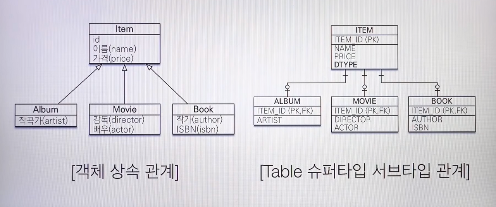

# JPA

```
@author: suktae.choi
- http://arahansa.github.io/docs_spring/jpa.html
- https://en.wikibooks.org/wiki/Java_Persistence/Relationships#Common_Problems
- https://docs.jboss.org/hibernate/orm/5.1/userguide/html_single/Hibernate_User_Guide.html
- https://zhangyuhui.blog/2018/01/29/jpa-transaction-hibernate-session-jdbc-connection-and-db-transaction/
```

### Index
- [Object-Oriented Query Language](object-oriented-query-language)
- [FetchType.LAZY vs EAGER](lazy-eager)
- [EnumCodeConverter](enum-code-converter)
- [OSIV](osiv)
- [JPA Best Practices](https://github.com/cheese10yun/spring-jpa-best-practices)

### Blog
- [JPA에서 대량의 데이터를 삭제할때 주의해야할 점](https://jojoldu.tistory.com/235)
- [JPA N+1 문제 및 해결방안](https://jojoldu.tistory.com/165)
- [순환참조를 해결하는 방법](http://binarycube.tistory.com/1)
- [JPA 프로그래밍 정리](https://github.com/cheese10yun/TIL/blob/master/Spring/jpa/jpa.md)

***

## session-connection-transaction

- Open session (Hibernate)
- Open physical connection (JDBC)
- tx begin;
- ... CRUD
- commit; or rollback;
- Close physical connection
- Close session



> Keep session connected until at end of view resolving is `OSIV` pattern

## Persistence context


entityManager 에서 관리되는 객체를 의미한다.

생성된 자바객체는 \#save 를 통해 영속성상태가 되거나, \#find 를 통해 DB 에서 조회된 entity 가 해당된다.

```java
// POJO is persisted
User user = new User();
entityManager.persist(user);

// Selected POJO
User user = CRUDRepository.findOne(id);
```

- dirty-check: JPA 는 최초 영속성 상태가된 객체의 스냅샷을 관리하고, 최종 commit 시 변경이 있다면 update/delete query 를 발생한다.
- proxy-init: lazy-load 로 프록시만 들고있는데, 실제 property 에 접근해서 객체를 가져오는것

> 영속성은 tx 단위마다 생성 -> (좀더 정확히는 hibernate session 단위생성)

## OSIV

service 에서 tx 가 닫혔고 (detached 됨, lazy-loading 인 관계는 proxy 만 hold 하고 있는 상태)
뷰 렌더딩 시점에 proxy 만 가지고있는 연관 entity 에 접근하면 에러발생 (프록시 초기화 (proxy-load) 는 persist 상태일때만 가능하다)
: fetch-join 으로 모든 entity 를 load 한 후, tx 종료(세션닫힘, detached 로 됨. 하지만 이미 내용은 가지고있음)

## w/o transaction

- means

You do not have to create transaction to use JPA EntityManager and underlying Hibernate Session, if you just perform readonly Hibernate calls and **without lock** on entities, transaction is not necessary. However, most other write operation involved EntityManager calls ask for transaction to be provided, otherwise there will be some TransactionRequiredException thrown out.

- scope

명시적 tx 선언유무에 따라, session 유지기간이 다르고 그에따라 아래와 같이 다른점이 생긴다:

```java
/**
 * session-per-request patterns
 */
@Transactional	// session-connection-tx opened, AOP
public void updateUser(Long id) {
  User user = userRepository.findOne(id);
  user.setName("changed");
}	// session-connection closed, AOP

// console 결과
changed
```

```java
/**
 * session-per-operation patterns (anti)
 */
public void updateUser(Long id) {
	// session-connection-tx is opened implicitly for select, and tear-down
  User user = userRepository.findOne(id);
  // user is no longer persist-managable
  user.setName("changed");
}

// console 결과
기존데이터
```

## Session context (== 정리필요)

- entityManager 는 application-scope 으로 관리됨
- session 은 hibernate 설정에 따르 context 결정
  - thread 로 설정되어 있다면
- implicit tx 가 시작된다면
  - session opened
  - JDBC opened
  - tx begin; commit; or rollback;
  - JDBC closed
  - session closed
- 그다음 implicit tx 시작시
  - entityManager.getCurrentSession();
  - session 이 threadLocal 단위로 관리되므로, mark as closed 
  - exception throws

```java
// hibernate 설정
props.put(org.hibernate.cfg.Environment.CURRENT_SESSION_CONTEXT_CLASS, "thread");

// SessionFactoryImpl - threadLocal 에 세션 저장
else if ( "thread".equals( impl ) ) {
  return new ThreadLocalSessionContext( this );
}

public User getUser(Long id) {
  User user = new User(id);
  user.setName(userService.getName(id));	// implicit session open and mark closed
  user.setAddress(userService.getAddress(id));	// session fetches from threadLocal and fail

  return user;
}

// console 결과
sessionAlreadyClosedException
```

## EntityManager

The EntityManager works with PersistenceContext and if it's not provided the EntityManager creates one.

스프링에서는 @Bean 으로 관리하고, `@PersistenceContext` 로 주입받아 사용한다.

## TransactionManager

The TransactionManager is responsible for creating, commiting and ... tranactions based on annotations you provide

### JPA 기본개념

### 기본키 매핑

IDENTITY - auto increment 등 처럼 DB 에 위임
SEQUENCE - 생성할 시퀀스를 지정 (generator)
TABLE - 키 생성 전용 테이블이 있고, 그걸 지정

### 컬럼매핑

@Column
@Temporal - date, time, datetime 지정 (기본값은 datetime 이 모두 표현되는 timestamp)
@Lob - clob (char[], string), blob (나머지)
@Transient - ORM 에서 관리하지 않을 field

@Access - 접근제어레벨

- field 직접 접근, private 이라도 접근
-  property getter/setter 통해서 접근

### 연관관계 매핑

- OneToOne (무조건 1-1 로 존재해야함, 매핑이 optional 이면 1-1 이라고해도, oneToMany 로 매핑)
- OneToMany(mappedBy=B)
  - mappedBy 는 주인이 아닌곳에
- ManyToOne
- manytomany

@JoinColumn - 연관관계테이블의 키매핑에 사용, 생략가능

```java
/**
 * 단방향 매핑
 */
@OneToMany(fetch = FetchType.LAZY)
@JoinColumn(name = "SEQ_ID", referencedColumnName = "USER_ID")
private Set<Usery> Users = new LinkedHashSet<>();
```

- 단방향: joinColumn (생략가능) 으로 key-만 지정 + 연관관계annotation 사용 (mappedBy 미사용)
- 양방향: 연관관계 annotation 사용 (mappedBy 로 owner 지정해야함)

### 상속관계 매핑

- @Inheritance

N 개의 타입으로 상속관계매핑이 필요한 경우

```java
@Entity(name = "PersonInfo")
@Table(name = "PERS_INFO")
@Inheritance(strategy = InheritanceType.SINGLE_TABLE)
@DiscriminatorFormula("case when LOCT_TP in ('A','B) then 'KR' when LOCT_TP in ('C') then 'JP' else 'US' end")
public abstract class PersonInfo {
    @Column("name)
    private String name;
    
    @Column("LOCT_TP")
    @DiscriminatorColumn("type")
    private LocationType locationType;
}


```

컬럼당 1개의 상속관계가 정의된다면

```java
@DiscriminatorValue("KR")
public class KrPersonInfo extends PersonInfo {
    // ..
}

@Entity(name = "PersonInfo")
@Table(name = "PERS_INFO")
@Inheritance(strategy = InheritanceType.SINGLE_TABLE)
@DiscriminatorColumn(name = "LOCT_TP")
public abstract class PersonInfo {
    @Column("name)
    private String name;
    
    @Column("LOCT_TP")
    private LocationType locationType;
}

@DiscriminatorValue("KR")
public class KrPersonInfo extends PersonInfo {
    // ..
}
```

- @MappedClass - 컬럼에 영향을 끼치지 않음 (단순 코드상 상속)

### 복합키 매핑

@IdClass

@EmbeddedId - Embeddable

### 조인테이블 매핑

매핑테이블을 별도로 지정하는 방식이다

@JoinTables


