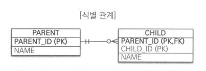
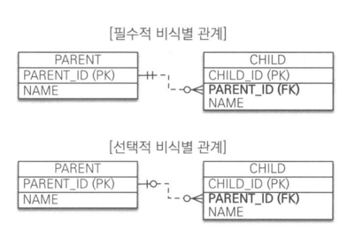

# JPA
```
https://arahansa.github.io/docs_spring/jpa.html
https://github.com/SoonMyeong/jpa-study/tree/master
https://en.wikibooks.org/wiki/Java_Persistence/Relationships#Common_Problems
```

### Index
- [JPQL](jpql)
- [Proxy](proxy)
- [Spring Data JPA](spring-data-jpa)
- [Persistence Context](persistence-context)
- [연관관계 매핑](relation-mapping)
- [상속관계 매핑](inheritance-mapping)

### Blog
- [JPA Best Practices](https://github.com/cheese10yun/spring-jpa-best-practices)
- [JPA에서 대량의 데이터를 삭제할때 주의해야할 점](https://jojoldu.tistory.com/235)
- [JPA N+1 문제 및 해결방안](https://jojoldu.tistory.com/165)
- [순환참조를 해결하는 방법](http://binarycube.tistory.com/1)
- [JPA 프로그래밍 정리](https://github.com/cheese10yun/TIL/blob/master/Spring/jpa/jpa.md)

### [Versions](https://jakarta.ee/specifications/persistence/)
- JPA 2.2 
  - streaming (cursor 지원)
- JPA 3.0
  - package renamed javax -> jakarta
- JPA 3.1
- JPA 3.2
- JPA 4.0

***
## 객체 그래프 탐색
Proxy 를 이용해서 `어떤 연관관계의 객체`까지 탐색할지를 `SQL 에서 선언 시점에 결정` 이 아닌 지연로딩 방식의 Proxy 를 통해 `사용 시점에 결정` 할 수 있게 합니다.

> 물론 Lazy loading 을 사용한다면 N+1 이 발생하므로 fetchJoin 을 통해 미리 로딩하는게 나음

## 복합키
테이블간의 결합을 막고, 부모 > 자식 > 손자로 이어지는 상속구조에서 식별관계는 P.K 가 길어지는 단점 있어서 `비식별관계`로 Entity 를 구성하는게 권장됩니다.

`복합키는 조회시 복합키 생성이 필요한 단점`이 있어 F.K 는 그대로 유지하고, 별도의 P.K 를 선언해서 사용하는 방식이 좀 더 낫습니다. (비식별 관계)
- 식별관계
  - 부모테이블의 기본키를 `자식테이블의 기본키 + 외래키`로 사용합니다



- 비식별관계
  - 부모테이블의 기본키를 `자식테이블의 외래키`로만 사용합니다



### @IdClass vs @EmbeddedId/@Embeddable
문법적인 차이는 있지만 기능을 동일 합니다 (OOP 관점으로 보면 @EmbeddedId 가 좀더 나음)
대신 JPQL 로 보면 아래의 차이가 있습니다:
```java
//@EmbeddedId
em.createQuery("select p.id.id1, p.id.id2 from Parent p"); 

//@IdClass
em.createQuery("select p.idl, P.id2 from Parent p");
```

## 데이터 타입
### @Embedded/@Embeddable
새로운 유형의 (값) 클래스를 직접 정의해서 사용 가능합니다:

> 기존 @EmbeddedId/@Embeddable 와 동일한 사용성입니다. (대상 컬럼이 P.K 인지 단순 값인지의 차이만 존재) 

```java
@Entity
public class Member {
    @Id @GeneratedValue
    private Long id;
    private String name;
    @Embedded Address homeAddress; // 집 주소
}

@Embeddable
public class Address {
    @Column(name = "city") // 매핑할 컬럼 정의 가능
    private String city;
    private String street;
    private String zipcode;
    // ..
}
```

### @ElementCollection/@CollectionTable


값 클래스를 Collection 으로 정의 가능합니다:

```java
@Entity
public class Member {
    @Id @GeneratedValue
    private Lzong id;
    @Embedded
    private Adzdress homeAddress;

    @ElementCollection(fetch = FetchType.LAZY)
    @CollectionTable(name = "FAVORITE_FOODS", joinColumns = @JoinColumn(name = "MEMBER_ID"))
    private Set<String> favoriteFoods = new HashSet<String>();
    
    @ElementCollection(fetch = FetchType.LAZY)
    @CollectionTable(name = "ADDRESS", joinColumns = @JoinColumn(name = "MEMBER_ID"))
    private Set<Address> addressHistory = new ArrayList<Address>();
}
```
```sql
# @Embedded
INSERT INTO MEMBER (ID, CITY, STREET, ZIPCODE) VALUES (1, '통영', '몽돌해수욕장 , 660-1231);

# @ElementCollection 을 사용하는 string 타입
INSERT INTO FAVORITE FOODS (MEMBER_ID, FOOD_NAME) VALUES (1, "짬뽕");
INSERT INTO FAVORITE_FOODS (MEMBER_ID, FOOD_NAME) VALUES (1, "짜장");

# @ElementCollection 을 사용하는 @Embedded 타입
INSERT INTO ADDRESS (MEMBER_ID, CITY, STRBET, 2IPCODE) VALUES (1, '서울', '강남', '123-1231);
INSERT INTO ADDRESS (MEMBER_ID, CITY, STREET, 2IPCODE) VALUES (1,  '서울', '강북 , 1000-0001);
```

@OneToMany 과 동일하게 데이터가 추가되지만 (@CollectionTable 으로 별도 테이블 사용) 차이점은 아래와 같습니다:

- @OneToMany
  - @Entity 와의 관계
  - P.K 에 대한 제약이 없습니다
  - @Id 식별자가 있습니다 
- @ElementCollection
  - @Embedded 와의 관계
  - `대상 테이블의 모든 컬럼을 P.K 로 잡아야 합니다`
  - @Id 식별자가 없습니다

`@ElementCollection 으로 표현되는 관계는 모두 @OneToMany 로 표현 가능` 합니다. 제약이 없는 일대다 관계로 설정하는게 낫습니다
