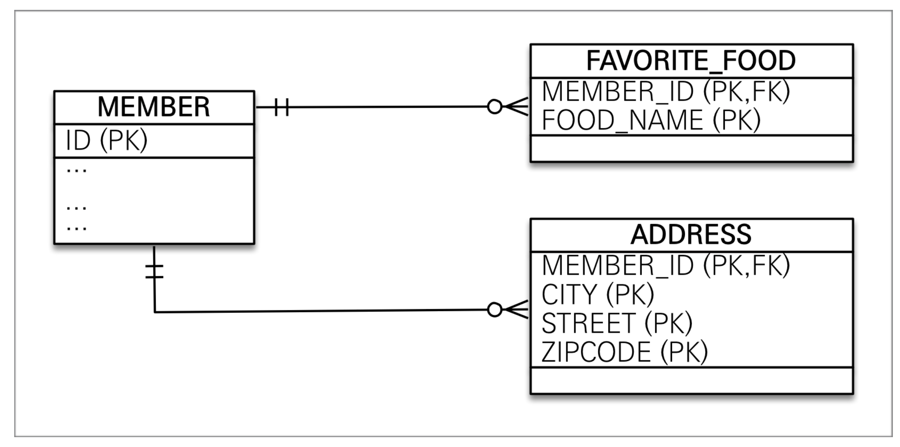

# JPA
```
https://arahansa.github.io/docs_spring/jpa.html
https://github.com/SoonMyeong/jpa-study/tree/master
https://en.wikibooks.org/wiki/Java_Persistence/Relationships#Common_Problems
```

### Index
- [JPQL](jpql)
- [Spring Data JPA](spring-data-jpa)
- [Persistence Context](persistence-context)
- [엔티티 매핑](entity-mapping)
- [상속 매핑](inheritance-mapping)

### Blog
- [JPA Best Practices](https://github.com/cheese10yun/spring-jpa-best-practices)
- [JPA에서 대량의 데이터를 삭제할때 주의해야할 점](https://jojoldu.tistory.com/235)
- [JPA N+1 문제 및 해결방안](https://jojoldu.tistory.com/165)
- [순환참조를 해결하는 방법](http://binarycube.tistory.com/1)
- [JPA 프로그래밍 정리](https://github.com/cheese10yun/TIL/blob/master/Spring/jpa/jpa.md)

### [Versions](https://jakarta.ee/specifications/persistence/)
- JPA 2.2 
  - streaming (cursor 지원)
- JPA 3.0
  - package renamed javax -> jakarta
- JPA 3.1
- JPA 3.2
- JPA 4.0

***
## 객체 그래프 탐색
Proxy 를 이용해서 `어떤 연관관계의 객체`까지 탐색할지를 `SQL 에서 선언 시점에 결정` 이 아닌 지연로딩 방식의 Proxy 를 통해 `사용 시점에 결정` 할 수 있게 합니다.

> 물론 Lazy loading 을 사용한다면 N+1 이 발생하므로 fetchJoin 을 통해 미리 로딩하는게 나음

## 복합키
테이블간의 결합을 막고, 부모 > 자식 > 손자로 이어지는 상속구조에서 식별관계는 P.K 가 길어지는 단점 있어서 `비식별관계`로 Entity 를 구성하는게 권장됩니다.

그리고 복합키 사용시 조회할때 복합키 생성이 필요한 단점이 있어 F.K 는 그대로 유지하고, 별도의 P.K 를 선언해서 사용하는 방식이 좀 더 낫습니다.

### 식별 vs 비식별 관계
- 식별관계
  - 부모테이블의 기본키를 자식테이블에서 기본키 + 외래키로 사용합니다
- 비식별관계
  - 부모테이블의 기본키를 자식테이블의 외래키로만 사용합니다

### @IdClass vs @EmbeddedId/@Embeddable
선언에 대한 문법적인 차이는 있지만, 복합키를 사용한다 의 관점은 동일합니다.

대신 JPQL 로 보면 아래의 차이가 있습니다:

```sql
# @IdClass
SELECT account.accountNumber FROM Account account;

# @EmbeddedId (복합키로 인해 1-depth 추가)
SELECT book.bookId.title FROM Book book;
```

### @OneToOne
@OneToOne 관계일때 같은키로 P.K 을 선언하는 것을 의미합니다.

@MapsId 및 @JoinColumn 을 같이 선언해서 문법상 가능하지만 항상 N+1 이 발생합니다. 그래서 연관관계의 주인이 F.K 을 가지고 @JoinColumn 해서 lazy 하는 방식이 더 낫습니다

## 조인테이블
매핑테이블을 별도로 지정하는 방식입니다. 즉 연관관계를 맺으려면

- 테이블에 F.K 가 있다면 -> @JoinColumn
- 매핑 테이블에 F.K 가 있다면 -> @JoinTable

으로 사용하면됩니다.

```java
@ManyToOne
@JoinTable(name = "PARENT_CHILD", // 매핑할 조인 테이블 이름
  joinColumns = @JoinColumn(name = "CHILD_ID"), // 현재 엔티티를 참조하는 외래 키
  inverseJoinColumns = @JoinColumn(name = "PARENT_ID") // 반대방향 엔티티를 참조하는 외래 키
)
private Parent parent;
```

## 여러 테이블
1개의 Entity 가 여러개의 테이블을 매핑하는 것도 문법적으로 가능합니다. 가능은 하지만 테이블과 엔티티를 일대일로 정의하는게 맞습니다

```java
@Entity
@Table(name="BOARD")
@SecondaryTable(name="BOARD_DETAIL",
    pkJoinColumns = @PrimaryKeyJoinColumn(name="BOARD_DETAIL_ID"))
public class Board { ... }
```

## Proxy


LAZY 로 설정된 연관관계는 Proxy 를 만들고 실제 객체의 참조를 관리합니다. (즉 실제로 값을 사용하는 시점에 N+1 로 DB 조회)

Proxy 는 원본 엔티티를 상속받은 객체이므로 타입 체크시 주의해야 합니다.

> 아래와 같이 `HibernateProxy or PersistentCollection` 타입이고 concrete type 은 initialize 후 비교가능

```java
public final class Hibernate {
    public static void initialize(Object proxy) throws HibernateException {
        if (proxy == null) {
            return;
        }

        if (proxy instanceof HibernateProxy) {
            ((HibernateProxy)proxy).getHibernateLazyInitializer().initialize();
        } else if (proxy instanceof PersistentCollection) {
            ((PersistentCollection)proxy).forceInitialization();
        }
    }
}
```

### 프록시의 한계
프록시는 null 값을 가질 수 없습니다. 그래서 연관관계 엔티티 (즉 instance) 를 가져올때 3가지 중 1개의 값을 리턴합니다:

- (값이 없는 경우) null
- (LAZY 의 경우) Proxy 로 감싼 instance
- (EAGER 의 경우) 실제 instance

연관관계 매핑에 따라 아래와 같이 동작합니다:

- @OneToOne
  - 프록시는 null 을 가질수 없으므로 OneToOne 연관관계 엔티티의 존재유무를 알아야 합니다
  - 그래서 존재함을 확인하기 위해 N+1 쿼리가 발생합니다
  - @JoinColumn 으로 대상의 기본키를 외래키로 가지고 있으면 존재유무를 알수 있으므로 Fetch.LAZY 가 가능합니다  
- @ManyToOne
  - 연관관계의 주인이고, @JoinColumn 을 통해 연관관계의 존재유무를 알수 있습니다
- @OneToMany
  - 연관관계의 주인이 아니라서 존재유무는 알수 없지만 Fetch.LAZY 가 가능합니다
  - 이유는 Collection 은 null 대신 `empty 표현이 가능`하기 때문입니다
    - 즉 실제 instance or proxy 로 감싼 empty.collection 으로 표현

### EAGER 
엔티티 조회시 join 으로 연관관계를 같이 가져옵니다.

이때 기본적으로 left join 이지만, not null 임을 알려준다면 inner-join 으로 쿼리가 실행됩니다:

- @JoinColumn(nullable = false)
- @ManyToOne(fetch = FetchType.EAGER, optional = false)
  - 관계의 매핑이 not null 이다. 라고 표현하므로 좀더 객체지향적인 접근 (column not null 은 DB 적인 관점)

### LAZY
엔티티 조회시 연관관계를 같이 가져오지 않고 Proxy 로 대체합니다. (그후 실제로 데이트를 사용하는 시점에 N+1 발생)

기본적으로 모든 매핑은 LAZY 로 설정하고 필요시 JPQL (querydsl or jooq) 로 FetchJoin 하는 방식이 낫습니다

### CASCADE
특정 엔티티를 영속 상태로 만들 때 연관된 엔티티도 함께 영속 상태로 만들수 있습니다.

> 영속성 전이를 사용하면 부모 엔티티를 저장할 때 자식 엔티티도 함께 저장

### Orphan Removal
부모에서 자식의 참조 제거시 자식 엔티티가 삭제되도록 설정 할 수 있습니다.

```java
@Entity
public class Parent {
    @Id @GeneratedValue
    private Long id;
    
    @OneToMany(mappedBy = "parent", orphanRemoval = true)
    private List<Child> children = new ArrayList<Child>();
    // ...

    public static void main(String[] args) {
        Parent parent = repository.findById(anyLong());
        parent.getChildren().remove(0);
    }
}

// DELETE FROM CHILD WHERE ID = ?
```

### DDD (CASCADE + Orphan Removal)
Aggregate Root 에서 연관관계를 관리할때 CASCARD, OrphanRemoval 을 모두 사용해서 관리할면 편리합니다

## 데이터 타입
### @Embedded/@Embeddable
새로운 유형의 (값) 클래스를 직접 정의해서 사용 가능합니다:

> 기존 @EmbeddedId/@Embeddable 와 동일한 사용성입니다. (대상 컬럼이 P.K 인지 단순 값인지의 차이만 존재) 

```java
@Entity
public class Member {
    @Id @GeneratedValue
    private Long id;
    private String name;
    @Embedded Address homeAddress; // 집 주소
}

@Embeddable
public class Address {
    @Column(name = "city") // 매핑할 컬럼 정의 가능
    private String city;
    private String street;
    private String zipcode;
    // ..
}
```

### @ElementCollection/@CollectionTable


값 클래스를 Collection 으로 정의 가능합니다:

```java
@Entity
public class Member {
    @Id @GeneratedValue
    private Lzong id;
    @Embedded
    private Adzdress homeAddress;

    @ElementCollection(fetch = FetchType.LAZY)
    @CollectionTable(name = "FAVORITE_FOODS", joinColumns = @JoinColumn(name = "MEMBER_ID"))
    private Set<String> favoriteFoods = new HashSet<String>();
    
    @ElementCollection(fetch = FetchType.LAZY)
    @CollectionTable(name = "ADDRESS", joinColumns = @JoinColumn(name = "MEMBER_ID"))
    private Set<Address> addressHistory = new ArrayList<Address>();
}
```
```sql
# @Embedded
INSERT INTO MEMBER (ID, CITY, STREET, ZIPCODE) VALUES (1, '통영', '몽돌해수욕장 , 660-1231);

# @ElementCollection 을 사용하는 string 타입
INSERT INTO FAVORITE FOODS (MEMBER_ID, FOOD_NAME) VALUES (1, "짬뽕");
INSERT INTO FAVORITE_FOODS (MEMBER_ID, FOOD_NAME) VALUES (1, "짜장");

# @ElementCollection 을 사용하는 @Embedded 타입
INSERT INTO ADDRESS (MEMBER_ID, CITY, STRBET, 2IPCODE) VALUES (1, '서울', '강남', '123-1231);
INSERT INTO ADDRESS (MEMBER_ID, CITY, STREET, 2IPCODE) VALUES (1,  '서울', '강북 , 1000-0001);
```

@OneToMany 과 동일하게 데이터가 추가되지만 (@CollectionTable 으로 별도 테이블 사용) 차이점은 아래와 같습니다:

- @OneToMany
  - @Entity 와의 관계
  - P.K 에 대한 제약이 없습니다
  - @Id 식별자가 있습니다 
- @ElementCollection
  - @Embedded 와의 관계
  - `대상 테이블의 모든 컬럼을 P.K 로 잡아야 합니다`
  - @Id 식별자가 없습니다

`@ElementCollection 으로 표현되는 관계는 모두 @OneToMany 로 표현 가능` 합니다. 제약이 없는 일대다 관계로 설정하는게 낫습니다
