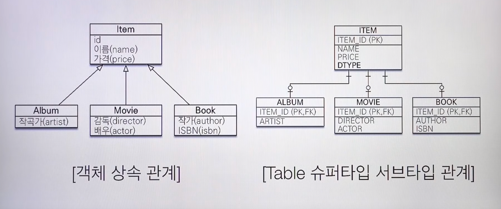
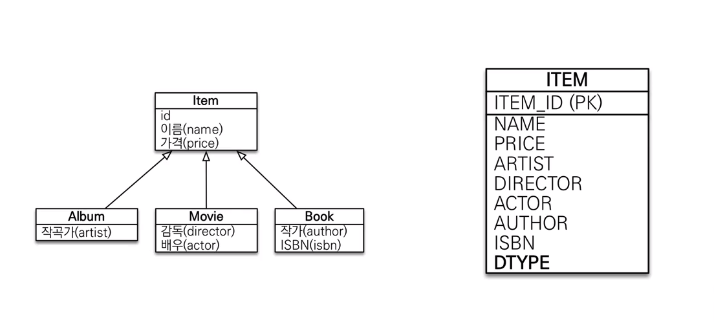
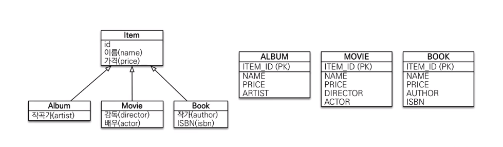
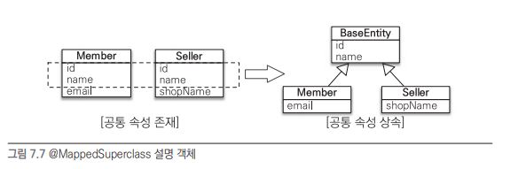

# 상속관계 매핑
```
https://www.baeldung.com/hibernate-inheritance
```

## @Entity 상속하
- `InheritanceType.JOINED`
  - 부모테이블이 존재하고, 자식테이블은 JOIN 으로 상속관계를 구현합니다
  - 단순조회시 JOIN 이 발생하고, INSERT 시 2번씩 쿼리가 수행됩니다



```java
@Entity(name = "PersonInfo")
@Table
@Inheritance(strategy = InheritanceType.JOINED)
@DiscriminatorFormula("case when LOCT_TP in ('A','B) then 'KR' when LOCT_TP in ('C') then 'JP' else 'US' end")
public abstract class PersonInfo {
    @Column("name")
    private String name;

    @Column("LOCT_TP")
    @DiscriminatorColumn("type")
    private LocationType locationType;
}
```

- `InheritanceType.SINGLE_TABLE`
  - 1개의 테이블에 부모/자식의 모든 컬럼을 표현합니다
  - 모든 자식테이블의 컬럼을 nullable 로 정의해야하고, 테이블 사이즈가 커집니다



```java
@Entity(name = "PersonInfo")
@Table(name = "PERS_INFO")
@Inheritance(strategy = InheritanceType.SINGLE_TABLE)
@DiscriminatorColumn(name = "LOCT_TP")
public abstract class PersonInfo {
    @Column("name)
    private String name;

    @Column("LOCT_TP")
    private LocationType locationType;
}

@DiscriminatorValue("KR")
public class KrPersonInfo extends PersonInfo {
    // ..
}
```

- `InheritanceType.TABLE_PER_CLASS`
  - 자식테이블 각각에 필요한 컬럼이 (부모에 선언한) 정의되는 형태입니다
  - 자식테이블을 함께 조회할때 UNION 을 사용해야하므로, `일반적으로 추천하지 않습니다`



```java
@Entity
@Inheritance(strategy = InheritanceType.TABLE_PER_CLASS) // 자식 테이블에서 사용할 공통 필드 정의
public abstract class Item {
    @Id @GeneratedValue
    @Column(name = "ITEM_ID")
    private Long id;
    
}
@Entity
@DiscriminatorValue("A")
public class Album extends Item { // 자식 테이블이 개별로 생성
    // ...
}
```

## @MappedSuperClass
- 별도 테이블이 생성되지 않고 상속만 가능한 형태 입니다
  - 단순한 공통필드 정의 (등록일자/등록자 등)
- @Entity 는 @Entity or @MappedSuperClass 가 선언된 클래스만 상속 할 수 있습니다



```java
@Getter
@MappedSuperclass
public abstract class BaseEntity<ID extends Serializable> {
    @Column(name = "REGR_INFO")
    @CreatedDate
    private Instant regDate;

    @Column(name = "MODR_INFO")
    @LastModifiedDate
    private Instant modDate;
    
    @Version
    @Column(name = "VER")
    private Long version;
}

@Entity
public class Person extends BaseEntity<String> {
    // ...
}
```

> 자식 Entity 는 @MappedSuperClass 에 정의된 모든 컬럼을 직접 소유하므로 `InheritanceType.TABLE_PER_CLASS` 와 동일한 형태로 구성됩니다.