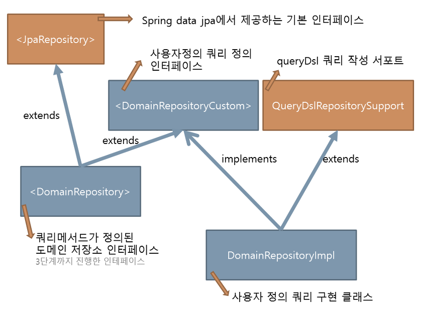

# JPQL
```
https://sungunjo.github.io/jpa-study/2022/03/01/ch.10-object-oriented-query-language.html
https://joont92.github.io/jpa/QueryDSL
```

### Blog
- [JPASubQuery vs JPAExpressions](https://jojoldu.tistory.com/379?category=637935)
- [연관관계 없이 Join 조회하기](https://jojoldu.tistory.com/396)

***
## `entityManager vs JPQL`
- entityManager#find
  - `영속성을 먼저` 검색합니다
  - (미발견시) 쿼리를 실행합니다
  - 조회된 엔티티를 영속성에 저장합니다
- JPQL (== createQuery or querydsl)
  - `DB 를 먼저` 조회합니다. (== 쿼리 직접실행)
  - DB 를 직접 조회하므로 `현재까지 영속성에서 변경된 내용이 반영되지 않습니다.`
  - 조회된 엔티티가 `이미 영속성에 있는 경우 조회결과를 버리고`, 없으면 저장합니다 (영속성에서 변경된 내용을 유지하기위함) 

> spring-data 및 querydsl 은 모두 JPQL 실행

```
app -> JPQL (flush) -> DB
               |          
           ---------
          |  영속성  |
           ---------
               |
app <- JPQL (clear) <- DB
```

JPQL 사용시 영속성과의 불일치를 해소하기 위해 2가지 검토가 필요합니다:
- entityManager#flush
  - (조회쿼리) 실행전 영속성을 flush 해야 합니다
  - 영속성에 저장된 내용이 flush 로 반영해야 DB 직접조회 결과를 신뢰할 수 있습니다 
- entityManager#clear
  - (수정쿼리) 실행후 영속성을 clear 해야 합니다
  - 영속성에 저장된 내용이 DB 결과와 다르게 되므로 클리어해야 불일치를 방지할 수 있습니다

```java
// spring data jpa 사용시 annotation 으로 선언가능
@Modifying(clearAutomatically = true, flushAutomatically = true)
public void modifyUser();
```

## R (== 조회)
```java
// find - JPQL 이 아닌 em.find 사용
em.find(Member.class, 234L);
```

```java
// ANSI SQL
em.createNativeQuery("SELECT * FROM MEMBER WHERE ID = '243'", Member.class)
    .getResultList();

// JPQL (or HQL)
em.createQuery("SELECT m FROM Member m WHERE m.id = :id", Member.class)
    .setParameter("id","243")
    .getSingleResult(); // 결과가 없거나 1개 이상이면 exception

// Named - @NamedQuery 로 선언된 JPQL 을 사용
@Entity
@NamedQuery(
    name = "Member.findById",
    query = "SELECT m FROM Member m where m.id = :id")
public class Member {
    // ..
}

List<Member> resultList = em.createNamedQuery("Member.findById", Member.class)
    .setParameter("id", "243")
    .getSingleResult();
```

`em.createNativeQuery` 과 `jdbcTemplate.queryForList` 모두 native-sql 을 실행하는 것을 동일합니다. 대신 em 을 통해 실행하면 영속성에서 관리됩니다. (projection 하지않고 Entity.class 를 직접 전달한 경우)

> JPQL 을 사용해도 결국엔 SQL 이 DB 에서 실행되므로 표현방식의 차이만 있음

## CUD
```java
// JPQL (or HQL) - INSERT
em.createQuery("INSERT INTO Member (id) VALUES (:id)", Member.class)
    .setParameter("id","243")
    .executeUpdate();

// JPQL (or HQL) - UPDATE
em.createQuery("UPDATE Member m SET m.name = 'DUMMY' WHERE m.id = :id", Member.class)
    .setParameter("id","243")
    .executeUpdate();

    // JPQL (or HQL) - DELETE
em.createQuery("DELETE FROM Member m WHERE m.id = :id", Member.class)
    .setParameter("id","243")
    .executeUpdate();
```

## TypeQuery vs Query
- TypeQuery
  - 반환 타입을 지정한 경우
- Query
  - 반환 타입이 없는 경우
  - SELECT 절의 조회 대상이 하나면 Object, 여러개면 Object[]

## Projection
- @Entity
  - 영속성에서 식별자로 사용할 @Id 가 있으므로 entityManager 에서 관리됩니다
- @Embeddable, 스칼라 (숫자, 문자 등 기본 데이터)
    - 영속성에서 식별자로 사용할 @Id 가 있으므로 entityManager 에서 관리되지 않습니다

## Join
- inner
  - join 으로만 명시했을때의 기본 동작입니다
- left
- theta
  - where clause 에 조인조건을 명시하는 방식입니다
  - ```select m from Member m, Team t where m.username = t.name```
  - where 조건을 사용하므로 inner join 과 결과가 동일합니다
- on
  - JPQL 문법에서 join 구문에 on 은 불필요합니다 (Entity 의 관계를 통해 알아서 분석)
  - 대신 조인 대상의 필터링을 위한 on 은 지원합니다
  - ```select m, t from Member m left join m.team t on t.name = 'A'```
- fetch
  - ```select m from Member m left join fetch m.team```
  - fetch 라는 문법을 사용하면 eager-load 합니다
  - hibernate 는 collection fetch join 후 페이징 시 (limit) warn logging 을 남기며 메모리에서 페이징 처리합니다

## Distinct
left join (1-N 관계) 은 조회결과에 중복이 가능합니다. (driven-entity 개수만큼 N 건의 driving-entity 가 반환되므로)

- JPQL 에서 DISTINCT 사용
- SQL 에 DISTINCT 추가
  - 하지만 SQL 은 조회한 각 로우의 데이터가 다르므로 SQL DISTINCT 는 효과가 없습니다
- `애플리케이션에서 한번 더 중복 제거`

## SubQuery
Hibernate 5.x 까지는 where 절 에서의 subquery 만 가능했지만, hibernate 6.1 부터 select, from 절 에서 subquery 가 지원됩니다

## Case
```jpql
select
    case when m.age <= 10 then '학생요금'
         when m.age >= 60 then '경로요금'
         else '일반 요금'
    end
from Member m
```

## Union
Hibernate 6.x 부터 union 쿼리를 지원합니다

```java
List<String> topics = entityManager.createQuery("""
    select c.name as name
    from Category c
    union all
    select t.name as name
    from Tag t
    """, String.class)
.getResultList();
```

## Querydsl


기본적으로 JPQL 을 정적 QClass 를 통해 작성한다. 라는 개념입니다.

쿼리는 JPAQuery or HibernateQuery 를 통해 생성하고, XYZQuery 를 만들기위한 빌더인 XYZQueryFactory 의 사용이 권장됩니다.

- JPQLQuery
    - JPAQuery
    - HibernateQuery
- QueryBuilder
    - `JPAQueryFactory`
    - `HibernateQueryFactory`

### R (== 조회)
```java
JPAQueryFactory query = new JPAQueryFactory(em);
QCustomer customer = QCustomer.customer;

Customer bob = query.from(customer)
  .where(customer.firstName.eq("Bob"))
  .uniqueResult(customer);
```

### CUD
```java
// update
queryFactory.update(user)
  .where(user.login.eq("Ash"))
  .set(user.login, "Ash2")
  .set(user.disabled, true)
  .execute();
```

```java
// delete
queryFactory.delete(user)
  .where(user.login.eq("David"))
  .execute();
```

### [Projections](https://icarus8050.tistory.com/5)
**Entity binding**
```java
@Entity
class Employee {

  @QueryProjection
  public Employee(long id, String name) {
    // ...
  }
}
```

```java
QEmployee employee = Employee.employee;
JPQLQuery query = new HibernateQuery(session);

List<Customer> dtos = query.select(QEmployee.create(employee.firstName, employee.lastName))
  .from(employee).fetch();
```

> 생성되는 create method 는 Projections.constructor 를 사용합니다. 즉 직접사용도 가능

**DTO binding**
```java
List<UserDTO> dtos = query.select(
  Projections.constructor(UserDTO.class, user.firstName, user.lastName)).fetch();
```

아니면 생성자 생성인 경우에는 QClass 를 생성해서, compile-error 로 잘못된 타입지정을 막을 수 도 있습니다:
```java
class EmployeeDTO {

  @QueryProjection
  public EmployeeDTO(long id, String name) {
    // ...
  }
}
```

```java
QEmployee employee = Employee.employee;
JPQLQuery query = new HibernateQuery(session);

// Entity 와 생성법이 다르다. #create 를 사용하지않고 직접 생성
List<Customer> dtos = query.select(new QCustomerDTO(customer.id, customer.name))
  .from(employee).fetch();
```

setter 를 통해 처리하거나:
```java
List<UserDTO> dtos = query.select(
  Projections.bean(UserDTO.class, user.firstName, user.lastName)).fetch();
```

Reflection 을 통해 직접접근도 가능합니다:
```java
List<UserDTO> dtos = query.select(
  Projections.fields(UserDTO.class, user.firstName, user.lastName)).fetch();
```

Expression\<?\>... 를 넘기는 방식이라 필드명 불일치/생성자 불일치 등의 에러는 Runtime 시점에만 확인 가능합니다.