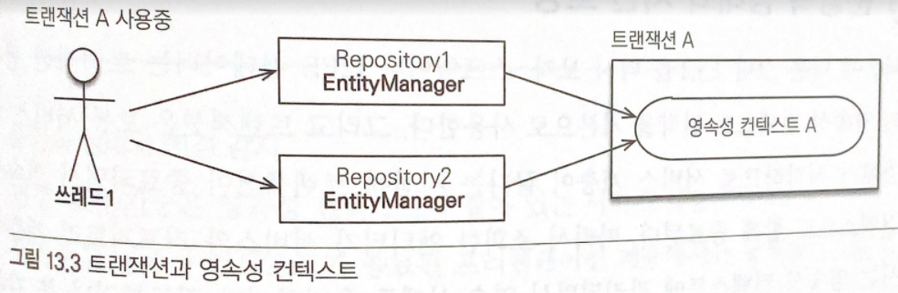
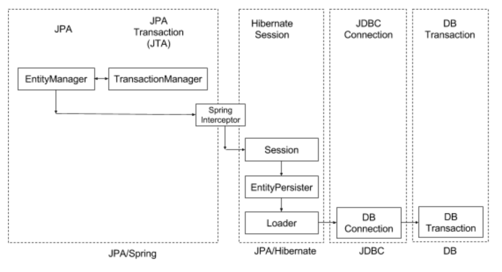
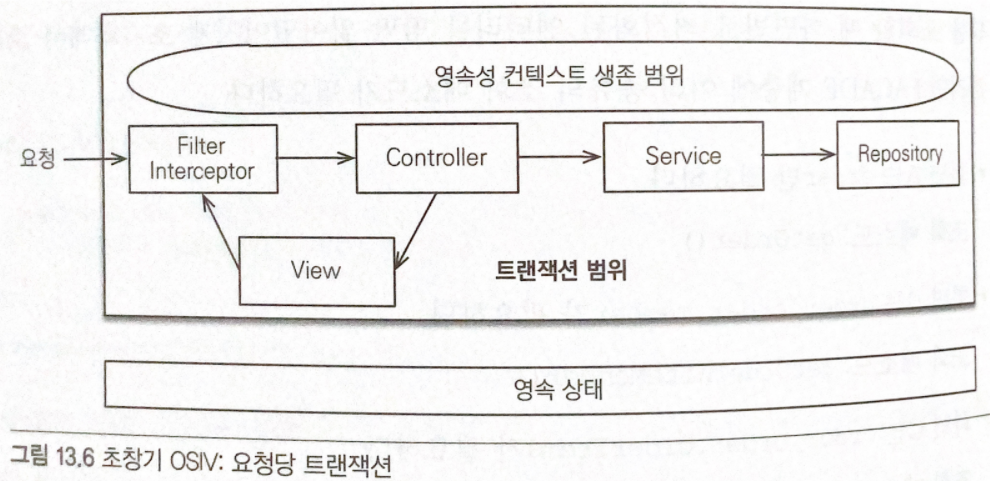

# Persistence Context

```
@author: suktae.choi
```

### Blog

- [OSIV](http://pds19.egloos.com/pds/201106/28/18/Open_Session_In_View_Pattern.pdf)

***

| Hibernate       | JPA                 |
|-----------------|---------------------|
| Session         | Entity Manager      |
| Session Context | Persistence Context |

## [Scope](https://colevelup.tistory.com/21)

entityManager 는 기본적으로 transaction-scope 로 동작합니다. 즉 현재 tx 를 실행하는 thread 단위에서만 영속성은 유효합니다

> 영속성은 동시성 이슈가 있으므로 thread 단위로 유니크해야 합니다

영속성을 관리하는 em 은 아래의 방법으로 가져옵니다:

- @PersistenceContext EntityManager em;
  - javax 에서 지원하는 방식입니다
  - new or tx 에서 사용중인 em 을 리턴합니다
- @Autowired EntityManager em;
  - 스프링빈은 기본적으로 싱글톤 이기 때문에 동시성 이슈가 있지만 (영속성이 다같이 공유됨)
  - proxy 가 반환되고 (runtime-weaving) 사용시점에 new or tx 에서 사용중인 em 으로 처리합니다
- EntityManager em = emf.createEntityManager();
  - 항상 instance 가 생성되지만 `다른 em 이라도 tx-scope 를 보고 같은 영속성 or 다른 영속성`을 바라볼지 결정되어 리턴됩니다

어노테이션을 주입 or 팩토리를 통한 생성 모두 `동일 트랜잭션 범위에서는` em instance 는 달라도 같은 영속성을 사용합니다.



트랜잭션이 다르면 동일한 엔티티 매니저를 사용해도 다른 영속성 컨텍스트를 사용합니다

```java
// hibernate 설정
props.put(org.hibernate.cfg.Environment.CURRENT_SESSION_CONTEXT_CLASS, "thread");

// SessionFactoryImpl - threadLocal 에 세션 저장
else if ( "thread".equals( impl ) ) {
  return new ThreadLocalSessionContext( this );
}
```

## OSIV



service 에서 tx 가 닫혔고 (detached 됨, lazy-loading 인 관계는 proxy 만 hold 하고 있는 상태)
뷰 렌더딩 시점에 proxy 만 가지고있는 연관 entity 에 접근하면 에러발생 (프록시 초기화 (proxy-load) 는 persist 상태일때만 가능하다)
: fetch-join 으로 모든 entity 를 load 한 후, tx 종료(세션닫힘, detached 로 됨. 하지만 이미 내용은 가지고있음)



- OpenSessionInViewFilter (servlet-filter) 진입에서 hibernate#openSession
  - dispatcher-servlet -- controller -- service -- repository 까지 수행
  - controller 에서 return
- OpenSessionInViewFilter (servlet-filter) 에서 hibernate#closeSession

```java
protected void doFilterInternal(HttpServletRequest request, HttpServletResponse response, FilterChain filterChain) throws ServletException, IOException {
        if (TransactionSynchronizationManager.hasResource(sessionFactory)) {
            participate = true;
        } else {
            boolean isFirstRequest = !isAsyncDispatch(request);
            if (isFirstRequest || !applySessionBindingInterceptor(asyncManager, key)) {
                // open session
                logger.debug("Opening Hibernate Session in OpenSessionInViewFilter");
                Session session = openSession(sessionFactory);
                SessionHolder sessionHolder = new SessionHolder(session);
                TransactionSynchronizationManager.bindResource(sessionFactory, sessionHolder);

                AsyncRequestInterceptor interceptor = new AsyncRequestInterceptor(sessionFactory, sessionHolder);
                asyncManager.registerCallableInterceptor(key, interceptor);
                asyncManager.registerDeferredResultInterceptor(key, interceptor);
            }
        }

        try {
            filterChain.doFilter(request, response);
        } finally {
            if (!participate) {
                // close session
                SessionHolder sessionHolder =
                    (SessionHolder)TransactionSynchronizationManager.unbindResource(sessionFactory);
                if (!isAsyncStarted(request)) {
                    logger.debug("Closing Hibernate Session in OpenSessionInViewFilter");
                    SessionFactoryUtils.closeSession(sessionHolder.getSession());
                }
            }
        }
    }
```
