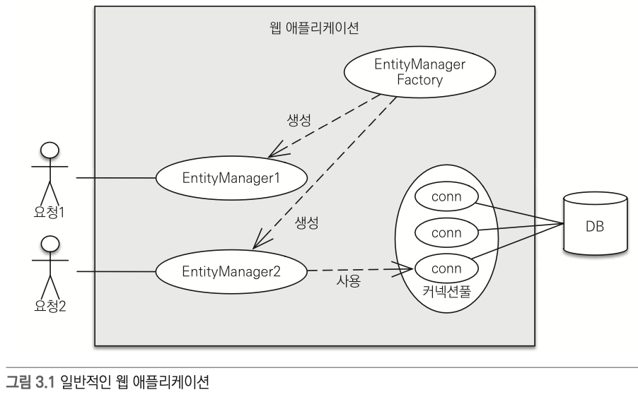
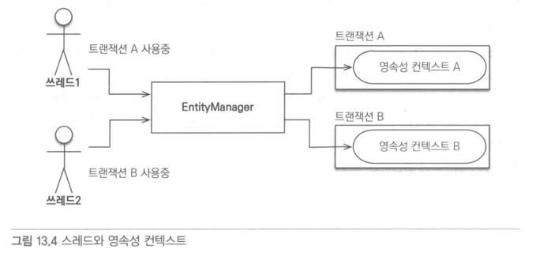
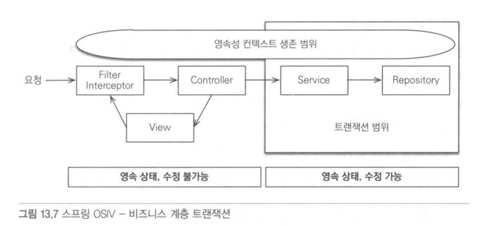

# Persistence Context
```
https://www.baeldung.com/jpa-hibernate-persistence-context
```
### Blog
- [JPA 영속성 컨텍스트 주의 점](https://github.com/cheese10yun/blog-sample/blob/master/query-dsl/docs/jpa-persistence-context.md)
- [Open_Session_In_View_Pattern.pdf](Open_Session_In_View_Pattern.pdf)

***
| Hibernate       | JPA                 |
|-----------------|---------------------|
| Session         | Entity Manager      |
| Session Context | Persistence Context |

EntityManager 에서 관리되는 객체를 의미합니다. 영속상태는 아래의 조건을 만족하면 됩니다:
- (신규) new Object(); 를 통해 생성된 자바 객체를 \#save
- (조회) \#find 를 통해 조회한 entity

> 영속성은 tx 단위마다 생성됩니다 (정확히는 hibernate session 단위)

EntityManager 는 현재의 DB 커넥션에 유효합니다. 즉 현재 실행되고 있는 Transaction 단위에서 영속성은 유지 됩니다

> 동시성 이슈가 있으므로 Thread 간에 공유하거나 재사용 하면 안됨



## 특징
- DB 와 애플리케이션 사이의 1차 캐시 역할을 수행합니다
  - repeatable read 수준의 격리 보장 (1차캐시를 통해 조회하므로 기존 값이 조회됨)
- 영속성에 저장되는 Entity 는 @Id (동등성 식별위한) 가 필수

### 변경감지
JPA는 엔티티를 영속성 컨텍스트에 보관할 때, 최초 상태 `스냅샷` 을 저장하고 플러시 시점에 스냅샷과 비교해서 변경된 엔티티를 감지 합니다:
- 현재 엔티티와 스냅샷을 비교해서 변경된 필드 선별후
- Update SQL 를 생성합니다
  - 기본적으로 Update SQL 은 모든 필드를 업데이트 하는 동일 SQL 을 사용합니다 (쿼리 재사용하여 DB 성능 향상)
  - 변경된 필드만 포함하는 SQL 을 동적으로 생성하려면 `@DynamicUpdate/@DynamicInsert` 을 Entity 에 선언
- Flush (DB 에 SQL 전달해서 반영) & Commit

### Flush
- em#flush 직접 호출
- 트랜잭션 커밋 시 자동 호출
- `JPQL 쿼리 실행 시` 자동 호출 (querydsl 포함)
  - JPQL 은 영속성이 아닌 DB 를 직접 조회하므로 현재 영속성의 값과 다른 데이터가 조회될 수 있습니다 (영속성은 쓰기지연으로 1차캐싱)
  - `현재까지의 영속성 내용을 JPQL 쿼리결과에 반영 하기 위해` 쿼리 수행전 flush 를 수행합니다 (flushAutomatically=true)
  - 만약 JPQL 로 수정된 내용이 있다면 -> JPQL 의 결과는 영속성에 반영되지 않으므로 데이터 일관성이 깨집니다. 그래서 명시적으로 clearAutomatically=true 를 설언해서 영속성을 clear 해야 합니다. (그러면 다시 재조회 발생해서 갱신된 내용이 반영됨)
  
```java
@Modifying(clearAutomatically = true, flushAutomatically = true)
public void updateUser(String id);
```

### [트랜잭션의 범위와 영속성](https://colevelup.tistory.com/21)
트랜잭션이 같으면 같은 영속성 컨텍스트를 사용합니다


트랜잭션이 다르면 다른 영속성 컨텍스트를 사용합니다



## OSIV
Transaction 의 범위가 아닌 Controller (== View) 에서 준영속 상태의 객체 그래프 탐색시 `org.hibernate.LazyInitializationException` 이 발생합니다.

OSIV 는 Session (== Entity Manager) 의 범위를 View 까지 확대하여 지연로딩 (== N+1 방식으로) 을 지원합니다.

### 스프링 OSIV
- 트랜잭션 범위
  - [FROM] @Transactional -> [FROM] @Transactional  
  - DBCP 커넥션을 획득/반환은 트랜잭션 시작/종료 시점 입니다
- 영속성 범위
  - [FROM] @Transactional -> [TO] Filter/Interceptor
    - `트래픽 진입 -> Filter/Interceptor` 시점부터 
    - `Filter/Interceptor -> 트래픽 아웃` 시점까지 영속성 존재
    - 영속성이 유지되면서 Controller 에서 객체 그래프 탐색시 > 지연로딩을 통한 조회가 가능해 집니다 (nontransactional read 사용)



OSIV 사용중 단순 조회가 아닌 엔티티의 수정이 발생해도 2가지 조건에 의해 반영되지 않습니다:
- 묵시적
  - 스프링 OSIV filter/interceptor 는 최종적으로 em.close() 로 종료하므로 반영되지 않습니다 (#flush 하지 않음)
- 명시적
  - em.flush 을 호출해도 tx 가 이미 종료된 상태이므로 TransactionRequiredException 예외가 발생합니다
