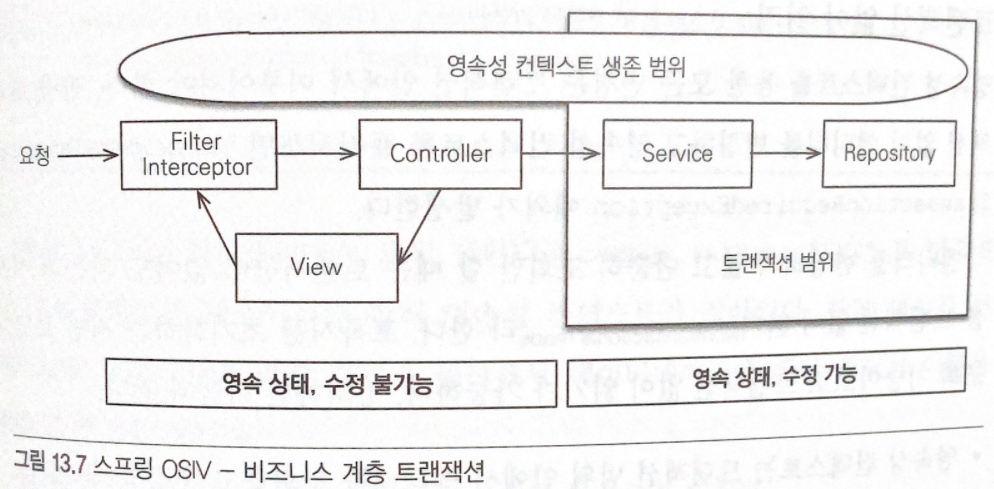

# Persistence Context

```
@author: suktae.choi
```

### Blog

- [OSIV](http://pds19.egloos.com/pds/201106/28/18/Open_Session_In_View_Pattern.pdf)

***

## OSIV

service 에서 tx 가 닫혔고 (detached 됨, lazy-loading 인 관계는 proxy 만 hold 하고 있는 상태)
뷰 렌더딩 시점에 proxy 만 가지고있는 연관 entity 에 접근하면 에러발생 (프록시 초기화 (proxy-load) 는 persist 상태일때만 가능하다)
: fetch-join 으로 모든 entity 를 load 한 후, tx 종료(세션닫힘, detached 로 됨. 하지만 이미 내용은 가지고있음)


- OpenSessionInViewFilter (servlet-filter) 진입에서 hibernate#openSession
  - dispatcher-servlet -- controller -- service -- repository 까지 수행
  - controller 에서 return
- OpenSessionInViewFilter (servlet-filter) 에서 hibernate#closeSession

```java
protected void doFilterInternal(HttpServletRequest request, HttpServletResponse response, FilterChain filterChain) throws ServletException, IOException {
        if (TransactionSynchronizationManager.hasResource(sessionFactory)) {
            participate = true;
        } else {
            boolean isFirstRequest = !isAsyncDispatch(request);
            if (isFirstRequest || !applySessionBindingInterceptor(asyncManager, key)) {
                // open session
                logger.debug("Opening Hibernate Session in OpenSessionInViewFilter");
                Session session = openSession(sessionFactory);
                SessionHolder sessionHolder = new SessionHolder(session);
                TransactionSynchronizationManager.bindResource(sessionFactory, sessionHolder);

                AsyncRequestInterceptor interceptor = new AsyncRequestInterceptor(sessionFactory, sessionHolder);
                asyncManager.registerCallableInterceptor(key, interceptor);
                asyncManager.registerDeferredResultInterceptor(key, interceptor);
            }
        }

        try {
            filterChain.doFilter(request, response);
        } finally {
            if (!participate) {
                // close session
                SessionHolder sessionHolder =
                    (SessionHolder)TransactionSynchronizationManager.unbindResource(sessionFactory);
                if (!isAsyncStarted(request)) {
                    logger.debug("Closing Hibernate Session in OpenSessionInViewFilter");
                    SessionFactoryUtils.closeSession(sessionHolder.getSession());
                }
            }
        }
    }
```

## Session

### Lifecycle

- Open (hibernate) session (in terms of JPA, create EntityManager)
- Open physical connection (JDBC)
- tx begin;
  - ... CRUD
- commit; or rollback;
- Close physical connection
- Close session



### Session Context

- entityManager 는 application-scope 으로 관리됨
- session 은 hibernate 설정에 따르 context 결정
  - thread 로 설정되어 있다면
- implicit tx 가 시작된다면
  - session opened
  - JDBC opened
  - tx begin; commit; or rollback;
  - JDBC closed
  - session closed
- 그다음 implicit tx 시작시
  - entityManager.getCurrentSession();
  - session 이 threadLocal 단위로 관리되므로, mark as closed
  - exception throws

```java
// hibernate 설정
props.put(org.hibernate.cfg.Environment.CURRENT_SESSION_CONTEXT_CLASS, "thread");

// SessionFactoryImpl - threadLocal 에 세션 저장
else if ( "thread".equals( impl ) ) {
  return new ThreadLocalSessionContext( this );
}

public User getUser(Long id) {
  User user = new User(id);
  user.setName(userService.getName(id));	// implicit session open and mark closed
  user.setAddress(userService.getAddress(id));	// session fetches from threadLocal and fail

  return user;
}

// console 결과
sessionAlreadyClosedException
```