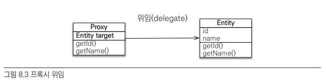

# 프록시
### Blog
- [How to Convert a Hibernate Proxy to a Real Entity Object](https://www.baeldung.com/hibernate-proxy-to-real-entity-object)

***


지연 로딩 기능을 사용하려면 실제 엔티티 객체 대신에 데이터베이스 `조회를 지연할 수 있는 가짜 객체`가 필요한데 이것을 프록시 객체 입니다.
- fetchType.LAZY 로 설정된 연관관계는 Proxy 를 리턴합니다 (실제 값을 `사용시점에 N+1` 로 DB 조회)
- Proxy 는 원본 엔티티를 상속받은 객체이므로 타입 체크시 주의해야 합니다
  - 아래와 같이 `HibernateProxy or PersistentCollection` 타입이고 실제 타입은 initialize 후 확인 가능

```java
public final class Hibernate {
    public static void initialize(Object proxy) throws HibernateException {
        if (proxy == null) {
            return;
        }

        if (proxy instanceof HibernateProxy) {
            ((HibernateProxy)proxy).getHibernateLazyInitializer().initialize();
        } else if (proxy instanceof PersistentCollection) {
            ((PersistentCollection)proxy).forceInitialization();
        }
    }
}
```

## 특징
`프록시는 null 값을 가질 수 없습니다`. 그래서 연관관계 엔티티 (즉 instance) 를 가져올때 3가지 중 1개의 값을 리턴합니다:

- (값이 없는 경우) null
- (LAZY 의 경우) Proxy 객체
- (EAGER 의 경우) 실제 객체

연관관계 매핑에 따라 아래와 같이 동작합니다:

- @OneToOne
  - 프록시는 null 을 가질수 없으므로 OneToOne 연관관계 엔티티의 존재유무를 알아야 합니다
  - 그래서 존재함을 확인하기 위해 N+1 쿼리가 발생합니다
  - @JoinColumn 으로 대상의 기본키를 외래키로 가지고 있으면 존재유무를 알수 있으므로 Fetch.LAZY 가 가능합니다
- @ManyToOne
  - 연관관계의 주인이고, @JoinColumn 을 통해 연관관계의 존재유무를 알수 있습니다
  - 그러므로 FetchType.LAZY 가 가능합니다
- @OneToMany
  - 연관관계의 주인이 아니라서 존재유무는 알수 없지만 Fetch.LAZY 가 가능합니다
  - `Collection 은 null 대신 empty 가 가능`하기 때문입니다

### 객체 그래프
Proxy 를 이용해서 `어떤 연관관계의 객체`까지 탐색할지를 `SQL 에서 선언 시점에 결정` 이 아닌 지연로딩 방식의 Proxy 를 통해 `사용 시점에 결정` 한다는 의미 입니다

> 물론 Lazy loading 을 사용한다면 N+1 이 발생하므로 fetchJoin 을 통해 미리 로딩하는게 나음

### EAGER
엔티티 조회시 join 으로 연관관계를 같이 가져옵니다.

이때 기본적으로 left join 이지만, not null 임을 알려준다면 inner-join 으로 쿼리가 실행됩니다:

- @JoinColumn(nullable = false)
- @ManyToOne(fetch = FetchType.EAGER, optional = false)
  - 관계의 매핑이 not null 이다. 라고 표현하므로 좀더 객체지향적인 접근 (column not null 은 DB 적인 관점)

### LAZY
엔티티 조회시 연관관계를 같이 가져오지 않고 Proxy 로 대체합니다. (그후 실제로 데이트를 사용하는 시점에 N+1 발생)

기본적으로 모든 매핑은 LAZY 로 설정하고 필요시 JPQL (querydsl or jooq) 로 FetchJoin 하는 방식이 낫습니다

### CASCADE
특정 엔티티를 영속 상태로 만들 때 연관된 엔티티도 함께 영속 상태로 만들수 있습니다.

> 영속성 전이를 사용하면 부모 엔티티를 저장할 때 자식 엔티티도 함께 저장

### Orphan Removal
부모에서 자식의 참조 제거시 자식 엔티티가 삭제되도록 설정 할 수 있습니다.

```java
@Entity
public class Parent {
    @Id @GeneratedValue
    private Long id;
    
    @OneToMany(mappedBy = "parent", orphanRemoval = true)
    private List<Child> children = new ArrayList<Child>();
    // ...

    public static void main(String[] args) {
        Parent parent = repository.findById(anyLong());
        parent.getChildren().remove(0);
    }
}

// DELETE FROM CHILD WHERE ID = ?
```

### DDD (CASCADE + Orphan Removal)
Aggregate Root 에서 연관관계를 관리할때 CASCARD, OrphanRemoval 을 모두 사용해서 관리할면 편리합니다

