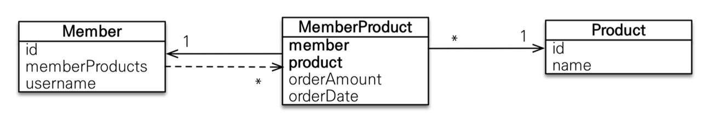

# 연관관계 매핑
```
https://www.nowwatersblog.com/jpa/ch10
```

## 기본키 매핑
- 직접생성
  - @Id 컬럼을 Entity 를 만들때 직접 설정하는 방식
- IDENTITY
  - DB 에 위임 (auto_increment)
  - `@GeneratedValue (strategy = GenerationType.IDENTITY)`
- SEQUENCE
  - 생성할 시퀀스를 지정 
  - `@GeneratedValue (strategy = GenerationType.SEQUENCE, generator ="BOARD_SEQ_GENERATOR")`
- TABLE
  - 키 생성 전용 테이블 사용
- AUTO
  - dialect 에 따라 3가지 방식중 선택
  - `@GeneratedValue (strategy = GenerationType.AUTO)`

```
JPA는 성능 향상을 위해 트랜잭션 커밋 시점에 SQL을 일괄 실행하지만,
IDENTITY/SEQUENCE/TABLE 전략은 DB에서 PK를 생성하므로 persist() 시점에 즉시 INSERT 쿼리가 실행됩니다.

(Persisten Context 에 엔티티를 관리하려면 @Id 값을 Entity 식별자로 사용 해야 하므로 -> Dirty Check 를 위한 동등성 비교)
```

## 컬럼 매핑
- @Column
  - 모든 컬럼에 정의
- @JoinColumn
  - 연관관계 매핑시 사용할 `상대방의 F.K`
  - @JoinColumn 을 관리하는 엔티티가 (즉 F.K 를 컬럼으로 관리) 연관관계의 주인
- @Enumerated
  - ENUM 저장 방식 (STRING/ORDINAL)

```java
@Enumerated (EnumType.STRING)
private Rolerype rolerype;

// 아래와 같이 사용 
member.setRolerype(RoleType.ADMIN); // DB에 문자 ADMIN으로 저장됨
```

- ~~@Temporal~~
  - Date, Time, DateTime, LocalDate, LocalDateTime, Instant 등에 지정
  - AtttributeConverter 를 상속한 `Jsr310JpaConverters` 가 기본 제공되어서 이제 따로 정의 하지 않아도됨

```java
public class Jsr310JpaConverters {
    @Converter(autoApply = true)
    public static class LocalDateConverter implements AttributeConverter<LocalDate, Date> {
        @Override
        public Date convertToDatabaseColumn(LocalDate date) {
            return date == null ? null : LocalDateToDateConverter.INSTANCE.convert(date);
        }

        @Override
        public LocalDate convertToEntityAttribute(Date date) {
            return date == null ? null : DateToLocalDateConverter.INSTANCE.convert(date);
        }
    }
    // ...
}
```

- @Lob
  - Text, BLOB 에 지정
- @Transient
  - JPA 에서 저장/조회 하지 않을 필드
- @Access(AccessType.FIELD/PROPERTY)
  - 필드 접근시 직접접근 or Getter/Setter 지정

```java
// 수정 일시
@LastModifiedDate
@Column(name = "MOD_YMDT")
@AccessType(AccessType.Type.PROPERTY)
private Instant modDate;

// PROPERTY 방식으로 지정해서 Setter 를 통한 기본값 세팅
public void setModDate(Instant date) {
    if (Objects.isNull(date)) {
        modDate = Instant.now();
        return;
    }

    modDate = date;
}

// Getter ..
```

## 연관관계
```java
public class User {
    @OneToMany(fetch = FetchType.LAZY, mappedBy = "user")
    private Set<Order> orders = new LinkedHashSet<>();    
}

public class Order {
    @ManyToOne(fetch = FetchType.LAZY)
    @JoinColumn(name = "USER_ID") // F.K
    private User user;    
}
```

### @OneToMany
- `@OneToMany(mappedBy = "user")`
  - 연관관계 대상
  - mappedBy 으로 연관관계 주인의 필드명 지정
- 단방향
  - `mappedBy = ?` 으로 지정할 대상이 없으므로 (양방향 이므로) 저장시 INSERT 가 아닌 `INSERT-UPDATE 쿼리가 발생` 합니다
  - 따라서 단방향 @OneToMany 은 권장되지 않습니다 (양방향 권장)

```java
@Entity
public class Team {
    @OneToMany
    private List<Member> members;
}
```
```sql
-- Member insert (team_id = null)
INSERT INTO member (name, team_id) VALUES (?, null);

-- Member update (team_id = 1)
UPDATE member SET team_id = 1 WHERE id = ?;

-- INSERT → UPDATE 두 번 쿼리가 나감 (N개면 2N번!)
```

### @ManyToOne
- `@ManyToOne; @JoinColumn(name = "USER_ID")`
  - 연관관계 주인
  - `스스로 연관관계를 결정 할수 있는 F.K 를 저장`하고 있어서 주인이라는 개념을 사용합니다 (@JoinColumn 으로 F.K 지정)
- 양방향
  - JPA 는 연관관계의 주인이 cascade 로 같이 저장합니다
  - 하지만 POJO 의 관점으로 보면 양쪽 모두에 save 하는걸 권장합니다

```java
// https://en.wikibooks.org/wiki/Java_Persistence/Relationships#Object_corruption,_one_side_of_the_relationship_is_not_updated_after_updating_the_other_side
public class Member {
    private Team team;
    
    public void changeTeam(Team team) {
        this.team = team; // 연관관계 주인에 설정 (데이터 관점에서 해당 작업만 해도 문제없음)
        team.getMembers().add(this); // 양방향 갱신을 하지 않으면 team 에는 member 가 없음 (명시적으로 재조회 하기 전까지)
    }
}
```

### @OneToOne
- Proxy 객체는 `존재함이 보장되는 객체를` 아직 로딩하지 않은 가짜 객체 입니다
  - Proxy 객체가 있다면 null 이 아님을 보장한다는 의미입니다. (JPA 는 null or proxy 로 객체를 표현)
  - 따라서 Proxy 아니면 null 을 세팅하기 위해 존재함을 확인해야 하는 N+1 문제가 발생 할 수 있습니다 
- 양방향:

```java
public class User {
    // eager 로딩만 가능합니다 (실제로 존재함을 SQL 을 실행해야만 알 수 있음)
    @OneToOne(mappedBy = "user")
    private Order order = new LinkedHashSet<>();
}

public class Order {
    // lazy 로딩이 가능합니다 (연관관계의 주인이므로 F.K 가 존재한다면 실제로 Entity 가 존재함을 알 수 있음)
    @OneToOne(fetch = FetchType.LAZY)
    @JoinColumn(name = "USER_ID")
    private User user;
}
```

- 단방향:

```java
public class Order {
    // lazy 로딩이 가능합니다 (연관관계의 주인이므로 F.K 가 존재한다면 실제로 Entity 가 존재함을 알 수 있음)
    @OneToOne(fetch = FetchType.LAZY)
    @JoinColumn(name = "USER_ID")
    private User user;
}
```

### @ManyToMany
- @JoinTable (매핑 테이블) 을 이용해서 연관관계를 매핑 합니다
  - 대신 `joinColumns/inverseJoinColumns` 을 통해 2개의 컬럼만 사용하므로 확장이 불가능합니다
  - 그럴 경우 별도로 테이블을 만들고 `(대상1) OneToMany -- ManyToOne (매핑테이블) ManyToOne -- OneToMany (대상2)` 으로 정의하면 확장이 가능합니다

```java
@ManyToMany(fetch = FetchType.EAGER)
@JoinTable(
    name = "TABLE_NAME",
    joinColumns = @JoinColumn(name = "PERSON_ID"),
    inverseJoinColumns = @JoinColumn(name = "PRODUCT_ID"))
@Where(clause = "DEL_YN <> 1")   // 유효한 상품만 조회
@Fetch(FetchMode.SUBSELECT)
private Set<Order> orders = new LinkedHashSet<>();

@ManyToMany(mappedBy = "orders")
private Set<User> users = new LinkedHashSet<>();
```

