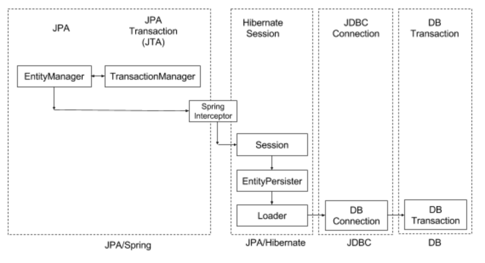

# Session

```
@author: suktae.choi
```

## Lifecycle

- Open (hibernate) session (in terms of JPA, create EntityManager)
- Open physical connection (JDBC)
- tx begin;
  - ... CRUD
- commit; or rollback;
- Close physical connection
- Close session



## Session Context

- entityManager 는 application-scope 으로 관리됨
- session 은 hibernate 설정에 따르 context 결정
  - thread 로 설정되어 있다면
- implicit tx 가 시작된다면
  - session opened
  - JDBC opened
  - tx begin; commit; or rollback;
  - JDBC closed
  - session closed
- 그다음 implicit tx 시작시
  - entityManager.getCurrentSession();
  - session 이 threadLocal 단위로 관리되므로, mark as closed
  - exception throws

```java
// hibernate 설정
props.put(org.hibernate.cfg.Environment.CURRENT_SESSION_CONTEXT_CLASS, "thread");

// SessionFactoryImpl - threadLocal 에 세션 저장
else if ( "thread".equals( impl ) ) {
  return new ThreadLocalSessionContext( this );
}

public User getUser(Long id) {
  User user = new User(id);
  user.setName(userService.getName(id));	// implicit session open and mark closed
  user.setAddress(userService.getAddress(id));	// session fetches from threadLocal and fail

  return user;
}

// console 결과
sessionAlreadyClosedException
```