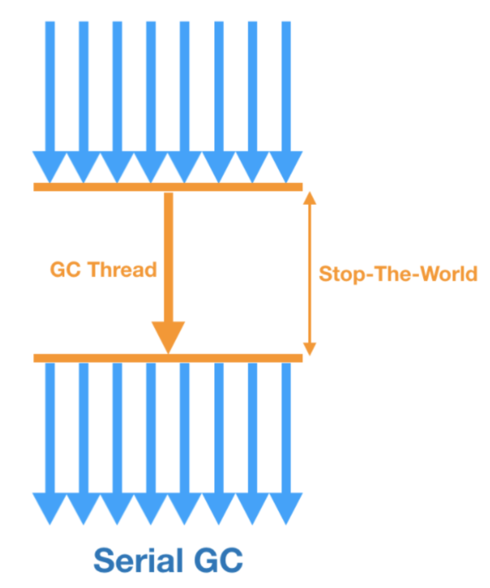
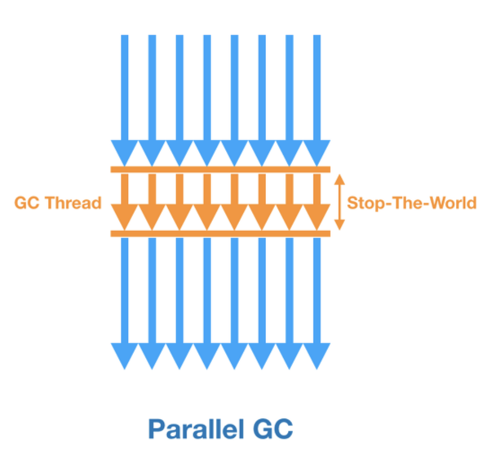
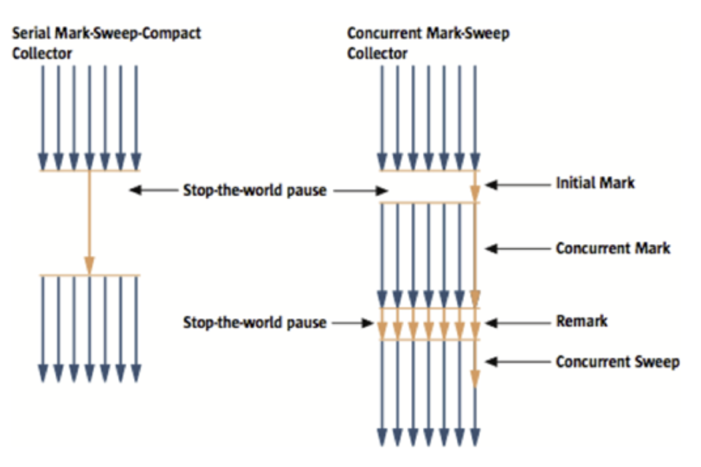
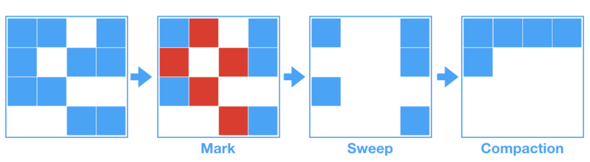

## Garbage Collection

```
@author: suktae.choi
- https://perfectacle.github.io/2019/05/07/jvm-gc-basic/
- https://perfectacle.github.io/2019/05/11/jvm-gc-advanced/
- https://www.slideshare.net/aszegedi/everything-i-ever-learned-about-jvm-performance-tuning-twitter
- https://docs.oracle.com/en/java/javase/11/gctuning/garbage-first-g1-garbage-collector1.html
```

### GC 유형

#### Serial GC (-XX:+UseSerialGC)

- 알고리즘
  - Mark-Sweep-Compact
- GC Thread
  - minor GC: 1개
  - major GC: 1개
- `Compaction 수행`

#### Parallel GC (-XX:+UseParallelGC)

- 알고리즘
  - Mark-Sweep-Compact
- GC Thread
  - `minor GC: N개`
  - major GC: 1개
- `Compaction 수행`

#### Parallel Old GC (-XX:+UseParallelOldGC)

- 알고리즘
  - (Young) Mark-Sweep-Compact
  - (Old) Mark-Summary-Compact
- GC Thread
  - `minor GC: N개`
  - `major GC: N개`
- `Compaction 수행`

#### CMS GC (-XX:+UseConcMarkSweepGC)

GC 때 compact 를 하지 않음 (그래서 평소 GC 가 short-time 이지만, 파편화시 ParallelGC 로 compact 수행)

- 알고리즘
  - `Initial Mark (STW)`: GC Root가 참조하는 객체만 마킹
  - `Concurrent Mark`: 참조하는 객체를 따라가며 지속적으로 마킹
  - `Remark (STW)`: concurrent mark 과정에서 변경된 사항이 없는지 다시 한번 마킹하며 확정
  - `Concurrent Sweep`: 접근할 수 없는 객체를 제거
- GC Thread
  - `minor GC: N개`
  - `major GC: N개`
- `Compaction 미수행`
- 특징
  - 알고리즘이 복잡해서 `리소스를 많이` 사용한다
  - (Compat 를 하지않고) STW 를 `짧게 2번 끊어서, 소요시간이 짧다`
  - (Compact 를 하지않아) STW 가 짧지만, `단편화 발생시 ParallelGC` 가 수행되고 이때는 STW 가 길다

#### G1 GC (-XX:+UseG1GC)

- 알고리즘
  - `Initial Mark`: GC Root가 참조하는 객체만 마킹
  - `Remark (STW)`: concurrent mark 과정에서 변경된 사항이 없는지 다시 한번 마킹하며 확정
  - `Cleanup (STW)`: empty region 제거
  - `Compact`: 각 region 에 있는 객체를 적절히 재배치 후, empty region 제거
- GC Thread
  - minor GC: N개
  - major GC: N개
- `Compaction 수행`
- 특징
  - Young, Old 가 연속된 공간이 아닌 `개별 Region 이 필요에 따라` 유연하게 할당
  - Young and/or Old 전체영역이 아닌 `garbage region 만 GC 수행`
  - 주기적 and/or -XX:InitiatingHeapOccupancyPercent 수치도달시 Young,Old GC 가 같이 수행된다

### GC 구조


- Young
  - Eden, From (S0), To (S1) 영역으로 구성
  - 새로 생성한 객체는 Eden 영역에 할당
- Old
  - Young 영역에서 살아남은 객체가 존재

**Minor GC**

- Eden 영역이 가득 차면 `Minor GC` 발생
  - Minor GC 가 발생하면 New 영역 전체에 Mark-Sweep 이 이뤄진다
  - Reference 가 있는 객체는 현재 사용되는 Survivor 영역으로 이동한다
- 다시 Minor GC 가 발생하면
- 살아남은 객체는 다른 Survivor 영역으로 이동한다 - `Aging`
  - Eden 에서 Survivor 로 이동할 객체도, 이동할 Survivor 로 할당된다
- 이 과정을 반복
- Threshold 이상의 Age 객체는 Old 영역으로 이동하게 된다 - `Promotion`

> Survivor 영역 중 하나는 반드시 비어 있는 상태로 남아 있어야 한다.
>
> 객체의 크기가 Eden 보다 크면, 바로 Old 영역으로 할당된다.

**Major GC**

- Old 영역이 가득 차면 `Full GC` 발생 (==`STW (stop-the-world)` 발생)

### GC 알고리즘

#### Serial GC



#### Parallel/ParallelOld GC



#### CMS GC



- 장점
  - Major GC 수행시 `STW 가 짧게 2번` 발생한다.
  - GC 도중이라도, 시스템이 멈추지않고 일부요청을 처리 할 수 있다.
- 단점
  - GC가 도는 도중에는 어플리케이션 스레드가 절반만 돌기 때문에 `서비스 처리율이 감소`한다.
  - Mark-Sweep 알고리즘에 비해 하는 일도 많고 복잡해서 `메모리, CPU를 더 많이` 쓴다.
  - 메모리 Compaction을 수행하지 않으므로 `단편화`가 발생시, STW 가 길게 발생한다.

> Old GC 수행도중 단편화로 인해 메모리가 충분히 확보되지 않으면 즉시 모든 작업을 멈추고, Compaction 을 위해 ParallelOldGC 을 처음부터 수행한다.
>

#### G1 GC



모든 영역이 정해져 있지 않고, Region 이라는 작은 단위로 분리되어 있다.

- Young (Eden, S0, S1), Old, Humongous, Unused 로 구성
- Region의 목표 수치는 `2048개` 로 분활된다. 즉, 8G의 Heap이라면 하나의 Region의 크기는 4MB
  - 8192 / 2048 = 4MB

> 객체 크기가 Region의 1/2보다 큰 경우, humongous 영역에서 관리

**Minor/Major GC**

주기적으로 or `-XX:InitiatingHeapOccupancyPercent` 에서 정한 수치가 넘어가면 동작한다. 

> minor/major GC 는 같이 수행된다. 조금씩 Young GC 때 Old region 이 같이 정리되는 개념이다

- Initial mark
  - Initial marking of live object along with Young GC
- Remark `(STW)`
  - Empty regions are removed and reclaimed. Region liveness is now calculated for all regions
- Cleanup `(STW)`
  - G1 selects the regions with the lowest "liveness", those regions which can be collected the fastest
- Compact
  - cleanup 에서 정리된 region 에 있던 object 를 별도의 region 으로 모으는 작업

> Young GC 가 발생할때 병렬적으로 Old region 에 대해 미리 mark 해놓고, Next GC에 liveness (빨리 처리가능한) 한 region 이 같이 정리되는 구조.
>

### Changes in JDK 8

- Perm 사라짐 (MetaSpace 영역으로 바뀜 - native memory)
  - PermGen 영역이 삭제되어 heap 영역에서 사용할 수 있는 메모리 증가
  - PermGen영역을 스캔 하기 위해 소모되었던 시간이 감소되어 GC 성능이 향상 되었다.

#### Before JDK 8

- `new / survive / old / perm / native`  

#### After JDK 8

- `new / survive / old / metaSpace (native)`

>  기존 perm 에 저장되어 문제를 유발하던 static/string literal 은 heap 으로 옮겨져 GC 대상으로 됨 
