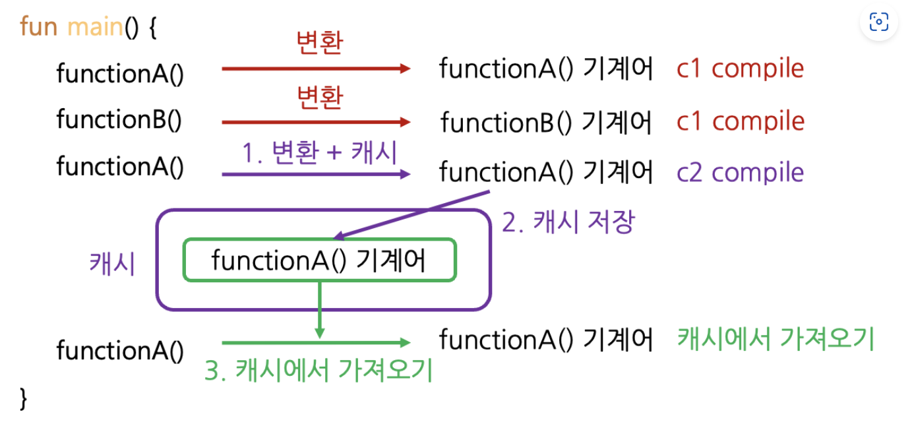

# JIT (Just-In Time) Compiler

```
@author: suktae.choi
- https://www.oracle.com/technical-resources/articles/java/architect-evans-pt1.html
- https://docs.oracle.com/javase/8/embedded/develop-apps-platforms/codecache.htm
- https://kotlinworld.com/307?category=914495
```


> *.java/kt -- [javac] -- *.class -- [jit] -- binary

핫스팟 JVM 은 C1, C2 2가지 유형의 JIT Compiler 가 존재합니다.

- C1 compiler (== -client): 1-3 level compilation
  - low optimization
  - fast compile-time
- C2 compiler (== -server): 4 level compilation + cache (codeCache 영역)
  - high optimization
  - low compile-time

## CodeCache
C2 로 컴파일된 코드는 CodeCache 에 저장 & interpret 시점에 (interpret 결과) 를 캐시에서 가져옵니다



한번 저장된 code 는 아래 케이스일때 삭제됩니다.

- Optimization failed -> re-calculate
- Compiler changed
- 메서드를 지닌 `클래스 언로딩`

마찬가지로 CodeCache 도 단편화가 발생 할 수 있습니다.