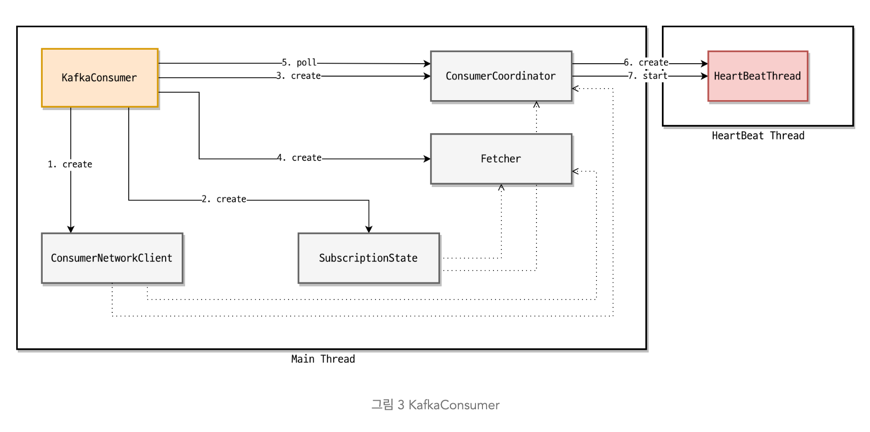

# Kafka

```
@author: suktae.choi
- https://kafka.apache.org/documentation
- https://www.conduktor.io/kafka/
- https://github.com/kafkakru/meetup/tree/master/conference/1st-conference
- https://www.popit.kr/author/peter5236
- https://bysssss.tistory.com/46
```

### Index

- [Kafka Stream](kafka-stream)
- [Kafka Connect](kafka-connect)
- [MirrorMaker 2.0](mm2)
- [Schema Registry](schema-registry)
- [KSQL](ksql)
- [Transactions](transactions)

### Blog

- [Consumer – Push vs Pull approach](https://blog.knoldus.com/kafka-consumer-push-vs-pull-approach/)
- [Schema Registry](https://medium.com/@gaemi/kafka-%EC%99%80-confluent-schema-registry-%EB%A5%BC-%EC%82%AC%EC%9A%A9%ED%95%9C-%EC%8A%A4%ED%82%A4%EB%A7%88-%EA%B4%80%EB%A6%AC-1-cdf8c99d2c5c)

***

## 기본 개념

### Topic/Partition

1개의 토픽은 N 개의 파티션으로 분산되어 처리 가능합니다.

토픽은 (정확하게는 파티션) Broker 에 저장되며 파티션 리더만을 통해 CRUD 가 발생합니다. 즉 Producer, Consumer 는 파티션 리더하고만 통신합니다.

> 파티션단위의 순서는 보장됨


### Segment (== file)

카프카에서 파티션을 나누는 단위이고, 브로커에 저장되는 메세지의 (물리적인) 로그파일 명칭 입니다.

> 카프카는 모두 로그파일에 넣고 -> OS 페이징캐시만을 이용해서 IO 를 관리합니다. (별도로 카프카 내부에서의 캐싱 없음)

- 세그먼트의 제한 크기나 보존 기간에 도달하면, 해당 파일을 닫고 새로운 세그먼트에 쓰기를 진행
- 카프카 브로커는 모든 파티션의 모든 세그먼트에 대해 각각 하나의 열린 파일 핸들을 유지
  - 따라서 OS 의 File Descriptor 는 [충분한 숫자](https://docs.confluent.io/current/kafka/deployment.html#file-descriptors-and-mmap)로 잡아야한다.

```bash
Kafka uses a very large number of files and a large number of sockets to communicate with the clients. All of this requires a relatively high number of available file descriptors.

Many modern Linux distributions ship with only 1,024 file descriptors allowed per process. This is too low for Kafka.

#!/bin/bash
# current opened socket counts
$ find /{kafka_home} -name '*index' | wc -l

# FD increased
$ echo 'vm.max_map_count=262144' >> /etc/sysctl.conf
# apply
$ sysctl -p
```

### Segment.Retention

Record 를 저장하는 파일의 보관주기

- 시간: 특정시간이 지난 파일 삭제 (default. 7-days)
- 사이즈: 특정사이즈가 오버되면 파일 삭제 (default. 1G)
- 주기: retention 체크 주기 (default. 5-mins)

### Segment.Compaction

카프카에서의 compaction 은 압축을 한다는 의미가 아닌 latest 만 남긴다는 의미입니다.

consumer-group 이 이미 fetch 한 offset 은 __consumer__offsets 토픽에 저장되어 있으므로, 해당 key 로 발행된 value (message) 는 최신1개만 남기고 제거하는 동작입니다

> 최신 1개만 남겨도 되는 케이스 일때만 사용가능. 모든 이벤트의 history 를 기록하는 성격이라면 compaction 사용시 유실

## Broker

### Replication

카프카는 파티션 리더가 모든 CRUD 를 담당하므로, 팔로어는 주기적으로 segment 을 fetch 해서 replication 을 수행합니다.

```
// TODO - 해당 과정에 대한 그림 필요

우선 데이터 보내고 나중에 commit 유무 알려줌 (next fetch 에서)
리더는 모든 ISR 이 복제를 완료한 데이터만 (즉 commit 된 데이터를 의미함) consumer 가 읽어가도록 보장한다
```

replication.factor 에 설정된 수치만큼 replication 이 되고, out-of-sync 가 아닌 팔로어를 ISR (InSyncReplica) 로 관리합니다.

- leader: 주기적으로 heartbeat 을 보내 응답하지 않는 follower 를 ISR 그룹에서 제외
- follower: 주기적으로 Leader 의 data fetch

### Controller

[Controller Broker](https://www.slideshare.net/ConfluentInc/a-deep-dive-into-kafka-controller) 는 브로커 중 하나가 임의로 선정 됩니다.

- 목적: (브로커) 장애시 해당 브로커에 속하던 `파티션 리더 선출`
- 플로우: ISR 에서 raft 를 통해 리더를 선출합니다

### Coordinator

[Coordinator Broker](https://kafka.apache.org/documentation/#impl_offsettracking) 는 브로커 중 하나가 임의로 선정 됩니다.

- 목적: (컨슈머) 장애시 해당 파티션을 처리하는 `다른 consumer-group 선정`
- 플로우: 기본적으로 heartbeat 로 체크하고 record polling, offset commit 이 오면 heartbeat 를 받았다고 판단합니다

## Producer

메세지를 전송하는 단위 입니다.

### send 흐름


- send
- partitioner
- accumulator
- sender

// TODO - 각 kafka options 의미 설명

### Acks


- 0: no ack from leader (== async)
- 1: ack from leader
- all: ack from all ISR members

### ProducerRecord

```java
public class ProducerRecord<K, V> {
    private final String topic;
    private final Integer partition;
    // metadata 저장. key-value pair
    private final Headers headers;
    // (optional) 파티션을 결정하는 식별단위 (key 의 hash 로 partition 결정, 없으면 RR)
    private final K key;
    private final V value;
    private final Long timestamp;

    // ...
}
```

### send 유형

- at-least once
  - acks 를 기다리고 실패시 재전송
- at-mose once
  - acks 를 기다리지 않음
- exactly once (== transaction)
  - PID (producerID) & sequence 의 조합
  - `enable.idempotence=true`

exactly-once 는 transaction 을 지원한다는 의미이고, Producer 에서의 처리는 같습니다:

```java
KafkaProducer<String, String> producer = new KafkaProducer<>(configs);

producer.initTransactions();
producer.beginTransaction();
    try {
        producer.send(record);
        producer.flush();
        producer.commitTransaction();
    } catch(Exception e) {
        producer.abortTransaction();
    } finally {
        producer.close();
    }
```

- send 된 message 는 broker 에 저장 (offset++)
- 그후 commit 수행 (offset++)
  - 즉 transaction committed 마킹하는 record 가 추가로 전송됨
- consumer 는 `read_committed` 으로 설정하고, latest-commit 마킹 이전의 record 만 fetch
  - consumer 는 commit 된 메세지를 가져간다. 까지만 보장하고 exactly-once 를 보장하진 않습니다 (fetch 했지만 acks 실패 등)

즉 일반적인 사용성에서 kafka transaction 은 
- producer: commit record 를 추가로 보내면서 exactly-once 보장
- consumer: coommit 된 record 만 fetch 까지만 보장 (중복가능)

## Consumer

메세지를 소비하는 단위 입니다.

### fetch 흐름



- fetcher
- coordinator
- assigner

// TODO - 각 kafka options 의미 설명

### Consumer Group

consumer 는 특정 consumer-group 에 속하고, 그룹은 group-id 로 구분됩니다. 컨슈머그룹은 subscribe 하는 파티션의 offsets 을 `__consumer__offsets` 토픽으로 관리합니다.

- consumer-group:partition:offsets 으로 관리

### Rebalancing

그룹안에서 Consumer 추가/삭제시 rebalancing 발생

- 리밸런싱이 일어나는 동안은 STW

### Commit

Consumer group 에서 kafka 에 offset 을 기록하는 과정

- auto commit
  - enable.auto.commit=true, time-interval 로 주기적으로 commit
  - 아직 처리못했는데 (장애) auto.commit 해버리면 **유실발생**
- manual commit
  - enable.auto.commit=false, \#commitSync 이 호출되야 commit
  - #commitSync 는 동기방식이므로, 카프카에서 응답올때까지 **STW**
  - commit 전에 장애발생시 리밸런싱 이후 **중복가능**
- async-manual commit
  - enable.auto.commit=false, \#commitAsync 이 호출되야 commit
  - 응답을 기다리지 않으므로, STW 없음
  - commit 전에 장애발생시 리밸런싱 이후 **더 많은 중복가능**
    - async 로 처리하니, local 처리량이 sync 방식보다 더 많으므로

> 중복가능성이 있으니, 멱등성이 유지되는게 중요하다.

### Push vs Pull

- Push (kafka to consumer)
  - pros
    - No latency to receive record from broker
  - cons
    - Failover: 복잡함. 컨슈머가 죽었을때 retry or discard 등 모든 컨슈머에 대해 meta 관리해야함
    - Backpressure: 어려움. 필요하면 그런것도 다 broker 에서 관리해야함
- Pull (consumer)
  - pros
    - Some latency to receive record from broker
    - long polling: time-based, size-based 등으로 나름 빠르게 대응할 수 있음
  - cons
    - backpressure: 부하가 있다면 다음 메세지를 천천히 가져가면됨
    - failover: 나중에 살아났을때 next offset 부터 가져가면됨
    -

## Failover

장애시 정책은 `unclean.leader.election.enable` 를 통해 설정가능

- false: ISR 에서만 leader 를 기다림
  - 가용성낮음, 유실낮음
- true: ISR 가 없다면 (== out-of-sync) replicas 중에서 리더를 선출한다.
  - 가용성높음, 유실높음

## Advanced

### ACID

- Kafka: ISR 그룹 전체에 메세지가 복제되면, 그것을 commit 으로 간주한다.
- Consumer: polling 시, 커밋된 메세지만 가져온다. (== 모든 ISR 에 동기화된)

### Cluster Mirroring

동일 클러스터 내 에서의 복제는 Replicas

클러스터 단위의 복제는 Mirroring

