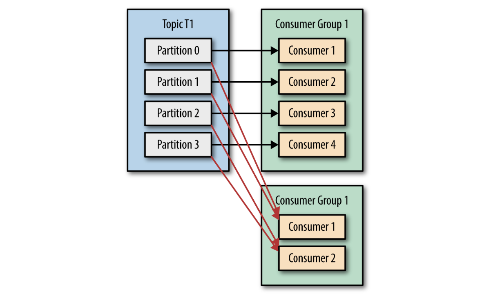
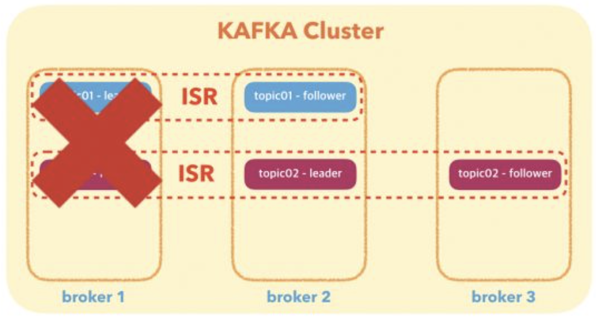

# Kafka

```
@author: suktae.choi
- https://kafka.apache.org/documentation
- https://github.com/kafkakru/meetup/tree/master/conference/1st-conference
- https://www.popit.kr/author/peter5236
- https://bysssss.tistory.com/46
```

### Index
- APIs
- [Kafka Stream](kafka-stream)
- [Kafka Connect](kafka-connect)
- [Transactions](transactions)

### Blog
- [Consumer – Push vs Pull approach](https://blog.knoldus.com/kafka-consumer-push-vs-pull-approach/)
- [Schema Registry](https://medium.com/@gaemi/kafka-%EC%99%80-confluent-schema-registry-%EB%A5%BC-%EC%82%AC%EC%9A%A9%ED%95%9C-%EC%8A%A4%ED%82%A4%EB%A7%88-%EA%B4%80%EB%A6%AC-1-cdf8c99d2c5c)
- KSQL

***

## Topic/Partition
토픽은 N 개의 파티션으로 분산됨

파티션단위의 순서는 보장됨

1개의 파티션은 consumer group 단위로, 그룹안에 1개의 consumer 만 구독가능

> 동시처리 방지위해



## Replication
해당 토픽의 카프카 리더가 R/W 를 모두 담당함

카프카리더의 데이터를 Fellow 가 주기적으로 pull 해서 replication 유지

> 이런 관계를 ISR (In Sync Replicas) 이라고 부름



## Election
**[Controller Broker](https://www.slideshare.net/ConfluentInc/a-deep-dive-into-kafka-controller)**

브로커들의 liveness 관리.

브로커중에서 bootstrap 시점 주키퍼 `/controller` 임시노드를 먼저 생성한 브로커가 컨트롤러로 선정되고, 나머지는 watching

- 브로커가 중단되면, 해당 브로커가 리더였던 파티션의 새로운 리더 선출담당

> (TBD) Controller Broker 의 재선출과정은?

**ISR (In Sync Replicas)**

브로커 down 시, 해당 브로커가 리더였던 파티션의 새 리더는 ISR 그룹안에서 선정한다.

- Leader - 주기적으로 heartbeat 을 보내 응답하지 않는 follower 를 ISR 그룹에서 제외
- Follower - 주기적으로 Leader 의 data pull

> 즉 ISR 내에서는 fresh 보장됨

Controller 는 주키퍼 확인후 (ISR 브로커중에서), 기본적으로 RR 로 새 리더를 선출한다.

## Failover
전면장애시 정책은 `unclean.leader.election.enable` 를 통해 설정가능

- false: ISR 에서만 leader 를 기다림
  - 가용성낮음, 유실낮음
- true: ISR 가 없다면 (== out-of-sync) replicas 중에서 리더를 선출한다.
  - 가용성높음, 유실높음

**GroupCoordinator Broker**

Consumer 에게 Heartbeat 를 받고, 일정주기 동안 없으면 Rebalancing 을 수행

- 전송방법: record polling, offset commit 이 오면 heartbeat 를 받았다고 판단

## Files
**Retention**

Record 를 저장하는 파일의 보관주기

- 시간: 특정시간이 지난 파일 삭제 (default. 7 days)
- 사이즈: 특정사이즈가 오버되면 파일 삭제 (default. 1G)

**Segment**

카프카에서 파티션을 나누는 단위

- 세그먼트의 제한 크기나 보존 기간에 도달하면, 해당 파일을 닫고 새로운 세그먼트에 쓰기를 진행
- 카프카 브로커는 모든 파티션의 모든 세그먼트에 대해 각각 하나의 열린 파일 핸들을 유지
  - 따라서 OS 의 File Descriptor 는 [충분한 숫자](https://docs.confluent.io/current/kafka/deployment.html#file-descriptors-and-mmap)로 잡아야한다.

```bash
Kafka uses a very large number of files and a large number of sockets to communicate with the clients. All of this requires a relatively high number of available file descriptors.

Many modern Linux distributions ship with only 1,024 file descriptors allowed per process. This is too low for Kafka.

#!/bin/bash
# current opened socket counts
$ find /{kafka_home} -name '*index' | wc -l

# FD increased
$ echo 'vm.max_map_count=262144' >> /etc/sysctl.conf
# apply
$ sysctl -p
```

## Producer
### Acks
- 0: no ack from leader
- 1: ack from leader
- all: ack from all ISR members

### ProducerRecord

```java
public class ProducerRecord<K, V> {
  private final String topic;
  private final Integer partition;
  private final Headers headers;
  private final K key;
  private final V value;
  private final Long timestamp;

  // ...
}
```

- headers: metadata 저장. key-value pair
- key: (생락가능) used to determine which partition to assign
  - 있으면 - key 의 hash 로 파티션 구분
  - 없으면 - RR 로 공평하게 돌림
- value: payload

## Consumer
### Consumer Group
**Rebalancing**

그룹안에서 Consumer 추가/삭제시 rebalancing 발생

- 리밸런싱이 일어나는 동안은 STW

### Commit
Consumer group 에서 kafka 에 offset 을 기록하는 과정

- auto commit
  - enable.auto.commit=true, time-interval 로 주기적으로 commit
  - 아직 처리못했는데 (장애) auto.commit 해버리면 **유실발생**
- manual commit
  - enable.auto.commit=false, \#commitSync 이 호출되야 commit
  - \#commitSync 는 동기방식이므로, 카프카에서 응답올때까지 **STW**
  - commit 전에 장애발생시 리밸런싱 이후 **중복가능**
- async-manual commit
  - enable.auto.commit=false, \#commitAsync 이 호출되야 commit
  - 응답을 기다리지 않으므로, STW 없음
  - commit 전에 장애발생시 리밸런싱 이후 **더 많은 중복가능**
    - async 로 처리하니, local 처리량이 sync 방식보다 더 많으므로

> 중복가능성이 있으니, 멱등성이 유지되는게 중요하다.

### Offset
토픽 (정확하게는 파티션) offset 을 Consumer group 단위로 관리한다.

> 예전에는 zookeeper 에서, 지금은 kafka 자체가 저장

### Push vs Pull
**Push (kafka to consumer)**

- pros
  - No latency to receive record from broker
- cons
  - Failover: 복잡함. 컨슈머가 죽었을때 retry or discard 등 모든 컨슈머에 대해 meta 관리해야함
  - Backpressure: 어려움. 필요하면 그런것도 다 broker 에서 관리해야함

**Pull (consumer)**

- pros
  - Some latency to receive record from broker
  - long polling: time-based, size-based 등으로 나름 빠르게 대응할 수 있음
- cons
  - backpressure: 부하가 있다면 다음 메세지를 천천히 가져가면됨
  - failover: 나중에 살아났을때 next offset 부터 가져가면됨

## Advanced
### ACID

- Kafka: ISR 그룹 전체에 메세지가 복제되면, 그것을 commit 으로 간주한다.
- Consumer: polling 시, 커밋된 메세지만 가져온다. (== 모든 ISR 에 동기화된)

**Cluster Mirroring**

동일 클러스터 내 에서의 복제는 Replicas

클러스터 단위의 복제는 Mirroring

> 솔루션은 MirrorMaker 가 있음

UseCase 가 없음. 정말 필요한지 고민해보길