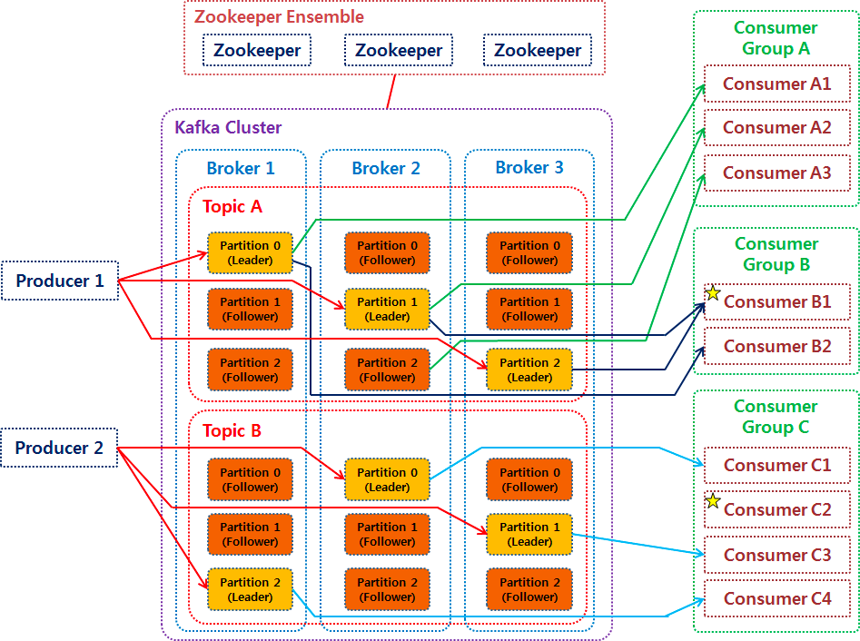
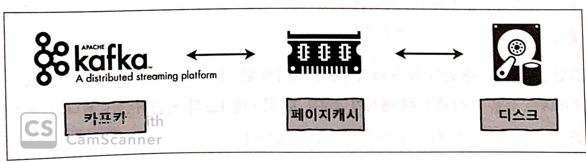
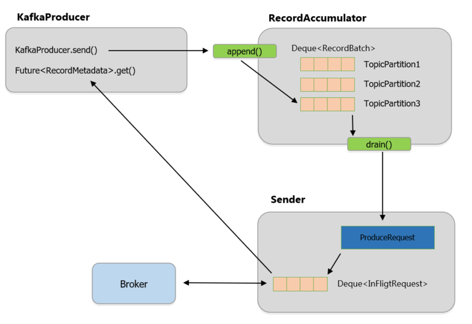
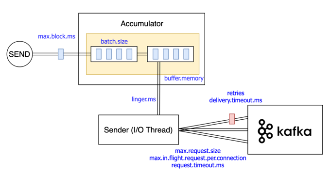
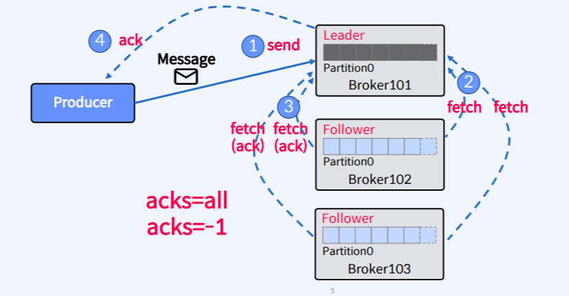
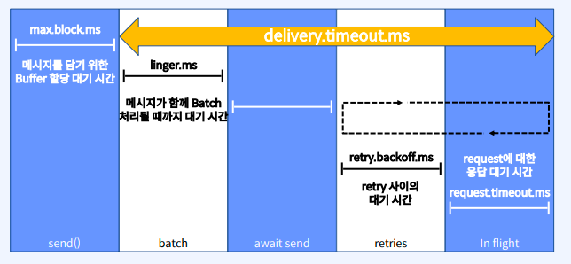

# Kafka

```
@author: suktae.choi
- https://kafka.apache.org/documentation
- https://docs.confluent.io/kafka/introduction.html
- https://www.conduktor.io/kafka/
- https://velog.io/@hyun6ik/series/Apache-Kafka
- https://github.com/kafkakru/meetup/tree/master/conference/1st-conference
- https://www.popit.kr/author/peter5236
- https://bysssss.tistory.com/46
```

### Index

- [Kafka Stream](kafka-stream)
- [Kafka Connect](kafka-connect)
- [MirrorMaker 2.0](mm2)
- [Schema Registry](schema-registry)
- [Transactions](transactions)

### Blog

- [Consumer – Push vs Pull approach](https://blog.knoldus.com/kafka-consumer-push-vs-pull-approach/)
- [Schema Registry](https://medium.com/@gaemi/kafka-%EC%99%80-confluent-schema-registry-%EB%A5%BC-%EC%82%AC%EC%9A%A9%ED%95%9C-%EC%8A%A4%ED%82%A4%EB%A7%88-%EA%B4%80%EB%A6%AC-1-cdf8c99d2c5c)

***

## 기본 개념

### Topic/Partition

1개의 토픽은 N 개의 파티션으로 분산되어 저장됩니다.

파티션은 Broker 에 로그파일 (==segment) 로 저장되며 파티션 리더만을 통해 CRUD 가 발생합니다. 즉 Producer, Consumer 는 파티션 리더와 통신합니다.

> 파티션단위의 순서는 보장됨



### Page cache

카프카는 모든 IO 에 OS 레벨의 page cache 를 활용합니다. (별도로 카프카 내부에서의 캐싱 없음)



https://docs.confluent.io/platform/current/kafka/deployment.html#memory 의 가이드에 따르면

- 카프카 자체에 대한 -Xmx -Xms 는 5G 정도면 충분
- 나머지는 모두 OS 가 사용하도록 (page cache) 메모리는 충분히 여유있게 유지

해야합니다.

### Zero copy (== Direct memory or DMA)

page cache 를 통해 memory 에 있는 record 는

- producer -- broker
- broker -- consumer

간의 통신에서 zero-copy 를 통해 수신/전송 됩니다. 이를 통해 JVM heap 의 사용률을 줄일 수 있고 불필요한 복사비용이 감소합니다.

### Segment (== file)

브로커에 저장되는 레코드의 (물리적인) 로그파일 입니다.

- 브로커는 파티션의 모든 세그먼트에 대해 각각 하나의 열린 파일 핸들러를 유지 합니다
- 따라서 OS File Descriptor 는 [충분한 숫자](https://docs.confluent.io/current/kafka/deployment.html#file-descriptors-and-mmap) 로 설정해야 합니다

```bash
# current opened socket counts
$ find /{kafka_home} -name '*index' | wc -l

# FD increased
$ echo 'vm.max_map_count=262144' >> /etc/sysctl.conf
# apply
$ sysctl -p
```

### Log Retention

Record 를 저장하는 파일의 보관주기는 아래와 같습니다:

- 시간: 특정시간이 지난 파일 삭제 (default. 7-days)
- 사이즈: 특정사이즈가 오버되면 파일 삭제 (default. 1G)
- 주기: retention 체크 주기 (default. 5-mins)

### Log Compaction

Log compaction ensures that Apache Kafka will always `retain at least the last known value` for `each message key` within the log of data for a `single topic partition`.


- kafka-key 를 기준으로 message compaction 을 진행하므로, compaction 사용시 key 는 필수값 입니다
  - record 의 key 는 원래 비필수
- 각 파티션에서의 unique 만 보장합니다 (global unique 하지 않음)
  - 그에 따라 파티션 rebalancing or 추가시 중복이 발생 할 수 있습니다

```json
log.cleanup.policy=compact
```

## Broker

### [Replication](https://docs.confluent.io/kafka/design/replication.html)

카프카는 파티션 리더가 모든 CRUD 를 담당하므로, 팔로어는 주기적으로 segment 을 fetch 해서 replication 을 수행합니다.

```
// TODO - 해당 과정에 대한 그림 필요

우선 데이터 보내고 나중에 commit 유무 알려줌 (next fetch 에서)
리더는 모든 ISR 이 복제를 완료한 데이터만 (즉 commit 된 데이터를 의미함) consumer 가 읽어가도록 보장한다
```

replication.factor 에 설정된 수치만큼 replication 이 되고, out-of-sync 가 아닌 팔로어를 ISR (InSyncReplica) 로 관리합니다.

- leader: 주기적으로 heartbeat 을 보내 응답하지 않는 follower 를 ISR 그룹에서 제외
- follower: 주기적으로 Leader 의 data fetch

### Controller

[Controller Broker](https://www.slideshare.net/ConfluentInc/a-deep-dive-into-kafka-controller) 는 브로커 중 하나가 임의로 선정 됩니다.

- 목적: (브로커) 장애시 해당 브로커에 속하던 `파티션 리더 선출`
  - broker (node) 는 controller 와 session 을 유지해야 합니다
  - follower 는 주기적으로 leader 의 데이터를 replicate 해야합니다 (not too far behind)
- 플로우: ISR 에서 raft 를 통해 리더를 선출합니다

### Coordinator

[Coordinator Broker](https://kafka.apache.org/documentation/#impl_offsettracking) 는 브로커 중 하나가 임의로 선정 됩니다.

- 목적: (컨슈머) 장애시 해당 파티션을 처리하는 `다른 consumer-group 선정`
- 플로우: 기본적으로 heartbeat 로 체크하고 record polling, offset commit 이 오면 heartbeat 를 받았다고 판단합니다

## Producer

메세지를 전송하는 단위 입니다.

### 구성요소



- kafkaProducer
  - serialization
  - partitioning
  - compression
- RecordAccumulator
  - serdes -- partition -- compression 이 완료된 record 가 저장되는 버퍼 입니다
  - 주기적으로 Sender 가 fetch 합니다
- Sender
  - (비동기) Accumulator 에 저장된 record 를 broker 에 전송합니다

### 옵션



- acks
  - 0: no ack from leader (== async)
  - 1: ack from leader
  - all: ack from all ISR members
- compression.type
- enable.idempotence/transaction.id
  - exactly-once 를 위해 사용하는 옵션
- max.in.flight.requests.per.connection
  - 하나의 커넥션에서 ACK 없이 전송할 수 있는 요청수 (기본값: 5)
- max.block.ms
  - producer#send 시 메시지를 저장하는 Buffer 할당까지 대기하는 시간
- batch.size(64kb)/linger.ms(10ms)
  - batch 에서 message 를 보내기까지의 size, timeout

### 전송방식

- at-least once
  - acks 를 기다리고 실패시 재전송
- at-mose once
  - acks 를 기다리지 않음
- exactly once ([transaction](transactions) 과 연관있음)
  - PID (producerID) & sequence 의 조합
  - `enable.idempotence=true`

### Acks

acks=all 은 `fellow partition` 이 모두 ack 를 리더파티션에 보내면 -> 리더 파티션이 producer 에 OK 를 응답합니다



### Delivery timeout

max.block.ms 이후 구간부터 `develiry.timeout.ms` 구간 입니다 



### 순서보장  

`max.in.flight.requests.per.connection (default: 5)` 의 설정에 따라 batch 로 보내진 메세지중 1개가 실패한 경우 retry 하지만 그로인해 메세지의 순서가 변경 될 수 있습니다.

`enable.idempotence=true` 로 설정한경우 batch 단위로 성공/실패 처리하므로 순서 보장이 가능합니다

## Consumer

메세지를 수신하는 단위 입니다.

### 구성요소


### 옵션

- group.id
  - consumer group 의 식별자 입니다. 동일 그룹내의 정보는 공유됩니다
- enable.auto.commit
  - 백그라운드로 오프셋을 커밋합니다 (periodically)
- isolation.level
  - read_uncommitted, read_committed
  - read_committed 은 (producer 에서) 트랜잭션 commit 된 메세지만 가져갑니다

### Consumer Group

- consumer 는 특정 consumer-group 에 속하고 그룹은 group-id 로 구분됩니다
- 컨슈머그룹은 subscribe 하는 파티션의 offsets 을 `__consumer_offsets` 토픽으로 관리합니다.
- 그룹에 consumer 추가/삭제시 리밸런싱이 발생하고 그 동안은 STW 입니다

## Advanced

### ACID

- producer: replication.factor (즉 ISR) 을 만족하면 그것을 commit 으로 간주합니다
  - transaction 을 사용한다면 -> commit record 를 명시적으로 한번 더 보내는 과정이 추가
- consumer: polling 시 커밋된 메세지만 가져옵니다 (== 모든 ISR 에 동기화된 record)
  - transaction 을 사용한다면 -> commit 마킹된 record 만 pull

## 가용성 vs 내구성

`unclean.leader.election.enable` 옵션을 통해 결정됩니다.

- false: ISR 에서만 leader 를 선출합니다
  - 가용성 낮음
  - 내구성 높음
- true: ISR 가 없다면 (== out-of-sync) replicas 중에서 리더를 선출한다.
  - 가용성 높음
  - 내구성 낮음