# Kafka
```
https://kafka.apache.org/documentation
https://docs.confluent.io/kafka/introduction.html
https://learn.conduktor.io/kafka/what-is-apache-kafka/
https://github.com/itmare/kafka/tree/master/lecture
https://velog.io/@hyun6ik/series/Apache-Kafka
https://github.com/kafkakru/meetup/tree/master/conference/1st-conference
https://www.popit.kr/author/peter5236
https://bysssss.tistory.com/46
```
### Blog
- [Consumer – Push vs Pull approach](https://medium.com/codex/asynchronous-communication-why-does-kafka-use-a-pull-based-message-consumer-442c19a70f58)
- [Kafka에서 파티션 증가 없이 동시 처리량을 늘리는 방법 - Parallel Consumer](https://d2.naver.com/helloworld/7181840)
- [카프카 컨슈머에 동적 쓰로틀링 적용하기](https://techblog.woowahan.com/20156/)

***
## 기본 개념
### Persistence
- OS는 디스크 성능 개선 위해 `메모리를 적극 활용한 read-ahead 와 write-behind 방식으로 페이지 캐시`를 적극적으로 활용 합니다
- 페이지 캐시는 OS 가 관리하는 영역이므로 카프카가 재시작 되더라도 유지됩니다
  - 물론 OS 가 재시작되면 페이지 캐시도 초기화 됩니다..

### (읽기/쓰기) Page cache
카프카는 모든 I/O 에 OS 레벨의 page cache 를 활용합니다. (별도로 카프카 내부에서의 캐싱 없음)

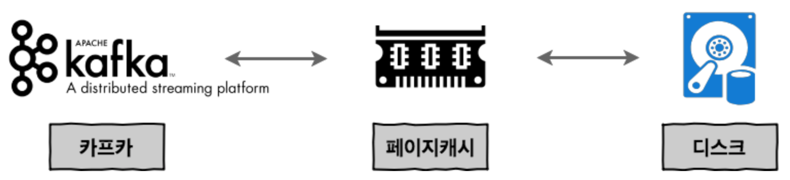

https://docs.confluent.io/platform/current/kafka/deployment.html#memory 의 가이드에 따르면

- 카프카 자체에 대한 -Xmx -Xms 는 5G 정도면 충분
- 나머지는 모두 OS 가 사용하도록 (page cache) 충분히 여유있게 유지

해야합니다.

### (전송) Zero copy (== Direct memory or DMA)
`디스크 -> 커널 버퍼 -> NIC`로 바로 전달해서 네트워 구간을 최적화 합니다.

### 1. 기존 (Non-Zero Copy) 방식
- 디스크에서 데이터를 커널 버퍼로 읽음
- 커널 버퍼의 데이터를 사용자 공간(User Space) 버퍼로 복사
- 사용자 공간 버퍼에서 다시 소켓 커널 버퍼로 복사
- 소켓 버퍼에서 네트워크 카드로 전송

### 2. Zero Copy (sendfile) 방식
- 커널이 직접 디스크 파일을 소켓으로 전송 (sendfile() 호출).
- 사용자 공간을 거치지 않고, 디스크 → 커널 버퍼 → 네트워크 카드로 바로 전달.

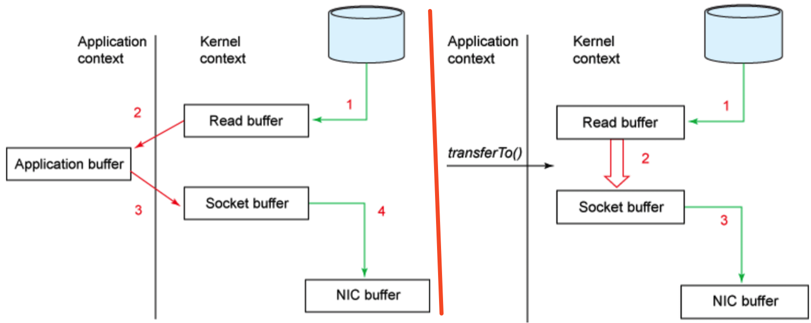

더 개선된 zero copy 는 NIC 버퍼가 Read 버퍼를 참조할 수 있는 주소정보를 획득하여 직접 접근합니다.
- 소켓 버퍼 복사과정 생략

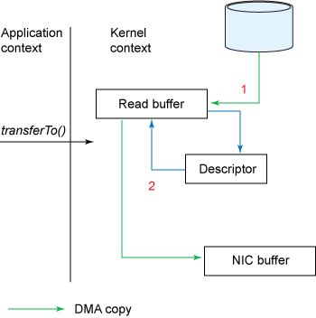

### Segment (== file)
브로커에 저장되는 레코드의 (물리적인) 로그파일 입니다

- 브로커는 파티션의 모든 세그먼트에 대해 각각 하나의 열린 파일 핸들러를 유지 합니다
- 따라서 OS 의 File Descriptor 는 [충분한 숫자](https://docs.confluent.io/current/kafka/deployment.html#file-descriptors-and-mmap) 를 설정해야 합니다

```bash
# current opened socket counts
$ find /{kafka_home} -name '*index' | wc -l

# FD increased
$ echo 'vm.max_map_count=262144' >> /etc/sysctl.conf
# apply
$ sysctl -p
```

### Log Retention
Record 를 저장하는 파일의 보관주기는 아래와 같습니다:
- Time: 특정시간이 지난 파일 삭제 (기본값: `7-days`)
- Size: 특정사이즈를 넘은 파일 삭제 (기본값: 1G)
- 주기: retention 체크 주기 (기본값: 5-mins)

### Log Compaction
토픽 > 파티션에 저장되어 있는 Record 의 Kafka Key 를 기준으로 `최신 1개만 유지` 하는 기능 입니다.

- `카프카 키`를 기준으로 Compation 진행하므로 필수
  - 원래 메세지의 Kafka-key 는 비필수
- `각 파티션의 유니크만 보장`합니다 (global unique 하지 않음)
  - 그에 따라 파티션 rebalancing or 추가시 중복이 발생 할 수 있습니다

```json
log.cleanup.policy=compact
```

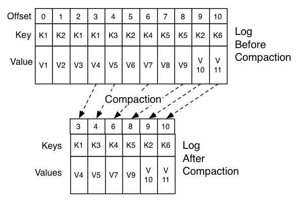

## 토픽/파티션
브로커는 `1개의 토픽의 메세지를 N-개의 파티션으로 분산`해서 Record 저장 합니다.

파티션은 로그파일로 (== sengment) 메세지를 저장하고, `파티션 리더를 통해서만 CRUD 가 발생`합니다. (즉 Producer, Consumer 는 파티션 리더와 통신)

> 파티션 단위의 메세지 순서는 보장

> 파티션은 늘릴수 있지만, 줄일수 없습니다 (데이터 유실)

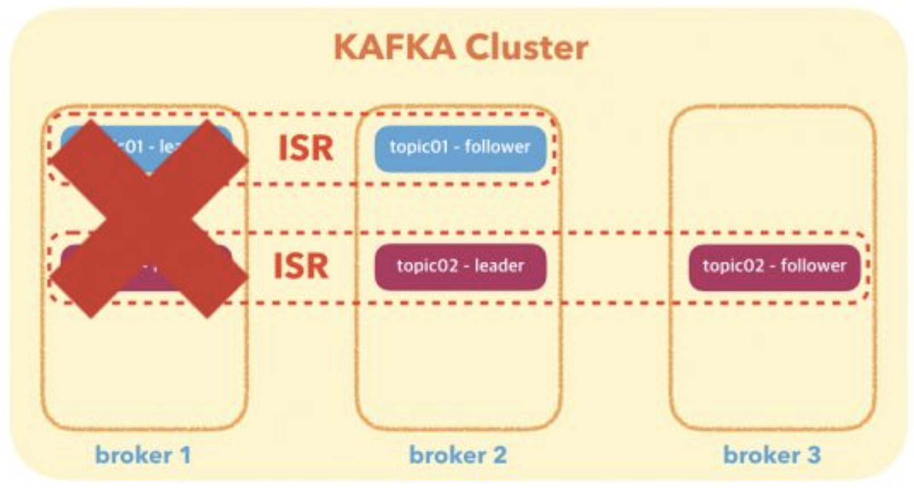

## Broker
### 1. [Replication](https://docs.confluent.io/kafka/design/replication.html)
카프카는 파티션 리더가 모든 CRUD 를 담당하므로, 팔로어는 주기적으로 segment 을 fetch 해서 replication 을 수행합니다.

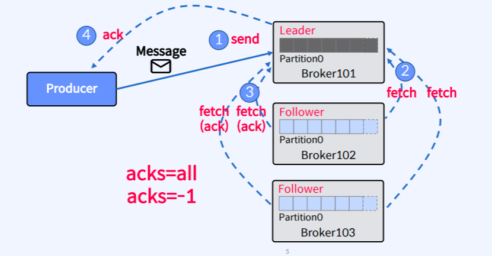

- Producer#send 을 통해 `파티션 리더`에 메세지를 저장합니다
  - producer 는 replication 이 완료될때까지 대기
- `팔로우 파티션` 은 메세지 fetch
- ISR 수치만큼의 팔로우가 ACKS 를 리턴하면 > 파티션 리더는 메세지를 Commit > Producer 에 committed 로 성공 응답합니다
  - 대기하던 producer 는 이제 다음 작업 진행
  - ISR 이 모두 복사된 메세지는 Committed 로 상태가 변경되고 (Tx 미사용시) > 아직 복사 진행중이라 Uncommitted 상태인 메세지는 consumer#poll 에서 제외됩니다 (브로커가 전달하지 않음)

```
안정적인 카프카 운영을 위해 min.insync.replicas 는 반드시 replication.factor 보다 작아야 합니다 
min.insync.replicas < replication.factor = 3 or 5 ... (quorum 숫자)

만약 동일한 수치가 설정되어 있다면, 팔로워가 장애가 발생시 모든 메세지가 발행 실패됩니다.
- 3개의 복제를 설정했지만
- 1개의 물리적인 브로커 장애시 1개의 복제가 될 수 없는 상황 발생
- 그때 min.insync.replicas == replication.factor 라면 -> ISR 를 만족 할 수 없으므로 모든 발행이 실패 (그리고 Producer 의 설정에 따라 무한 retries 가능) 
```

### 2. Controller
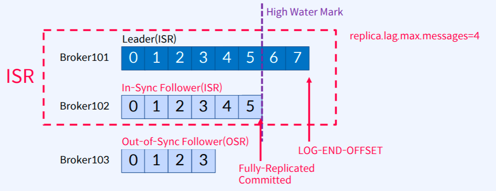

[Controller Broker](https://www.slideshare.net/ConfluentInc/a-deep-dive-into-kafka-controller) 는 브로커 중 하나가 임의로 선정 됩니다.

목적: `(브로커) 장애시` 해당 브로커에 속하던 `파티션 리더/팔로워 선출`
- 모든 브로커는 zookeeper 와 heartbeat 을 주고받습니다 (혹은 kraft 를 사용함으로써 브로커끼리 직접 통신) 
- `replica.lag.time.max.ms (10000ms)`

흐름은 아래와 같습니다:
- leader failure
  - 주키퍼는 leader 장애 감지시, zookeeper 에 상태 업데이트 합니다 (znode 제거)
  - zookeeper 는 metadata 갱신 > watching 하고 있던 controller 는 znode 변경 감지
  - controller broker 는 나머지 broker 에 전파합니다
    - kraft 를 사용한다면 zookeeper 과정이 생략되고, controller 가 각 브로커와 kraft 로 직접 heartbeat 통신하며 감지
- follower failure
  - 파티션 리더는 heartbeat and/or fetch 요청이 오지 않는 follower 를 zookeeper 에 상태 업데이트 합니다 (znode 제거)
  - zookeeper 는 metadata 갱신 > watching 하고 있던 controller 는 znode 변경 감지
  - controller broker 는 나머지 broker 에 전파합니다
    - kraft 를 사용한다면 zookeeper 과정이 생략되고, controller 가 각 브로커와 kraft 로 직접 heartbeat 통신하며 감지

### 3. [Cruise Control](https://github.com/linkedin/cruise-control)
Controller 에 의해 브로커 장애가 복구된 후 클러스터는 `스큐 (Broker Skew)` 상태에 빠지게 됩니다.

- 상황: 장애가 발생한 브로커 A가 가지고 있던 리더 파티션이, ISR에 있던 다른 브로커(B, C) 에게 몰리게 됩니다.
- 결과: 브로커 B, C는 갑자기 늘어난 리더 역할 때문에 네트워크 트래픽, CPU 사용량이 급증하여 과부하가 됩니다. 반면 다른 브로커들은 상대적으로 한가한 상태가 됩니다.

이때부터 Cruise Control 이 동작 합니다.

1. 불균형 상태 인지
   - Cruise Control은 주기적으로 클러스터의 상태(브로커별 리더 수, 파티션 수, 네트워크 I/O, CPU 사용량 등)를 모니터링합니다
   - 장애 복구 후 특정 브로커에 리더가 몰려있는 불균형 상태가 사용자가 설정한 '최적화 목표(Optimization Goals)'를 위반했음을 감지합니다
2. 최적화 계획 생성
   - Cruise Control의 Analyzer는 현재의 불균형 상태를 해결하고, 모든 브로커가 다시 균일한 부하를 갖도록 파티션을 재배치하는 실행계획을 세웁니다
   - 이 계획에는 "A 파티션의 리더를 브로커 B에서 D로 옮겨라", "B 파티션의 복제본을 브로커 C에서 E로 옮겨라" 와 같은 구체적인 액션들이 포함됩니다
3. 계획 실행 (Rebalancing Execution)
   - 자동 실행: `self.healing.enabled` 모드로 설정하면, 위에서 생성된 계획을 자동으로 실행하여 클러스터를 지속적으로 균형 잡힌 상태로 되돌립니다
     - 하지만 지속적인 리밸런싱 부하가 발생하므로 보통 수동실행 합니다
   - 수동 실행: 일반적으로는 관리자가 Cruise Control이 제안한 계획을 검토하고, 안전하다고 판단되면 API를 통해 실행 명령을 내립니다

### 4. Coordinator
[Coordinator Broker](https://kafka.apache.org/documentation/#impl_offsettracking) 는 브로커 중 하나가 임의로 선정 됩니다.

목적: `(컨슈머) 장애시` 해당 파티션을 처리하는 `컨슈머 선정/리밸런싱` 
- 개별 컨슈머들은 기본적으로 heartbeat 을 보내고 poll, offset commit 등 주기적으로 통신해야 합니다
- `max.poll.interval.ms` (default: 5min), `heartbeat.interval.ms` (default: 3sec)

[흐름](https://velog.io/@hyun6ik/Apache-Kafka-Consumer-Rebalance)은 아래와 같습니다:
- coordinator broker 는 (컨슈머그룹 리밸런싱때) joinGroup 을 먼저한 consumer 를 group leader 로 선정합니다
- leader consumer 는 파티션 할당정보를 coordinator 에게 전달 (== `consumer 가 파티션 할당 주체`)
- coordinator 는 zookeeper 에 파티션 할당정보 저장후 group leader 에게 ack 합니다 (== confirmed)
- 이제 consumer 는 할당된 파티션을 fetch 하며 consume 합니다

### 5. 파티션 판단 주체
- Producer
  - 카프카 메타데이터를 브로커를 통해 조회 & 저장 (Zookeeper 에 저장)
  - `레코드를 전송할 때 직접 지정`하거나, 파티셔너를 통해 결정
  - `이를 통해 브로커의 연산 부담을 줄임`
- Consumer
  - Consumer Group 중 하나를 Coordinator 로 선정
  - (리밸런싱 발생시) `Coordinator 가 파티션 할당 & 통보후 Acks 받음`
  - `이를 통해 브로커의 연산 부담을 줄임`

## Zookeeper
리더선출/컨슈머그룹 관리 등을 위한 메타데이터를 저장/전파 (watching 을 통한 znode 변경 감지) 합니다

> 기존에는 offset 을 기록했지만 `__consumer_offsets` 토픽 사용으로 대체

카프카 4.0 부터는 Zookeeper 없이 동작할 수 있습니다 (KRaft 모드사용 및 메타데이터 토픽으로 직접관리)

## Producer
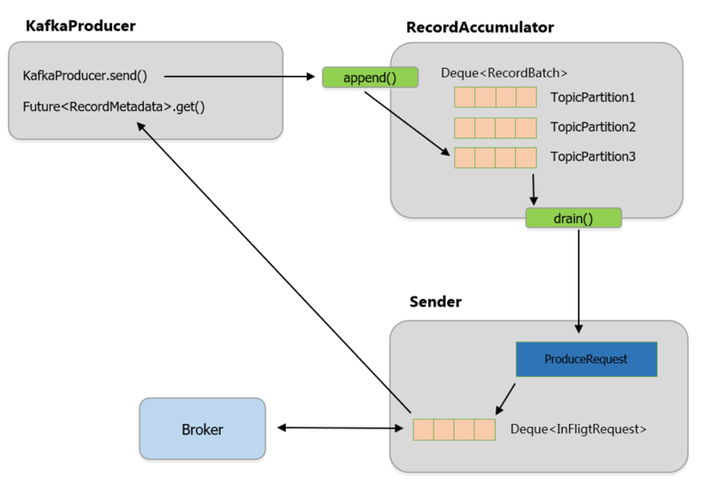

- kafkaProducer
  - serialization
  - `partitioning`
    - 파티션은 브로커가 지정 하는게 아니라, producer 가 직접 판단 합니다
    - `(kafka key).hashCode() % 파티션 개수` 의 결과로 파티션을 결정합니다 (없으면 Round-Robin 으로 선택)
  - compression
- RecordAccumulator
  - 전송될 record 를 저장하는 버퍼 입니다
  - 주기적으로 Sender 가 fetch 합니다
- Sender
  - (비동기) Accumulator 에 저장된 record 를 broker 에 전송합니다

### 1. 옵션
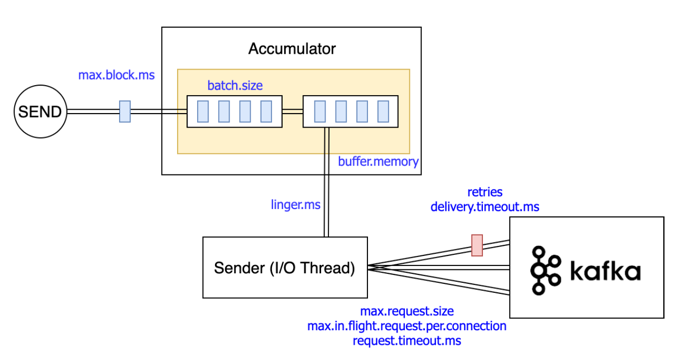

- acks
  - 0: no ack from leader (== async)
  - 1: ack from leader
  - `all`: ack from leader & all ISR members (at least once)
- compression.type
  - `LZ4 (중간정도의 압축률/성능)`, GZIP, Snappy, ZSTD
- [enable.idempotence](https://learn.conduktor.io/kafka/idempotent-kafka-producer/)/transaction.id
  - exactly once (== Transaction) 이 필요한 경우 모두 설정합니다
  - 내부적으로 idempotent 를 통한 중복제거는 아래의 그림처럼 브로커에서 중복제거를 하는 기능 입니다: 

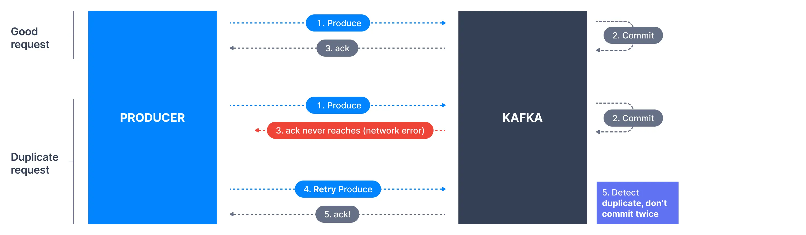

- max.in.flight.requests.per.connection
  - 하나의 커넥션에서 ACK 없이 전송할 수 있는 요청수 (기본값: 5)
  - `enable.idempotence=true` 로 설정시 배치단위로 성공/실패 처리되어 순서 보장
- max.block.ms
  - producer#send 시 메시지를 저장하는 Buffer 할당까지 대기하는 시간
- batch.size(64kb)/linger.ms(10ms)
  - batch 에서 message 를 보내기까지의 size, timeout

### 2. Acks
acks=all 은 `follower partition` 이 모두 ack 를 리더파티션에 보내면 -> 리더 파티션이 producer 에 OK 를 응답합니다


### 3. Delivery timeout
max.block.ms 이후 구간부터 `develiry.timeout.ms` 구간 입니다 

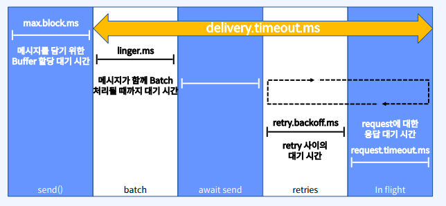

### 4. 순서 보장  
`max.in.flight.requests.per.connection (default: 5)` 의 설정에 따라 batch 로 보내진 메세지중 1개가 실패한 경우 retry 하지만 그로인해 메세지의 순서가 변경 될 수 있습니다.

`enable.idempotence=true` 로 설정한경우 batch 단위로 성공/실패 처리하므로 순서 보장이 가능합니다

## Consumer
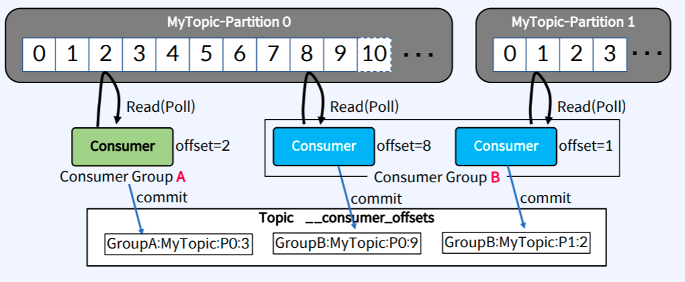

### 5. 옵션
- group.id
  - consumer group 의 식별자 입니다. 동일 그룹내의 정보는 공유됩니다
- enable.auto.commit
  - 백그라운드로 오프셋을 커밋합니다 (periodically)
- isolation.level
  - read_uncommitted, read_committed
  - read_committed 은 (producer 에서) 트랜잭션 commit 된 메세지만 가져갑니다

## Consumer Group
- consumer 는 특정 consumer-group 에 속하고 그룹은 group-id 로 구분됩니다
- 컨슈머그룹은 subscribe 하는 파티션의 offsets 을 `__consumer_offsets` 토픽으로 관리합니다.
- 컨슈머그룹에 속한 컨슈머의 추가/삭제시 리밸런싱이 발생하고 그 동안은 STW 입니다
- 각각의 파티션은 1개의 컨슈머그룹 > 1개의 컨슈머 하고 1-1 로 매핑 됩니다
  - 다른 컨슈머 그룹의 컨슈머와는 파티션을 공유 합니다

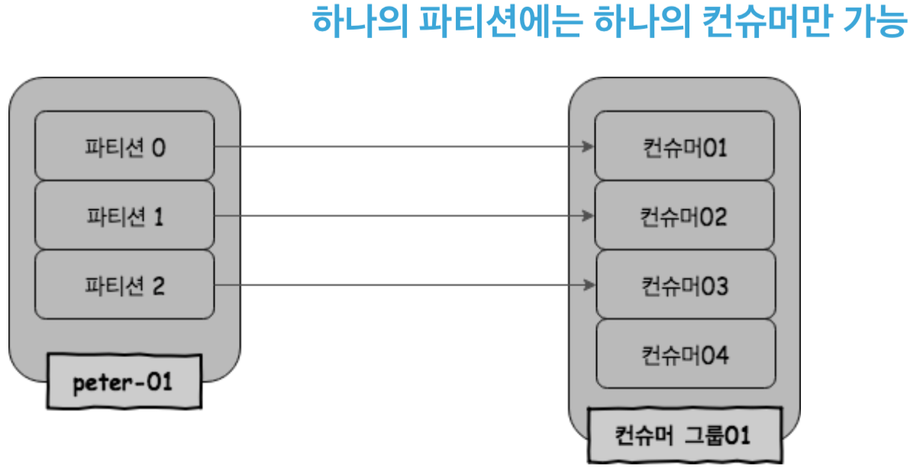

### 1. [전송 방식](https://learn.conduktor.io/kafka/delivery-semantics-for-kafka-consumers/)
- at most once
  - 메세지를 가져온 시점에 __consumer_offsets 토픽에 커밋 합니다
  - 그에 따라 메세지 유실이 가능 합니다 

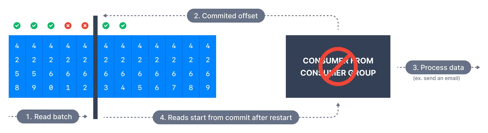

- `at least once`
  - 메세지를 가져온 후 처리하고 __consumer_offsets 토픽에 커밋 합니다
  - 그에 따라 처리 도중 예외가 발생하면 (아직 커밋 전이므로) 중복 처리가 발생 할 수 있습니다

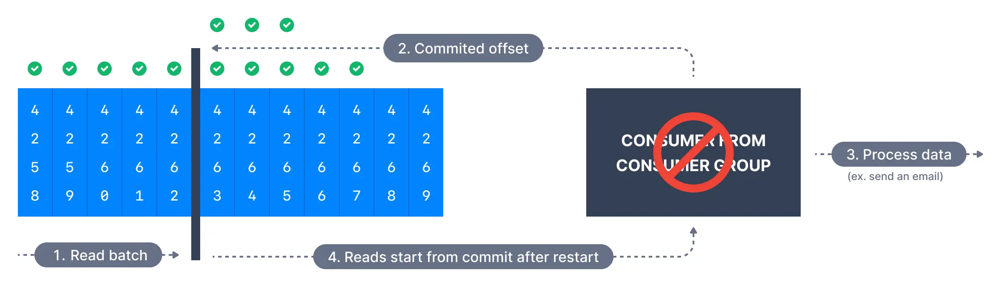

- exactly once ([transaction](#transactional) 과 연관있음)
  - `enable.idempotence=true`, `transaction.id={ANY_ID}`, `isolation.level=read_committed`
  - Producer: beginTransaction() -> send() -> commitTransaction() 을 통해 트랜잭션을 사용 합니다
  - Consumer: read_committed 로 커밋된 메세지만 가져옵니다
  - Producer -> Consumer 에서 `메세지 발행 > __consumer_offsets 커밋`하는 전체 흐름을 Atomic 하게 처리해서 트랜잭션 (exactly once) 보장합니다

### 2. Auto Commit
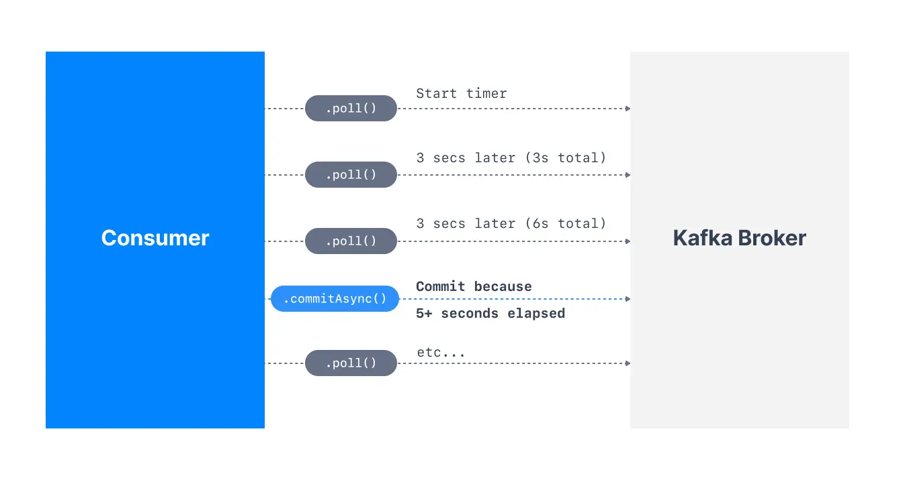

- `enable.auto.commit=true`
- `auto.commit.interval.ms=5s`

기본적으로 `Consumer#poll 호출시 커밋도 수행`합니다.

만약 가져온 메세지의 처리가 지연되어 poll 을 호출하지 않으면 > `auto.commit.interval.ms` 설정에 의해 비동기로 커밋이 호출됩니다.

> 아직 처리 되지 않은 메세지가 커밋되므로 at most once 를 지킬 수 없게 됩니다

### 3. 리밸런싱 (Incremental Rebalance)
컨슈머 그룹 리밸런싱은 아래의 조건에서 발생합니다:
- 컨슈머 추가/삭제
- 토픽의 파티션 증설

리밸런싱은 STW 가 발생하므로 `Incremental` 방식으로 영향 파티션 범위를 최소화 할 수 있습니다:
- 기존 리밸런싱 방식
  - 모든 Consumer 의 파티션 할당 반환후 전체 재할당
  - 다운타임 (== STW) 증가

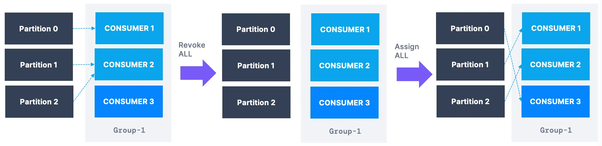

- 점진적 리밸런싱 (CooperativeStickyAssignor 등)
  - `partition.assignment.strategy=CooperativeStickyAssignor`
  - 기존 할당 유지, 필요한 파티션만 재조정
  - 다운타임 (== STW) 감소

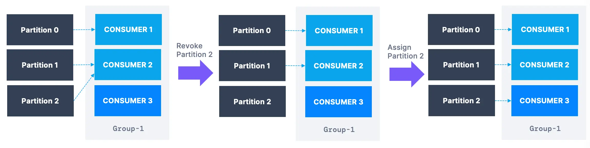

### 4. Static Group Membership
- 컨슈머 join group 시 매번 새로운 `member.id` 생성
- 컨슈머그룹은 새로운 멤버로 인지하고 리밸런싱 수행
- 만약 짧은 시간내 join/leave 한다면 리밸런싱을 최소화 할 수 있습니다
  - `group.instance.id={고정된 MEMBER_ID}`
  - `session.timeout.ms=3000ms`
  - 고정된 group.instance.id 를 통해 동일한 멤버로 인식 합니다 (즉 리밸런싱을 하지 않음)
  - (fallback) `session.timeout.ms` 수치만큼 해당 id 가 join 하지 않으면 리밸런싱을 수행합니다

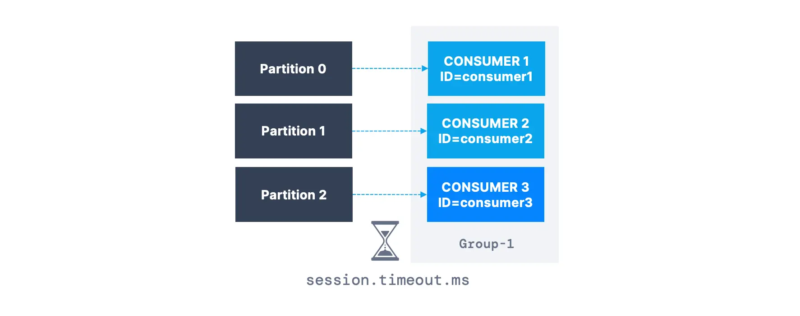

## Advanced
### 1. @Transactional
- Producer
  - @Transaction 미사용 -> ISR (== replication.factor) 만큼 복제된 레코드는 브로커에서 Committed 으로 마킹
  - @Transaction 사용 -> (Broker) 복제까지 완료후 Producer 에 ACK 를 하면 > (Producer) `Commit 명령을 수동으로 한번 더 호출`하는 과정 존재
    - Commit 명령을 명시적으로 한번 더 받아야 메세지가 최종 committed 로 변경
    - `transaction.id={..}` 도 명시적으로 설정해야 합니다
- Consumer
  - read_committed: 커밋된 메세지만 가져옵니다
  - read_uncommitted: 커밋되지 않은 메세지도 가져옵니다
  - 그후 Consumer 에서 Producer#sendOffsetsToTransaction 를 호출합니다 (Consumer#commitSync 가 아님)
  - 그후 Consumer 에서 Producer#commitTransaction 을 호출합니다
    - 메세지를 발행하는 주체인 Producer 를 통해서만 send, commit 을 일원화해서 Atomic 보장 
- Producer -> Consumer 에서 `메세지 발행 > __consumer_offsets 커밋`하는 전체 흐름을 `Producer 만을 이용해서` Atomic 하게 처리해서 트랜잭션을 보장합니다

```java
/**
 * Producer
 */
// 1. (Producer) 트랜잭션 초기화
producer.initTransactions();
// 2. 트랜잭션 시작
producer.beginTransaction();

/**
 * Consumer
 * Consumer 의 로직에서 Producer 를 DI 받아 직접 offset 관련 동작을 제어
 */
while (true) {
    // 3. (Consumer) 메시지 가져오기 
    ConsumerRecords<String, String> records = consumer.poll(Duration.ofMillis(Long.MAX_VALUE));

    try {
        // 4. 메시지 처리
        for (ConsumerRecord<String, String> record : records) {
            System.out.printf("Consumed message: key = %s, value = %s, partition = %d, offset = %d%n",
                record.key(), record.value(), record.partition(), record.offset());
        }

        // 6. 오프셋 커밋 정보 전송 (가장 중요)
        producer.sendOffsetsToTransaction(getOffsetsToCommit(consumer), consumer.groupMetadata());
        // 7. 트랜잭션 최종 커밋
        producer.commitTransaction();

    } catch (Exception e) {
        // 8. 예외 발생 시 트랜잭션 롤백
        producer.abortTransaction();
    }
}
```

> 단 Consumer 에서 Producer 를 가져올수 있을때만 유효합니다. nifi 처럼 이기종 kafka 를 relay 할때는 좀더 까다로움 (그럴때는 트랜잭션을 안쓰는게 낫다고 봄)

### 2. 가용성 vs 정합성 (or 내구성)
`unclean.leader.election.enable` 옵션을 통해 결정됩니다:
- false: ISR 에서만 leader 를 선출합니다
  - 가용성 ⬇️
  - 내구성 ⬆️
- true: ISR 가 없다면 (== out-of-sync) replicas 중에서 리더를 선출한다.
  - 가용성 ⬆️
  - 내구성 ⬇️

### 3. 발행 보장
`@TransactionalEventListener` 을 이용해서 트랜잭션 커밋 후 ApplicationContext 에서 이벤트를 발행 할 수 있습니다:
```java
@RequiredArgsConstructor
public class KafkaTransactionalEventListener {
    private final KafkaTemplate<Long, Object> kafkaTemplate;

    /**
     * 트랜잭션 COMMIT 이후에 호출
     */
    @TransactionalEventListener(phase = TransactionPhase.AFTER_COMMIT)
    public <T> void doSendAfterCommit(Event<T> event) {
        kafkaTemplate.send(event);
    }
}
```

대신 ApplicationContext 에 의존하는 방식이므로 스프링이 비정상적으로 종료된 경우 누락 될 수 있습니다.

발행누락을 막기 위해 [Outbox Pattern](https://ridicorp.com/story/transactional-outbox-pattern-ridi/) 을 사용할 수 있습니다:

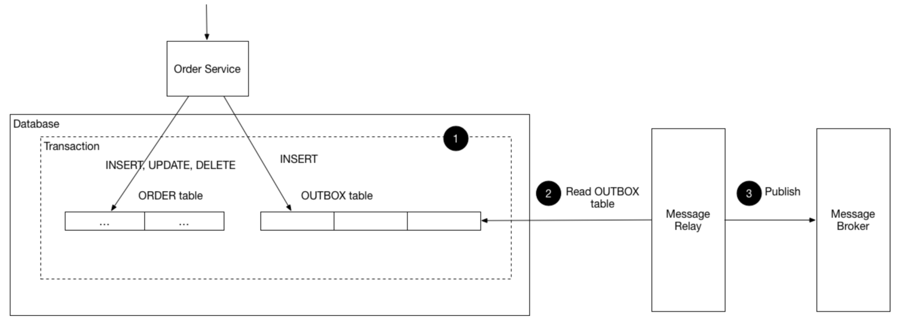

- 원본테이블 & Outbox 테이블을 동일 Transaction 에서 처리
  - 전파 필요한 메세지 유실 방지
- Outbox 테이블에 저장된 메세지는 CDC (== Debezium. `Kafka source connect 기반`) 를 통해 변경 감지 되고
  - Kafka Source Connector 는 카프카로 메세지 전송 `(connect-offsets 으로 offset 관리)`
  - Kafka Sink Connectort 는 카프카를 통해 메세지 수신 `(__consumer_offsets 으로 offset 관리)`
- 해당 토픽을 구독하는 컨슈머 (Application) 에서 메세지를 가져와서 이벤트를 발행해서 누락을 방지합니다
  - at least once 정도로 운영하므로 중복이 발생 할 수 있습니다
