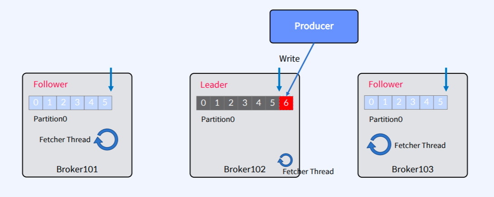

# Kafka
```
https://kafka.apache.org/documentation
https://docs.confluent.io/kafka/introduction.html
https://www.conduktor.io/kafka/
https://velog.io/@hyun6ik/series/Apache-Kafka
https://github.com/kafkakru/meetup/tree/master/conference/1st-conference
https://www.popit.kr/author/peter5236
https://bysssss.tistory.com/46
```

### Index
- [Kafka Stream](kafka-stream)
- [Kafka Connect](kafka-connect)
- [MirrorMaker 2.0](mm2)
- [Schema Registry](schema-registry)
- [Transactions](transactions)

### Blog
- [Consumer – Push vs Pull approach](https://blog.knoldus.com/kafka-consumer-push-vs-pull-approach/)

### Versions
- [Kafka 4.0](kafka-4.0)

***
## 기본 개념
### Persistence
- OS는 디스크 성능 개선 위해 `메모리를 적극 활용한 read-ahead와 write-behind 방식으로 페이지 캐시`를 적극적으로 활용 합니다
- 페이지 캐시는 OS 가 관리하는 영역이므로 카프카가 재시작 되더라도 유지됩니다
  - 물론 OS 가 재시작되면 페이지 캐시도 초기화 됩니다..

### Page cache
카프카는 모든 I/O 에 OS 레벨의 page cache 를 활용합니다. (별도로 카프카 내부에서의 캐싱 없음)


https://docs.confluent.io/platform/current/kafka/deployment.html#memory 의 가이드에 따르면

- 카프카 자체에 대한 -Xmx -Xms 는 5G 정도면 충분
- 나머지는 모두 OS 가 사용하도록 (page cache) 충분히 여유있게 유지

해야합니다.

### Zero copy (== Direct memory or DMA)
`디스크 -> 커널 버퍼 -> NIC`로 바로 전달해서 네트워 구간을 최적화 합니다.

>### 기존 (Non-Zero Copy) 방식
- 디스크에서 데이터를 커널 버퍼로 읽음
- 커널 버퍼의 데이터를 사용자 공간(User Space) 버퍼로 복사
- 사용자 공간 버퍼에서 다시 소켓 커널 버퍼로 복사
- 소켓 버퍼에서 네트워크 카드로 전송

>### Zero Copy (sendfile) 방식
- 커널이 직접 디스크 파일을 소켓으로 전송 (sendfile() 호출).
- 사용자 공간을 거치지 않고, 디스크 → 커널 버퍼 → 네트워크 카드로 바로 전달.


### Segment (== file)
브로커에 저장되는 레코드의 (물리적인) 로그파일 입니다

- 브로커는 파티션의 모든 세그먼트에 대해 각각 하나의 열린 파일 핸들러를 유지 합니다
- 따라서 OS 의 File Descriptor 는 [충분한 숫자](https://docs.confluent.io/current/kafka/deployment.html#file-descriptors-and-mmap) 를 설정해야 합니다

```bash
# current opened socket counts
$ find /{kafka_home} -name '*index' | wc -l

# FD increased
$ echo 'vm.max_map_count=262144' >> /etc/sysctl.conf
# apply
$ sysctl -p
```

### Log Retention
Record 를 저장하는 파일의 보관주기는 아래와 같습니다:
- Time: 특정시간이 지난 파일 삭제 (기본값: `7-days`)
- Size: 특정사이즈를 넘은 파일 삭제 (기본값: 1G)
- 주기: retention 체크 주기 (기본값: 5-mins)

### Log Compaction
토픽 > 파티션에 저장되어 있는 Record 의 Kafka Key 를 기준으로 `최신 1개만 유지` 하는 기능 입니다.

- `카프카 키`를 기준으로 Compation 진행하므로 필수
  - 원래 메세지의 Kafka-key 는 비필수
- `각 파티션의 유니크만 보장`합니다 (global unique 하지 않음)
  - 그에 따라 파티션 rebalancing or 추가시 중복이 발생 할 수 있습니다

```json
log.cleanup.policy=compact
```


## 토픽/파티션
브로커는 1개의 토픽의 메세지를 N-개의 파티션으로 분산해서 Record 저장 합니다.

파티션은 로그파일로 (== sengment) 메세지를 저장하고, `파티션 리더를 통해서만 CRUD 가 발생`합니다. (즉 Producer, Consumer 는 파티션 리더와 통신)

> 파티션 단위의 메세지 순서는 보장

> 파티션은 늘릴수 있지만, 줄일수 없습니다 (데이터 유실)


## Broker
### [Replication](https://docs.confluent.io/kafka/design/replication.html)
카프카는 파티션 리더가 모든 CRUD 를 담당하므로, 팔로어는 주기적으로 segment 을 fetch 해서 replication 을 수행합니다.



- producer#send 을 통해 leader partition 은 메세지를 저장합니다
  - producer 는 replication 이 완료될때까지 대기합니다 (아직 성공으로 응답가지 않음)
- follow partition (을 가지고 있는 broker) 은 메세지 fetch 후 저장
- 그후 leader 는 commit 하고 producer 에 committed 로 성공 응답합니다
  - 대기하던 producer 는 이제 다음 작업 진행
  - consumer 는 leader partition 을 통해 메세지를 가져가지만 uncommitted 인 메세지 (아직 replication 진행중) 는 가져가지 않도록 카프카가 보장합니다

복제는 `replication.factor 에 설정된 수치만큼 replication` 이 되고, `out-of-sync 가 아니면 ISR` (In-sync-replicas) 로 관리합니다.

- follow failure
  - (leader) heartbeat or fetch 요청이 오지 않는 follower 를 ISR 에서 제거후 zookeeper 에 metadata 업데이트 합니다
  - zookeeper 는 metadata 갱신 후 controller 에 통보
  - controller broker 는 전체 broker 에 변경내역 전파합니다
- leader failure
  - leader 의 장애는 zookeeper 가 감지합니다 (zookeeper 와 heartbeat 주기적으로 받고있음)
  - zookeeper 는 metadata 갱신 후 controller 에 통보
  - controller 는 리더 재선출후 zookeeper 에 metadata 갱신 & 전체 브로커에 전파합니다
  - 전파된 정보는 producer/consumer 도 갱신받습니다

### Controller
[Controller Broker](https://www.slideshare.net/ConfluentInc/a-deep-dive-into-kafka-controller) 는 브로커 중 하나가 임의로 선정 됩니다.


- 목적: (브로커) 장애시 해당 브로커에 속하던 `파티션 리더 선출`
  - broker (node) 는 controller 와 session 을 유지해야 합니다
  - follower 는 `replica.lag.time.max.ms (10000ms)` 수치만큼 주기적으로 fetch 해야 합니다 (not too far behind)
- 플로우
  - leader 는 follower 를 ISR 에서 제거후 zookeeper 에 상태를 업데이트 합니다
  - zookeeper 는 controller 에 통보하고
  - controller broker 는 나머지 broker 에 전파합니다 (각 broker 에서 local-cache 로 metadata 를 저장하고있음)

### Coordinator
[Coordinator Broker](https://kafka.apache.org/documentation/#impl_offsettracking) 는 브로커 중 하나가 임의로 선정 됩니다.

- 목적: (컨슈머) 장애시 해당 파티션을 처리하는 `컨슈머 선정` -> 리밸런싱
  - 기본적으로 heartbeat 로 체크하고 record polling, offset commit 이 오면 heartbeat 를 받았다고 판단합니다
  - max.poll.interval.ms (default: 5min), heartbeat.interval.ms (default: 3sec)
- [플로우](https://velog.io/@hyun6ik/Apache-Kafka-Consumer-Rebalance)
  - coordinator broker 는 (컨슈머그룹 리밸런싱때) joinGroup 을 먼저한 consumer 를 group leader 로 선정합니다
  - leader consumer 는 파티션 할당정보를 coordinator 에게 전달 (== `consumer 가 파티션 할당 주체`)
  - coordinator 는 zookeeper 에 파티션 할당정보 저장후 group leader 에게 ack 합니다 (== confirmed)
  - 이제 consumer 는 할당된 파티션을 fetch 하며 consume 합니다

producer 에서 record 의 파티션 할당을 직접 하는것처럼 (zookeeper 를 통해 파티션정보 metadata 를 받음) consumer 도 consumer-group 에서의 partition 할당은 consumer-leader 가 연산한후 통보 > ACKS 받습니다. (브로커 부담을 줄이기 위함)

## Zookeeper
리더선출을 위해 사용합니다 (기존에는 offset 을 기록했지만 `__consumer_offsets` 토픽 사용으로 대체)
카프카 4.0 부터는 Zookeeper 없이도 동작할 수 있습니다 (KRaft 모드)

## Producer
메세지를 전송하는 단위 입니다.


- kafkaProducer
  - serialization
  - `partitioning`
    - 파티션은 브로커가 지정 하는게 아니라, producer 가 직접 판단 합니다
  - compression
- RecordAccumulator
  - 전송될 record 를 저장하는 버퍼 입니다
  - 주기적으로 Sender 가 fetch 합니다
- Sender
  - (비동기) Accumulator 에 저장된 record 를 broker 에 전송합니다

### 옵션


- acks
  - 0: no ack from leader (== async)
  - 1: ack from leader
  - `all`: ack from leader & all ISR members (at least once)
- compression.type
  - `LZ4 (중간정도의 압축률/성능)`, GZIP, Snappy, ZSTD
- [enable.idempotence](https://learn.conduktor.io/kafka/idempotent-kafka-producer/)/transaction.id
  - exactly once (== Transaction) 이 필요한 경우 모두 설정합니다
  - 내부적으로 idempotent 를 통한 중복제거는 아래의 그림처럼 브로커에서 중복제거를 하는 기능 입니다: 


- max.in.flight.requests.per.connection
  - 하나의 커넥션에서 ACK 없이 전송할 수 있는 요청수 (기본값: 5)
  - `enable.idempotence=true` 로 설정시 배치단위로 성공/실패 처리되어 순서 보장
- max.block.ms
  - producer#send 시 메시지를 저장하는 Buffer 할당까지 대기하는 시간
- batch.size(64kb)/linger.ms(10ms)
  - batch 에서 message 를 보내기까지의 size, timeout

### Acks
acks=all 은 `fellow partition` 이 모두 ack 를 리더파티션에 보내면 -> 리더 파티션이 producer 에 OK 를 응답합니다


### Delivery timeout
max.block.ms 이후 구간부터 `develiry.timeout.ms` 구간 입니다 


### 순서 보장  
`max.in.flight.requests.per.connection (default: 5)` 의 설정에 따라 batch 로 보내진 메세지중 1개가 실패한 경우 retry 하지만 그로인해 메세지의 순서가 변경 될 수 있습니다.

`enable.idempotence=true` 로 설정한경우 batch 단위로 성공/실패 처리하므로 순서 보장이 가능합니다

## Consumer
메세지를 수신하는 단위 입니다.


### 옵션
- group.id
  - consumer group 의 식별자 입니다. 동일 그룹내의 정보는 공유됩니다
- enable.auto.commit
  - 백그라운드로 오프셋을 커밋합니다 (periodically)
- isolation.level
  - read_uncommitted, read_committed
  - read_committed 은 (producer 에서) 트랜잭션 commit 된 메세지만 가져갑니다

### Consumer Group
- consumer 는 특정 consumer-group 에 속하고 그룹은 group-id 로 구분됩니다
- 컨슈머그룹은 subscribe 하는 파티션의 offsets 을 `__consumer_offsets` 토픽으로 관리합니다.
- 컨슈머그룹에 속한 컨슈머의 추가/삭제시 리밸런싱이 발생하고 그 동안은 STW 입니다

### [전송 방식](https://learn.conduktor.io/kafka/delivery-semantics-for-kafka-consumers/)
- at most once
  - 메세지를 가져온 시점에 __consumer_offsets 토픽에 커밋 합니다
  - 그에 따라 메세지 유실이 가능 합니다 


- `at least once`
  - 메세지를 가져온 후 처리하고 __consumer_offsets 토픽에 커밋 합니다
  - 그에 따라 처리 도중 예외가 발생하면 (아직 커밋 전이므로) 중복 처리가 발생 할 수 있습니다


- exactly once ([transaction](transactions) 과 연관있음)
  - `enable.idempotence=true`, `transaction.id={ANY_ID}`, `isolation.level=read_committed`
  - Producer: beginTransaction() -> send() -> commitTransaction() 을 통해 트랜잭션을 사용 합니다
  - Consumer: read_committed 로 커밋된 메세지만 가져옵니다
  - Producer -- Consumer 에서 `메세지 발행 -- __consumer_offsets 토픽에 커밋` 의 전체 과정을 Atomic 하게 처리해서 트랜잭션 (exactly once) 을 보장합니다

### Automatic Offset Committing
enable.auto.commit=true
auto.commit.interval.ms=5s

기본적으로 poll() 호출시 커밋을 수행합니다.
만약 next poll 이 늦어지면 (즉 처리시간 지연) interval 이 지나면서 커밋이 수행되므로, at least once 의 처리되지 않은 메세지가 발생 할 수 있습니다


## Advanced
### @Transactional
- Producer
  - @Transaction 미사용 -> ISR (== replication.factor) 을 만족하는 record 는 브로커에서 Committed 으로 마킹
  - @Transaction 사용 -> Commit 명령을 수동으로 한번 더 호출하는 과정이 추가
- Consumer
  - read_committed: 커밋된 메세지만 가져옵니다
  - read_uncommitted: 커밋되지 않은 메세지도 가져옵니다
- Producer -- Consumer 에서 `메세지 발행 -- __consumer_offsets 토픽에 커밋` 의 전체 과정을 Atomic 하게 처리해서 트랜잭션 (exactly once) 을 보장

### 가용성 vs 내구성
`unclean.leader.election.enable` 옵션을 통해 결정됩니다.

- false: ISR 에서만 leader 를 선출합니다
  - 가용성 낮음
  - 내구성 높음
- true: ISR 가 없다면 (== out-of-sync) replicas 중에서 리더를 선출한다.
  - 가용성 높음
  - 내구성 낮음

### @TransactionalEventListener

### Outbox Pattern