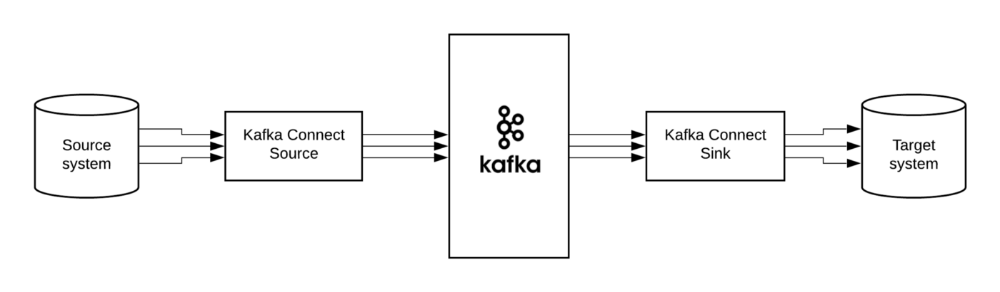
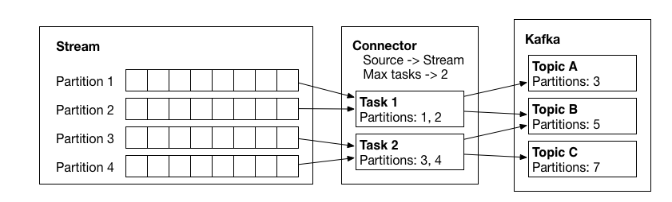

# Kafka Connect

```
@author: suktae.choi
- https://docs.confluent.io/current/connect/concepts.html
```



## Mode

### Standalone

1개의 워커로 동작하는 모드 입니다. 메타 정보를 local disk 에 저장합니다.

### Distributed

N개의 워커로 동작하는 모드 입니다. 메타 정보를 kafka topic 에 저장합니다.

## 구성요소

### Worker

worker 는 실행되는 서버단위이고 connect, task 를 포함하고 있습니다.



- source 를 적절한 파티션으로 분할하고 (connector)
- 파티션단위의 작업을 실제 전송 (task)

connector 조회/추가/삭제하는 REST API 를 제공합니다.

- connect-configs
- connect-offsets
- connect-status

변경된 설정은 `config.refresh.interval.ms: 60s` 의 주기로 변경 감지되어 worker 에 전파됩니다. 

### Connector

source or sink 에 연결 및 작업을 정의합니다. mysql-source-connector, mongodb-sink-connector 등이 있습니다

```bash
{
  "name": "my-source-connect",
  "config": {
    "connector.class": "io.confluent.connect.jdbc.JdbcSourceConnector",
    "connection.url": "jdbc:mysql://localhost:3306/test",
    "connection.user":"root",
    "connection.password":"비밀번호",
    "mode":"incrementing",
    "incrementing.column.name" : "id",
    "table.whitelist" : "users",
    "topic.prefix" : "example_topic_",
    "tasks.max" : "1"
  }
}

curl -XPOST -d @- http://localhost:8083/connectors --header "content-Type:application/json"
```

### Task

커넥터가 정의한 작업을 직접 수행하는 작업 주체 입니다.