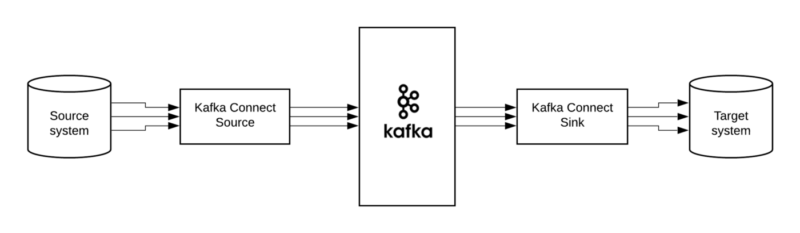
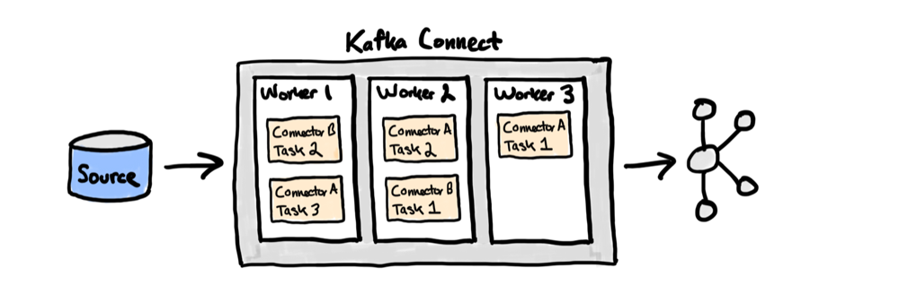

# Kafka Connect
```
https://docs.confluent.io/current/connect/concepts.html
https://velog.io/@choidongkuen/%EC%84%9C%EB%B2%84-Kafka-Connect-%EC%97%90-%EB%8C%80%ED%95%B4-xfnf832p
```

Kafka Connct는 반복적인 파이프라인 구축을 간편하게 하고, 직접 파이프라인 구축이 어려운 시스템을 위해 만들어진 Apache Kafka 프로젝트 중 하나입니다.

> 독립적인 실행 커텍터로 동작합니다 (kafka streams 는 라이브러리 형태로 실제 코드작업 필요)



## 동작 방식
### Standalone
1개의 워커로 동작하고, 메타 정보를 local 에 저장 합니다.

### Distributed
- N개의 워커로 동작하고, 메타 정보를 토픽에 저장 합니다
- (Distributed 모드) `Kafka Connect Cluster` 는 **Task**가 분산 실행되며, `리더 Worker`가 존재합니다
- Kafka Connect Cluster 를 실행한다는 의미는
  - 동일한 Kafka 설정/토픽을 사용하는 여러개의 Worker 프로세스를 하나의 클러스터로 묶는다는 의미입니다
  - 즉 `서버를 구동한다와 동일 개념`입니다. (실제로 kafka connect cluster 를 별도의 pod 으로 구동)
- 제공되는 REST API 를 통해 커넥터를 등록해야 실제 작업이 시작됩니다
- 내부적으로 Consumer Group 처럼 동작하며, 아래의 특징이 존재 합니다 (동일 Consumer Group 으로 동작위해 같은 `group.id` 설정 필요)
  - 리더 선출: 가장 먼저 그룹에 조인한 워커가 자동으로 리더 역할을 수행
  - 리밸런싱: 워커가 추가되거나 종료되면 (STW) 재 분배 됩니다
  - 메타데이터 저장: 아래 Kafka 토픽 3개에 상태를 저장합니다:
    - `connect-configs`: 커넥터 설정 정보
    - `connect-offsets`: 오프셋 정보 (source connector에서 중요)
    - `connect-status`: 커넥터 상태 및 실행 결과

## 구성요소
### Worker
OS 프로세스로 구동되어 태스크를 실행하는 단위 입니다.



- source 를 적절한 파티션으로 분할하고 (connector)
- 파티션단위의 작업을 실제 전송 (task)

(리더 워커는) Connector 설정을 조회/수정 하는 REST API 를 제공합니다.
변경된 설정은 `config.refresh.interval.ms: 60s` 의 주기로 변경 감지되어 각 Worker 에 전파됩니다.

### Connector
Kafka와 외부 시스템 간의 데이터 이동을 정의하는 논리적 단위 입니다.
- source connector
- sink connector

```
Kafka Connect Cluster (Distributed)
 ├── Worker 1
 │    ├── Task 1 (from Connector A)
 │    └── Task 2 (from Connector B)
 ├── Worker 2
 │    └── Task 3 (from Connector A)
 └── Worker 3
      └── Task 4 (from Connector B)

Connector A ("source-db")
 └── Task 1~3: DB 읽어서 Kafka로 전송

Connector B ("sink-es")
 └── Task 4~5: Kafka에서 읽어 ElasticSearch에 전송
```

### Task
실제 처리하는 작업 단위