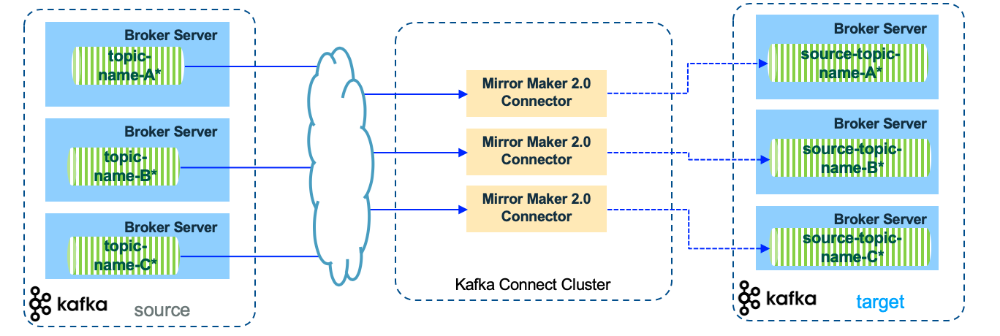

# MirrorMaker 2.0

```
@author: suktae.choi
- https://devocean.sk.com/blog/techBoardDetail.do?ID=164371
```

카프카 클러스터의 복제 (== DR 목적) 를 목적으로 사용합니다

kafka-connect 를 기반으로
- kafka-connect cluster
- source/sink connectors

의 구성으로 동작합니다. 자세한 기본동작은 [링크](https://ibm-cloud-architecture.github.io/refarch-eda/technology/kafka-mirrormaker/)의 글로 대신합니다.


## Consideration

### Topic metadata replication

Topic 및 ACL 의 전파를 위한

- sync.topic.acl.enabled=true
- sync.topic.configs.enabled=true

는 권장됩니다

### Naming convention

source/target cluster 의 토픽을 모두 소비하기위해 

- @KafkaListener(id = "TEST-TOPIC", topicPattern = "^.*accounts")

topics 대신 topicPattern 으로 prefix regex 을 모두 포함해야 합니다

> active-active 구성에서 circular 회피위해 topic prefix 추가됨

### Offset management

source 와 target cluster 의 broker offset 은 다릅니다 (source-offset: 5 부터 MM2 시작되었다면 -> target-offset: 1 부터 시작)


offsets 정보는 `topic: offset-synch` 에 저장됩니다

### MM2 topology

복제 단위단위 kafka-connect cluster 구성보다, 구성된 cluster 에서 connectors 를 추가하는 방식이 맞습니다 (운영 할 인프라의 범위를 줄이기 위함)



```yaml
apiVersion: v1alpha1
kind: KafkaMirrorMaker2
...

 mirrors:
  - sourceCluster: "event-streams-wdc"
    targetCluster: "kafka-on-premise"
    ...
    topicsPattern: "accounts,orders"
  - sourceCluster: "kafka-on-premise"
    targetCluster: "event-streams-wdc"
    ...
    topicsPattern: "accounts,customers"
```