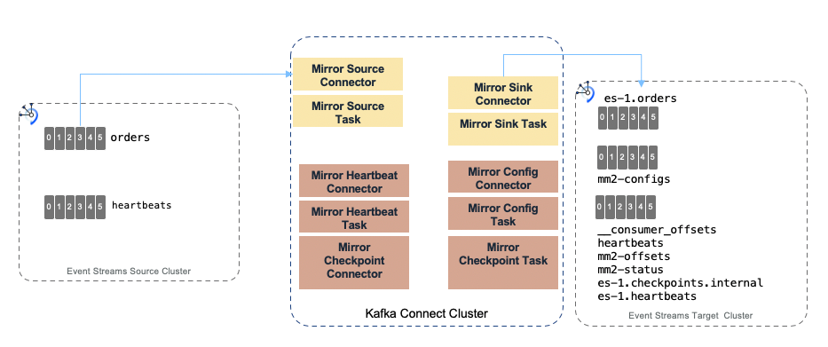
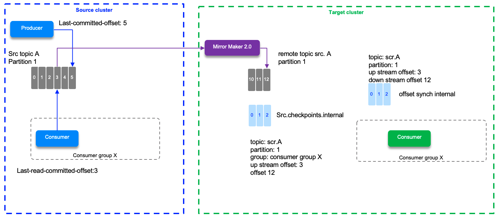

# MirrorMaker 2.0

```
@author: suktae.choi
- https://cwiki.apache.org/confluence/display/KAFKA/KIP-382%3A+MirrorMaker+2.0
- https://devocean.sk.com/blog/techBoardDetail.do?ID=164371
```

카프카 클러스터의 복제 (== DR 목적) 를 목적으로 사용합니다.

> kafka-connect 를 기반으로 동작



## Topic metadata replication
토픽설정 및 ACL 을 같이 복제하기위해

- sync.topic.acl.enabled=true
- sync.topic.configs.enabled=true

설정이 권장됩니다.

## Listen
source/target cluster 의 토픽을 모두 소비하기위해 

```java
@KafkaListener(id = "testTopicListener", topicPattern = "^.*TEST-TOPIC")
```

topics 대신 topicPattern 으로 prefix regex 을 모두 포함해야 합니다

> active-active 구성에서 circular 회피위해 topic prefix 추가됨 (ex. [source]TEST-TOPIC, [target]CR2.TEST-TOPIC)

## Offset
source 와 target cluster 의 `__consumer_offsets` 은 다릅니다. (source-offset: 5 부터 MM2 시작했으면 -> target-offset: 1 부터 시작)



>`__consumer_offsets` 복제시 source, target 간의 변경된 offset 을 맞춰서 변경후 전달합니다. (즉 서로 다른 값을 가지고 있음)

## 동작모드
- Active - Standby
  - 이벤트 발행: source
  - 1군데에만 신규 이벤트가 인입될때 사용합니다
  - __consumer_offsets: 동일하게 복제합니다
- Active - Active
  - 이벤트 발행: source/target
  - N군데에 신규 이벤트가 인입될때 사용합니다
  - __consumer_offsets: delta 계산후 복제합니다

## 방향성
- 단방향
  - Active - Standby 및 Active - Active (단반향) 모드
  - 장애시 producer: 100% 실패
  - 장애시 consumer: 50% 실패
- 양방향
  - Active - Active (양반향) 모드
  - 장애시 producer: 50% 실패
  - 장애시 consumer: 50% 실패

