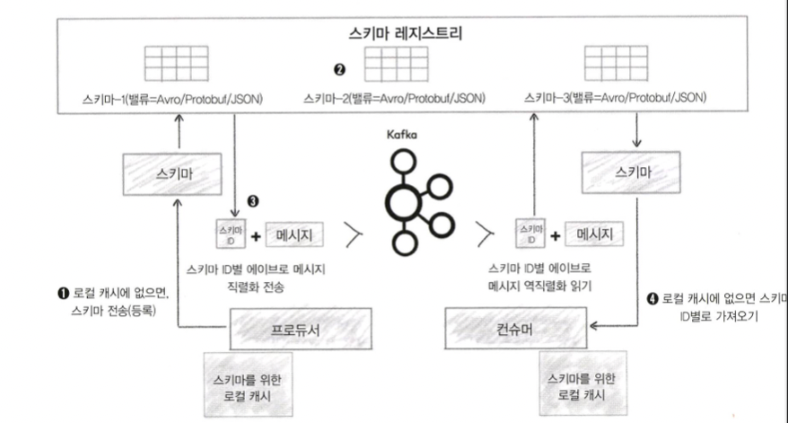

# Schema Registry

```
@author: suktae.choi
- https://velog.io/@fj2008/%EC%B9%B4%ED%94%84%EC%B9%B4-%EC%8A%A4%ED%82%A4%EB%A7%88-%EB%A0%88%EC%A7%80%EC%8A%A4%ED%8A%B8%EB%A6%AC
```

일반적인 데이터의 흐름에서 consumer 는 producer 의 이벤트를 `일방적으로 신뢰` 할 수 밖에 없습니다.

이 구조를 해결하기 위해 producer 와 consumer 는 schema registry 를 이용해 스키마를 등록하고, 이를 통해 정의된 데이터만 주고받게 됩니다.



// TODO - 주고받는 데이터흐름 설명 

## 호환성

### BACKWARD
- 허용: 기본값이 설정된 필드 추가, 필드 삭제
- 순서: 컨슈머 -> 프로듀서

### FORWARD
- 허용: 기본값이 설정된 필드 삭제, 필드 추가
- 순서: 프로듀서 -> 컨슈머

### FULL
- 허용: 기본값이 설정된 필드 추가/삭제
- 순서: 상관없음