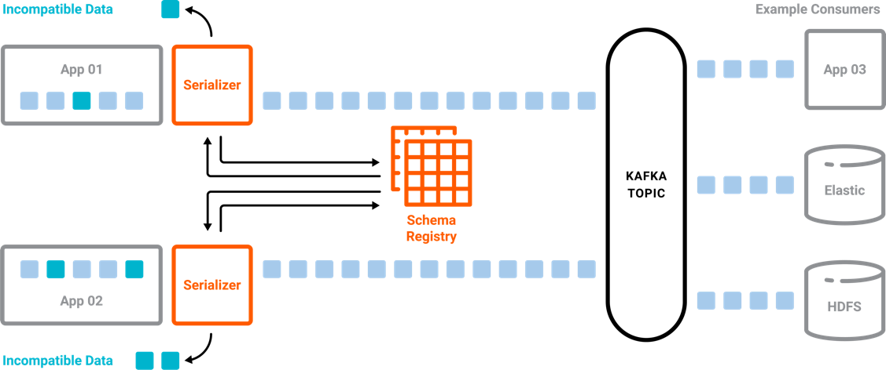
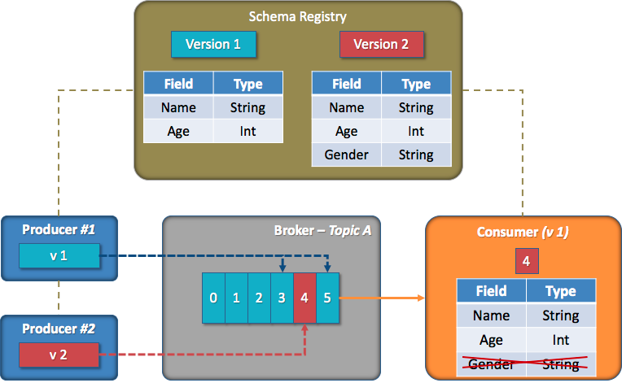

# Schema Registry

```
@author: suktae.choi
- https://velog.io/@fj2008/%EC%B9%B4%ED%94%84%EC%B9%B4-%EC%8A%A4%ED%82%A4%EB%A7%88-%EB%A0%88%EC%A7%80%EC%8A%A4%ED%8A%B8%EB%A6%AC
- https://always-kimkim.tistory.com/entry/kafka101-schema-registry
```

데이터의 발행/소비에서 consumer 는 producer 의 이벤트를 `일방적으로 신뢰` 할 수 밖에 없습니다.

schema registry 는 메세지의 스키마를 (등록) 관리하고 이를 통해 컨슈머는 정의된 데이터만 받을 수 있습니다.

> 즉 producer 가 현재 등록된 스키마에 호환되지 않는 메세지를 발행 할 경우 `발행 실패합니다`



## 흐름


- Producer 는 KafkaAvroSerializer 를 사용합니다
- KafkaAvroSerializer 는 SchemaRegistryClient 을 이용해 Schema Registry 에 정보를 등록합니다
- Schema Registry 에 정상적으로 스키마가 등록되면 SchemaID 를 반환하게 됩니다.
- KafkaAvroSerializer 는 SchemaID 와 메시지 본문을 포함한 데이터를 직렬화 합니다
- KafkaAvroDeserializer 는 다른 SchemaID 의 메세지를 backward/forward 방향성으로 매핑 합니다

```java
public void send(Shipment shipment) {
    kafkaTemplate.send("TOPIC-NAME", shipment);
}
```

```java
@KafkaListener(topics = "TOPIC-NAME")
public void process(ConsumerRecord<String, Shipment> record) {
    // do something
}
```

## 호환성

### FORWARD
- 개념: 컨슈머는 1번 스키마로 메시지를 처리하지만 2번 스키마도 처리할 수 있습니다.
- 허용: 기본값이 설정된 필드 삭제, 필드 추가
- 순서: 프로듀서 -> 컨슈머



- 컨슈머는 (배포전) 기존의 1번 스키마를 알고 있습니다
- 프로듀서는 (배포중) 1,2번 스키마로 메세지가 발행됩니다
- 컨슈머의 KafkaAvroDeserializer 는 1,2번 -> 1번으로 매핑합니다
  - 2번 메세지가 1번으로 convert 되야하므로 2번 스키마 등록시 아래의 특징이 존재합니다
    - 필드추가: 2번에 추가된 필드는 1번으로 convert 시 제거하면 되므로 필드추가는 자유롭습니다
    - (기본값이 설정된) 필드제거: 2번에 제거된 필드는 1번으로 convert 시 추가해야 하므로 기본값이 필요합니다
- 프로듀서의 배포가 완료되면 컨슈머의 배포도 가능합니다

### BACKWARD
- 개념: 컨슈머는 2번 스키마로 메시지를 처리하지만 1번 스키마도 처리할 수 있습니다.
- 허용: 기본값이 설정된 필드 추가, 필드 삭제
- 순서: 컨슈머 -> 프로듀서

### FULL
- 허용: 기본값이 설정된 필드 추가/삭제
- 순서: 상관없음