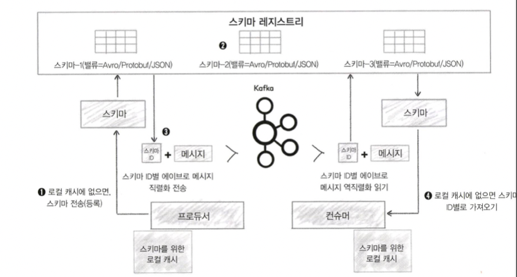
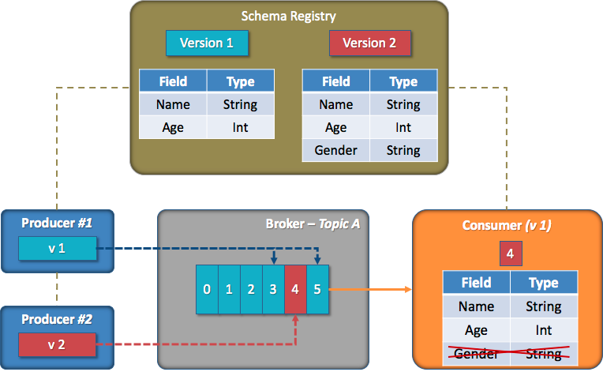

# Schema Registry
```
https://velog.io/@fj2008/%EC%B9%B4%ED%94%84%EC%B9%B4-%EC%8A%A4%ED%82%A4%EB%A7%88-%EB%A0%88%EC%A7%80%EC%8A%A4%ED%8A%B8%EB%A6%AC
https://medium.com/@gaemi/kafka-%EC%99%80-confluent-schema-registry-%EB%A5%BC-%EC%82%AC%EC%9A%A9%ED%95%9C-%EC%8A%A4%ED%82%A4%EB%A7%88-%EA%B4%80%EB%A6%AC-1-cdf8c99d2c5c
https://always-kimkim.tistory.com/entry/kafka101-schema-registry
```

데이터의 발행/소비에서 consumer 는 producer 의 이벤트를 `일방적으로 신뢰` 할 수 밖에 없습니다.

Schema Registry 는 메세지의 스키마를 (등록) 관리하고
- Producer 가 등록된 스키마와 호환되지 않는 메세지를 발행 할 경우 `발행 자체를 실패해서`
- Consumer 는 `정의된 데이터만 받도록 보장` 합니다

## 흐름


- Producer 는 KafkaAvroSerializer 를 사용합니다
  - Avro 는 필드의 값만 들어가는 형식이므로 사이즈가 절감됩니다 (스키마 정보는 registry 에 저장)
- KafkaAvroSerializer 는 SchemaRegistryClient 을 이용해 Schema Registry 에 정보를 등록합니다
- Schema Registry 에 정상적으로 스키마가 등록되면 SchemaID 를 반환하게 됩니다.
- `KafkaAvroSerializer 는 SchemaID 와 메시지 본문을 포함한 데이터를 직렬화` 합니다
- `KafkaAvroDeserializer 는 SchemaID 의 메세지를 backward/forward 방향성으로 매핑` 합니다

## 호환성
### FORWARD
- 개념: (컨슈머 입장에서) 1번 스키마로 처리하고 -> `1번으로 2번 스키마도` 처리할 수 있습니다.
- 호환성: 필드 삭제 (기본값 설정 필요), 필드 추가 (제약없음)
  - 컨슈머는 (배포전) 기존의 1번 스키마를 알고 있습니다
  - 프로듀서는 (배포중) 1,2번 스키마로 메세지가 발행됩니다
  - 컨슈머의 KafkaAvroDeserializer 는 `1,2번 -> 1번으로 매핑`합니다
  - 2번 메세지가 1번으로 convert 되야하므로 2번 스키마 등록시 아래의 특징이 존재합니다
    - (1번에) 필드추가: 2번에 추가된 필드는 1번으로 convert 시 제거되므로 필드추가는 자유롭습니다
    - (1번에) 필드제거: 2번에 제거된 필드는 1번으로 convert 시 추가해야 하므로 기본값이 필요합니다
- 배포 순서: 프로듀서 -> 컨슈머



### BACKWARD
- 개념: (컨슈머 입장에서) 2번 스키마로 처리하고 -> `2번으로 1번 스키마도` 처리할 수 있습니다.
- 호환성: 필드 추가 (기본값 설정 필요), 필드 삭제 (제약없음)
  - (2번에) 필드추가: 2번으로 1번을 처리하므로 -> 추가된 필드는 기본값 필요
  - (2번에) 필드제거: 문제없음
- 배포 순서: 컨슈머 -> 프로듀서

```json
// SCHEMA1
{
  "type": "record",
  "name": "User",
  "fields": [
    { "name": "id", "type": "int" }
  ]
}

// SCHEMA2
{
  "type": "record",
  "name": "User",
  "fields": [
    { "name": "id", "type": "int" },
    { "name": "name", "type": "string", "default": "" } ✅ default 필수
  ]
}
```

### FULL
- 호환성: 기본값이 설정된 필드 추가/삭제
- 배포 순서: 상관없음

## 필요한가
- 별도 인프라를 운영 해야하고 (Avro)
- 스키마 변경에도 제약이 생김 (간단한 필드추가에도 기본값을 넣어야 함)

이런 단점이 있으므로 아래를 보장 할 수 있으면 Schema Registry 없이도 운영이 가능합니다:
- (정기배포) 과정에서 Consumer 선배포를 보장하고
- (일반적으로) 카프카 메세지 or API 개발시 기본적으로 하위호환 보장하는 방식으로 개발하므로

별도의 인프라를 통해 관리하기 보다 프로세스를 정리해도 됩니다