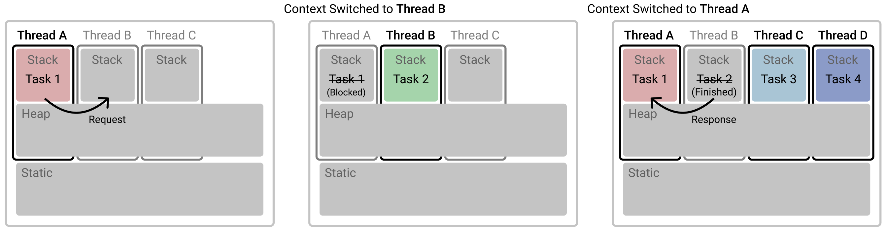
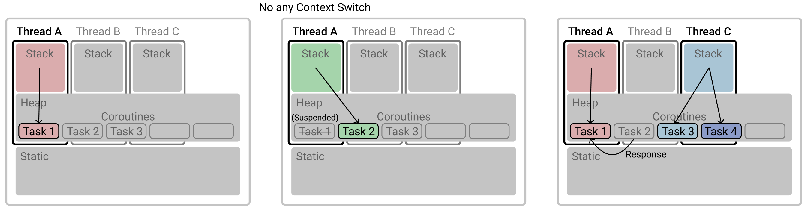

# Coroutine

```
@author: suktae.choi
- https://tech.devsisters.com/posts/crunchy-concurrency-kotlin/
- https://velog.io/@haero_kim/Thread-vs-Coroutine-%EB%B9%84%EA%B5%90%ED%95%B4%EB%B3%B4%EA%B8%B0
```

- Thread



- Coroutine




thread 는 CPU 에 의해 time-slice 만큼 실행된다. (특정 시간을 넘어가면 context-switching 으로 다른 thread 의 순서가 처리될때까지 펜딩)